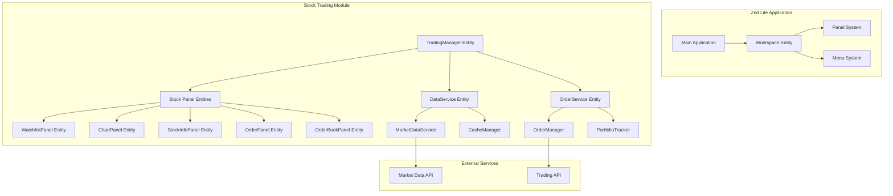

# Design Document: Stock Trading System

## Overview

The Stock Trading System integrates comprehensive trading functionality into Zed Lite using the existing GPUI framework and panel system. The design leverages Zed's proven architecture patterns while introducing specialized financial components for market data visualization, order management, and portfolio tracking.

The system follows Zed's modular approach by implementing trading functionality as a collection of specialized panels that integrate seamlessly with the existing workspace and dock system. This ensures consistency with Zed Lite's user experience while providing professional-grade trading capabilities.

## Architecture

### High-Level Architecture

The Stock Trading System follows Zed's established architectural patterns, using GPUI entities, proper context management, and the existing panel system. All components are designed as GPUI entities that implement the `Render` trait and integrate seamlessly with Zed's workspace and dock system.



### GPUI Integration Patterns

The trading system follows Zed's GPUI patterns:

1. **Entity Management**: All major components are GPUI entities with proper lifecycle management
2. **Context Usage**: Proper use of `Context<T>`, `App`, and `AsyncApp` contexts
3. **Event Handling**: Use of `EventEmitter` trait for inter-component communication
4. **Async Operations**: Proper use of `cx.spawn()` and `cx.background_spawn()` for async work
5. **Error Propagation**: Consistent use of `?` operator and `.log_err()` for error handling

### Component Integration

The trading system integrates with Zed Lite through three main integration points:

1. **Panel System Integration**: All trading components implement the `Panel` trait and register with the workspace dock system
2. **Menu System Integration**: Trading functionality is accessible through a new "Stocks" menu item with submenu navigation
3. **Settings Integration**: Trading preferences integrate with Zed's existing settings system

### Module Structure

Following Zed's crate organization patterns (.rules), avoiding `mod.rs` files, and implementing functionality in existing files where possible:

```
crates/stock_trading/
├── Cargo.toml
├── src/
│   ├── stock_trading.rs          # Main library file (specified in Cargo.toml)
│   ├── trading_manager.rs        # Central coordinator entity
│   ├── panels.rs                 # All panel implementations in one file
│   ├── market_data.rs            # Market data structures and service
│   ├── data_service.rs           # Data fetching and caching entity  
│   ├── order_service.rs          # Order management entity
│   ├── chart_renderer.rs         # Chart rendering components
│   ├── trading_actions.rs        # Action definitions
│   └── trading_settings.rs       # Settings integration
```

**Design Rationale (.rules compliance):**
- Consolidate panel implementations in `panels.rs` to avoid creating many small files
- Group related functionality together following Zed's preference for fewer, more substantial files
- Use descriptive file names without `mod.rs` paths
- Use full words for all variable names (no abbreviations like `mkt_data` → use `market_data`)
- Prioritize code correctness and clarity over speed/efficiency unless specified

## Components and Interfaces

### Core Components

#### TradingManager Entity
Central coordinator entity that manages the lifecycle of all trading components and coordinates communication between panels using GPUI's entity system.

```rust
pub struct TradingManager {
    data_service: Entity<DataService>,
    order_service: Entity<OrderService>,
    active_symbol: Option<String>,
    panels: HashMap<String, WeakEntity<dyn Panel>>,
    _subscriptions: Vec<Subscription>,
}

impl TradingManager {
    pub fn new(http_client: Arc<dyn HttpClient>, cx: &mut App) -> Entity<Self>;
    pub fn set_active_symbol(&mut self, symbol: String, cx: &mut Context<Self>);
    pub fn get_market_data(&self, symbol: &str, cx: &App) -> Task<Result<MarketData>>;
    pub fn place_order(&self, order: OrderRequest, cx: &App) -> Task<Result<OrderResponse>>;
}

impl EventEmitter<TradingEvent> for TradingManager {}

impl Render for TradingManager {
    fn render(&mut self, window: &mut Window, cx: &mut Context<Self>) -> impl IntoElement {
        // Render trading manager UI if needed
        div()
    }
}
```

#### Panel Entity Implementations

Each panel implements both the `Panel` trait and `Render` trait, following Zed's patterns:

```rust
// Watchlist Panel Entity
pub struct WatchlistPanel {
    focus_handle: FocusHandle,
    watchlist: Vec<WatchlistItem>,
    selected_index: Option<usize>,
    trading_manager: WeakEntity<TradingManager>,
    width: Option<Pixels>,
    _subscriptions: Vec<Subscription>,
}

impl Panel for WatchlistPanel {
    fn persistent_name() -> &'static str { "Stock Watchlist" }
    fn panel_key() -> &'static str { "StockWatchlist" }
    fn position(&self, _window: &Window, _cx: &App) -> DockPosition { DockPosition::Left }
    // ... other Panel trait methods
}

impl Render for WatchlistPanel {
    fn render(&mut self, window: &mut Window, cx: &mut Context<Self>) -> impl IntoElement {
        div()
            .flex()
            .flex_col()
            .child(
                div()
                    .child("Watchlist")
                    .on_click(cx.listener(|this, _event, window, cx| {
                        // Handle click events properly
                        this.handle_click(window, cx);
                    }))
            )
            .children(self.watchlist.iter().map(|item| {
                div().child(item.symbol.clone())
            }))
    }
}

impl EventEmitter<WatchlistEvent> for WatchlistPanel {}

// Chart Panel Entity
pub struct ChartPanel {
    focus_handle: FocusHandle,
    chart_data: Option<ChartData>,
    timeframe: TimeFrame,
    trading_manager: WeakEntity<TradingManager>,
    _subscriptions: Vec<Subscription>,
}

impl Panel for ChartPanel {
    fn persistent_name() -> &'static str { "Stock Chart" }
    fn panel_key() -> &'static str { "StockChart" }
    fn position(&self, _window: &Window, _cx: &App) -> DockPosition { DockPosition::Bottom }
    // ... other Panel trait methods
}

impl Render for ChartPanel {
    fn render(&mut self, window: &mut Window, cx: &mut Context<Self>) -> impl IntoElement {
        div()
            .flex()
            .flex_col()
            .child("Chart Panel")
            .when_some(self.chart_data.as_ref(), |this, data| {
                this.child(self.render_chart(data, window, cx))
            })
    }
}
```

#### Data Service Entity Architecture

```rust
pub struct DataService {
    http_client: Arc<dyn HttpClient>,
    cache: HashMap<String, (MarketData, Instant)>,
    subscriptions: HashMap<String, Vec<Subscription>>,
}

impl DataService {
    pub fn new(http_client: Arc<dyn HttpClient>, cx: &mut App) -> Entity<Self>;
    
    pub fn subscribe_to_symbol(
        &mut self, 
        symbol: String, 
        cx: &mut Context<Self>
    ) -> Task<Result<()>>;
    
    pub fn get_historical_data(
        &self, 
        symbol: &str, 
        timeframe: TimeFrame, 
        cx: &App
    ) -> Task<Result<Vec<Candle>>>;
    
    pub fn get_real_time_quote(
        &self, 
        symbol: &str, 
        cx: &App
    ) -> Task<Result<Quote>>;
    
    // Safe indexing with bounds checking
    pub fn get_cached_data(&self, symbol: &str) -> Option<&MarketData> {
        self.cache.get(symbol).map(|(data, _)| data)
    }
    
    // Proper error handling without unwrap()
    pub fn process_market_data(&mut self, data: MarketData, cx: &mut Context<Self>) -> Result<()> {
        // Use ? for error propagation instead of unwrap()
        let validated_data = self.validate_market_data(data)?;
        self.cache.insert(validated_data.symbol.clone(), (validated_data, Instant::now()));
        cx.notify();
        Ok(())
    }
    
    // Use .log_err() for visibility when ignoring errors
    pub fn cleanup_stale_data(&mut self, cx: &mut Context<Self>) {
        let cutoff = Instant::now() - Duration::from_secs(300);
        self.cache.retain(|_, (_, timestamp)| *timestamp > cutoff);
        
        // Background cleanup task with proper error handling
        cx.spawn(|this, mut cx| async move {
            if let Err(e) = this.update(&mut cx, |this, _| this.perform_deep_cleanup()) {
                e.log_err(); // Use .log_err() instead of let _ =
            }
        }).detach();
    }
}

impl EventEmitter<DataEvent> for DataService {}

impl Render for DataService {
    fn render(&mut self, _window: &mut Window, _cx: &mut Context<Self>) -> impl IntoElement {
        // Data service doesn't render UI directly
        div()
    }
}
```

### Action System Integration

The trading system integrates with Zed's action system using proper action definitions:

```rust
// Trading Actions
actions!(
    stock_trading,
    [
        ToggleWatchlistPanel,
        ToggleChartPanel,
        ToggleStockInfoPanel,
        ToggleOrderPanel,
        ToggleOrderBookPanel,
        RefreshMarketData,
    ]
);

#[derive(Clone, PartialEq, Debug, Deserialize, JsonSchema, Action)]
#[action(namespace = stock_trading)]
pub struct AddToWatchlist {
    pub symbol: String,
}

#[derive(Clone, PartialEq, Debug, Deserialize, JsonSchema, Action)]
#[action(namespace = stock_trading)]
pub struct RemoveFromWatchlist {
    pub symbol: String,
}

#[derive(Clone, PartialEq, Debug, Deserialize, JsonSchema, Action)]
#[action(namespace = stock_trading)]
pub struct PlaceOrder {
    pub symbol: String,
    pub side: OrderSide,
    pub order_type: OrderType,
    pub quantity: u64,
    pub price: Option<f64>,
}
```

### Event System Integration

Using GPUI's event system for inter-component communication:

```rust
// Trading Events
#[derive(Clone, Debug)]
pub enum TradingEvent {
    SymbolSelected(String),
    MarketDataUpdated(MarketData),
    OrderPlaced(Order),
    OrderCancelled(String),
}

#[derive(Clone, Debug)]
pub enum WatchlistEvent {
    SymbolAdded(String),
    SymbolRemoved(String),
    SelectionChanged(Option<String>),
}

#[derive(Clone, Debug)]
pub enum DataEvent {
    MarketDataReceived(MarketData),
    HistoricalDataReceived(String, Vec<Candle>),
    ConnectionStatusChanged(bool),
}
```

### Cargo.toml Configuration

Following Zed's crate patterns with gpui-component integration and proper license compliance (.rules):

```toml
[package]
name = "stock_trading"
version = "0.1.0"
edition.workspace = true
publish = false  # Required to avoid license errors (.rules compliance)
license.workspace = true

[lib]
path = "src/stock_trading.rs"  # Avoid default lib.rs, use descriptive name (.rules compliance)

[dependencies]
anyhow.workspace = true
futures.workspace = true
gpui.workspace = true
gpui-component = { git = "https://github.com/longbridge/gpui-component", branch = "main" }
http_client.workspace = true
serde = { workspace = true, features = ["derive"] }
serde_json.workspace = true
settings.workspace = true
ui.workspace = true
util.workspace = true
workspace.workspace = true

[dev-dependencies]
gpui = { workspace = true, features = ["test-support"] }
```

### GPUI Component Integration

Leveraging gpui-component's 60+ UI components for enhanced trading interface following .rules patterns:

```rust
use gpui_component::{
    button::Button,
    table::{Table, TableColumn},
    chart::{Chart, ChartType},
    input::Input,
    dock::Dock,
    Root,
};

// Enhanced Panel Implementation using gpui-component (.rules compliant)
impl Render for WatchlistPanel {
    fn render(&mut self, window: &mut Window, cx: &mut Context<Self>) -> impl IntoElement {
        div()
            .flex()
            .flex_col()
            .child(
                // Use gpui-component Button instead of basic div (.rules: use full words)
                Button::new("add_stock_button") // Full descriptive name, not "add_btn"
                    .primary()
                    .label("Add Stock")
                    .on_click(cx.listener(|this, _event, window, cx| {
                        // Proper error handling - never unwrap() (.rules compliance)
                        if let Err(error) = this.show_add_stock_dialog(window, cx) {
                            error.log_err(); // Use .log_err() for visibility
                        }
                    }))
            )
            .child(
                // Use virtualized Table for better performance with large datasets
                Table::new("watchlist_table")
                    .columns(vec![
                        TableColumn::new("symbol", "Symbol"),
                        TableColumn::new("price", "Price"),
                        TableColumn::new("change", "Change"),
                    ])
                    .data(self.watchlist_data.clone())
                    .on_row_click(cx.listener(|this, row_data, window, cx| {
                        // Safe data access with bounds checking (.rules compliance)
                        if let Some(symbol) = row_data.get("symbol") {
                            this.select_stock(symbol.clone(), window, cx);
                        }
                    }))
            )
    }
}

// Chart Panel using gpui-component Chart (.rules compliant)
impl Render for ChartPanel {
    fn render(&mut self, window: &mut Window, cx: &mut Context<Self>) -> impl IntoElement {
        div()
            .flex()
            .flex_col()
            .child(
                // Use built-in Chart component for K-line display
                Chart::new("kline_chart") // Full descriptive name (.rules compliance)
                    .chart_type(ChartType::Candlestick)
                    .data(self.chart_data.clone())
                    .timeframe(self.selected_timeframe)
                    .on_zoom(cx.listener(|this, zoom_level, window, cx| {
                        // Proper error propagation (.rules compliance)
                        if let Err(error) = this.handle_chart_zoom(zoom_level, window, cx) {
                            error.log_err(); // Never let _ = on fallible operations
                        }
                    }))
            )
    }
}

// Root component integration (.rules compliant)
impl Render for TradingSystemRoot {
    fn render(&mut self, window: &mut Window, cx: &mut Context<Self>) -> impl IntoElement {
        // Must use Root as first level child for gpui-component features
        Root::new(
            div()
                .size_full()
                .child(self.render_trading_interface(window, cx))
                .children(Root::render_dialog_layer(cx))
                .children(Root::render_sheet_layer(cx))
                .children(Root::render_notification_layer(cx)),
            window,
            cx
        )
    }
}
```

### Error Handling Patterns

Following `.rules` guidelines for comprehensive error handling:

```rust
// ✅ Correct: Use ? for error propagation (.rules compliance)
pub fn fetch_market_data(&self, symbol: &str) -> Result<MarketData> {
    let response = self.http_client.get(&format!("/api/stocks/{}", symbol))?;
    let data = serde_json::from_str(&response)?;
    Ok(data)
}

// ✅ Correct: Use .log_err() for visibility when ignoring errors (.rules compliance)
pub fn background_refresh(&mut self, cx: &mut Context<Self>) {
    cx.spawn(|this, mut cx| async move {
        if let Err(e) = this.update(&mut cx, |this, _| this.refresh_all_data()) {
            e.log_err(); // Visible error handling - never let _ = on fallible operations
        }
    }).detach();
}

// ✅ Correct: Explicit error handling with match (.rules compliance)
pub fn process_api_response(&mut self, response: ApiResponse) -> Result<()> {
    match response.validate() {
        Ok(data) => {
            self.update_cache(data);
            Ok(())
        }
        Err(ValidationError::InvalidSymbol(symbol)) => {
            log::warn!("Invalid symbol received: {}", symbol);
            Err(anyhow!("Invalid stock symbol: {}", symbol))
        }
        Err(e) => Err(e.into()),
    }
}

// ✅ Correct: Safe indexing with bounds checking (.rules compliance)
pub fn get_watchlist_item(&self, index: usize) -> Option<&WatchlistItem> {
    self.watchlist.get(index) // Safe indexing instead of direct [] to prevent panics
}

// ✅ Correct: Use full words for variable names (.rules compliance)
pub fn update_market_data(&mut self, market_data: MarketData) { // Not mkt_data
    self.historical_data.push(market_data); // Not hist_data
}

// ❌ Avoid: Never silently discard errors (.rules violation)
// let _ = client.request(...).await?; // DON'T DO THIS

// ❌ Avoid: Using unwrap() or panicking operations (.rules violation)
// let data = response.unwrap(); // DON'T DO THIS

// ❌ Avoid: Direct indexing without bounds checking (.rules violation)
// let item = self.watchlist[index]; // DON'T DO THIS - use .get(index)

// ❌ Avoid: Abbreviations in variable names (.rules violation)
// let mkt_data = fetch_data(); // DON'T DO THIS - use market_data
```

## Data Models

### Market Data Structures

```rust
#[derive(Debug, Clone, Serialize, Deserialize)]
pub struct MarketData {
    pub symbol: String,
    pub current_price: f64,
    pub change: f64,
    pub change_percent: f64,
    pub volume: u64,
    pub market_cap: Option<u64>,
    pub high_52w: Option<f64>,
    pub low_52w: Option<f64>,
    pub timestamp: SystemTime,
}

#[derive(Debug, Clone, Serialize, Deserialize)]
pub struct Candle {
    pub timestamp: SystemTime,
    pub open: f64,
    pub high: f64,
    pub low: f64,
    pub close: f64,
    pub volume: u64,
}

#[derive(Debug, Clone, Serialize, Deserialize)]
pub struct OrderBookEntry {
    pub price: f64,
    pub quantity: u64,
    pub side: OrderSide,
}

#[derive(Debug, Clone, Serialize, Deserialize)]
pub enum OrderSide {
    Buy,
    Sell,
}

#[derive(Debug, Clone, Serialize, Deserialize)]
pub enum TimeFrame {
    OneMinute,
    FiveMinutes,
    FifteenMinutes,
    OneHour,
    OneDay,
}
```

### Order Management Structures

```rust
#[derive(Debug, Clone, Serialize, Deserialize)]
pub struct OrderRequest {
    pub symbol: String,
    pub side: OrderSide,
    pub order_type: OrderType,
    pub quantity: u64,
    pub price: Option<f64>, // None for market orders
}

#[derive(Debug, Clone, Serialize, Deserialize)]
pub enum OrderType {
    Market,
    Limit,
    StopLoss,
    StopLimit,
}

#[derive(Debug, Clone, Serialize, Deserialize)]
pub struct Order {
    pub id: String,
    pub request: OrderRequest,
    pub status: OrderStatus,
    pub filled_quantity: u64,
    pub average_price: Option<f64>,
    pub created_at: SystemTime,
    pub updated_at: SystemTime,
}

#[derive(Debug, Clone, Serialize, Deserialize)]
pub enum OrderStatus {
    Pending,
    PartiallyFilled,
    Filled,
    Cancelled,
    Rejected,
}
```

### Settings Integration

```rust
#[derive(Debug, Clone, Serialize, Deserialize, JsonSchema)]
pub struct StockTradingSettings {
    pub default_watchlist: Vec<String>,
    pub default_timeframe: TimeFrame,
    pub auto_refresh_interval: Duration,
    pub chart_theme: ChartTheme,
    pub panel_positions: HashMap<String, DockPosition>,
    pub api_endpoints: ApiEndpoints,
}

#[derive(Debug, Clone, Serialize, Deserialize, JsonSchema)]
pub struct ApiEndpoints {
    pub market_data_url: String,
    pub trading_api_url: Option<String>,
    pub api_key: Option<String>,
}
```

## Correctness Properties

*A property is a characteristic or behavior that should hold true across all valid executions of a system-essentially, a formal statement about what the system should do. Properties serve as the bridge between human-readable specifications and machine-verifiable correctness guarantees.*

Based on the prework analysis, I'll now convert the testable acceptance criteria into correctness properties. After reviewing all properties for redundancy, I've identified several that can be consolidated:

**Property Reflection:**
- Properties about panel positioning (3.1, 4.1, 6.1) can be combined into one comprehensive panel positioning property
- Properties about data display (4.2, 6.2) can be combined into one data rendering property  
- Properties about persistence (2.5, 7.4) can be combined into one persistence property
- Properties about error handling (4.5, 8.4, 10.1, 10.3, 10.4) can be combined into comprehensive error handling properties

### Property 1: Menu Interaction Behavior
*For any* menu item click on the "Stocks" menu, the system should expand to show the "Watchlist" submenu
**Validates: Requirements 1.2**

### Property 2: Watchlist Data Management
*For any* valid stock symbol, adding it to the watchlist should result in the symbol being stored and displayed with basic information
**Validates: Requirements 2.2**

### Property 3: Watchlist Item Removal
*For any* stock currently in the watchlist, removing it should immediately update the display to exclude that stock
**Validates: Requirements 2.3**

### Property 4: Stock Selection Loading
*For any* watchlist item, clicking on it should result in detailed information being loaded for that stock
**Validates: Requirements 2.4**

### Property 5: Panel Positioning Consistency
*For any* stock selection, all related panels (chart, info, order book) should display in their designated workspace areas
**Validates: Requirements 3.1, 4.1, 6.1**

### Property 6: Chart Data Rendering
*For any* valid chart data, the K-line chart should render candlestick patterns containing all required price components (open, high, low, close)
**Validates: Requirements 3.2**

### Property 7: Chart Interaction Functionality
*For any* chart state, zoom and pan interactions should work correctly and update the display appropriately
**Validates: Requirements 3.3**

### Property 8: Timeframe Support
*For any* supported timeframe (1m, 5m, 15m, 1h, 1d), the chart should be able to display data in that timeframe
**Validates: Requirements 3.4**

### Property 9: Timeframe Transition
*For any* timeframe change, the chart should update the display with data appropriate to the new timeframe
**Validates: Requirements 3.5**

### Property 10: Data Display Completeness
*For any* valid stock or order book data, all required information fields should be displayed in the appropriate panels
**Validates: Requirements 4.2, 6.2**

### Property 11: Market Status Indication
*For any* market state change, the stock info panel should correctly indicate whether the market is open or closed
**Validates: Requirements 4.3**

### Property 12: Order Validation
*For any* order parameters entered, the system should validate them before submission, accepting valid orders and rejecting invalid ones
**Validates: Requirements 5.2**

### Property 13: Order Confirmation
*For any* order placement, the system should provide confirmation and status updates
**Validates: Requirements 5.3**

### Property 14: Order Type Support
*For any* order type (market or limit), the order panel should handle it correctly
**Validates: Requirements 5.4**

### Property 15: Active Order Display
*For any* set of active orders, they should be displayed with functional cancel capabilities
**Validates: Requirements 5.5**

### Property 16: Order Book Interaction
*For any* order book entry, clicking on it should pre-fill the order panel with that price level
**Validates: Requirements 6.4**

### Property 17: Spread Highlighting
*For any* order book data, the current spread between bid and ask prices should be highlighted
**Validates: Requirements 6.5**

### Property 18: Panel Docking Flexibility
*For any* trading panel, it should be dockable to the supported positions (left, right, bottom)
**Validates: Requirements 7.1**

### Property 19: Layout Proportionality
*For any* panel resize operation, the system should maintain proportional layouts
**Validates: Requirements 7.2**

### Property 20: Panel State Restoration
*For any* panel close/reopen cycle, the panel should restore to its previous state
**Validates: Requirements 7.3**

### Property 21: Data Persistence
*For any* user configuration (watchlist items, panel positions, settings), the data should persist between application sessions
**Validates: Requirements 2.5, 7.4**

### Property 22: Multi-Panel Navigation
*For any* scenario with multiple panels open, appropriate tab-based navigation should be provided where needed
**Validates: Requirements 7.5**

### Property 23: Data Caching Efficiency
*For any* market data request, frequently accessed data should be cached to reduce redundant API calls
**Validates: Requirements 8.1**

### Property 24: Stale Data Refresh
*For any* data that becomes stale, the system should automatically refresh it during market hours
**Validates: Requirements 8.3**

### Property 25: Memory Management
*For any* situation where memory usage exceeds thresholds, the system should automatically clean up old data
**Validates: Requirements 8.5**

### Property 26: Settings Persistence
*For any* panel position change, the preferences should be saved and persist
**Validates: Requirements 9.2**

### Property 27: Theme Integration
*For any* color theme change, the trading system should update chart and panel colors accordingly
**Validates: Requirements 9.3**

### Property 28: Settings Validation
*For any* invalid settings input, the system should provide appropriate validation feedback
**Validates: Requirements 9.5**

### Property 29: Comprehensive Error Handling
*For any* error condition (network failures, invalid symbols, system errors, parsing failures), the system should handle it gracefully with appropriate user feedback and fallback behavior
**Validates: Requirements 4.5, 8.4, 10.1, 10.3, 10.4, 10.5**

### Property 30: Rate Limiting Management
*For any* API rate limit scenario, the system should queue requests and retry with appropriate backoff strategies
**Validates: Requirements 10.2**

<function_calls>
<invoke name="prework">
<parameter name="featureName">stock-trading-system
## Error Handling

The stock trading system implements comprehensive error handling across all components to ensure reliability and user experience:

### Network Error Handling
- **Connection Failures**: Display offline status and fall back to cached data
- **API Rate Limiting**: Implement exponential backoff and request queuing
- **Timeout Handling**: Graceful degradation with user notification
- **SSL/TLS Errors**: Clear error messages with troubleshooting guidance

### Data Validation and Parsing
- **Invalid Stock Symbols**: Immediate validation with helpful suggestions
- **Malformed API Responses**: Fallback to previous valid data where possible
- **Data Type Mismatches**: Robust parsing with error logging
- **Missing Required Fields**: Default values and user notification

### UI Error States
- **Panel Loading Failures**: Display retry options and error details
- **Chart Rendering Errors**: Fallback to basic chart or error placeholder
- **Order Placement Failures**: Clear error messages with corrective actions
- **Settings Validation**: Real-time feedback for invalid configurations

### System Resource Management
- **Memory Pressure**: Automatic cleanup of old data and cache management
- **Storage Failures**: Graceful degradation with user notification
- **Thread Pool Exhaustion**: Request queuing and priority management
- **File System Errors**: Fallback to in-memory storage where appropriate

### Error Recovery Strategies
- **Automatic Retry**: For transient network and API errors
- **Circuit Breaker**: Prevent cascading failures in external service calls
- **Graceful Degradation**: Maintain core functionality during partial failures
- **User Notification**: Clear, actionable error messages without technical jargon

## Testing Strategy

The stock trading system employs a dual testing approach combining unit tests and property-based tests for comprehensive coverage:

### Property-Based Testing
Property-based tests validate universal correctness properties across all inputs using the `quickcheck` crate for Rust. Each property test runs a minimum of 100 iterations to ensure statistical confidence.

**Configuration:**
```rust
use quickcheck::{quickcheck, TestResult};
use quickcheck_macros::quickcheck;

#[quickcheck]
fn property_watchlist_persistence(symbols: Vec<String>) -> TestResult {
    // Test that any set of valid symbols persists correctly
    // Tag: Feature: stock-trading-system, Property 21: Data Persistence
}
```

**Key Property Test Areas:**
- **Data Management**: Watchlist operations, persistence, caching behavior
- **UI Interactions**: Panel positioning, menu navigation, chart interactions  
- **Order Processing**: Validation, confirmation, status updates
- **Error Handling**: Network failures, invalid inputs, system errors
- **Configuration**: Settings persistence, theme integration, validation

### Unit Testing
Unit tests focus on specific examples, edge cases, and integration points:

**Test Categories:**
- **Component Integration**: Panel registration, workspace integration
- **API Integration**: Mock external services, error response handling
- **Edge Cases**: Empty watchlists, no network connectivity, invalid data
- **User Workflows**: Complete trading scenarios, multi-panel interactions
- **Performance**: Memory usage, cache efficiency, rendering performance

**Testing Framework:**
```rust
#[cfg(test)]
mod tests {
    use super::*;
    use gpui::TestAppContext;
    
    #[gpui::test]
    async fn test_watchlist_panel_creation(cx: &mut TestAppContext) {
        // Test specific panel creation scenarios
    }
}
```

### Integration Testing
- **End-to-End Workflows**: Complete trading scenarios from menu to order placement
- **Panel Coordination**: Multi-panel interactions and data synchronization
- **External Service Integration**: Mock API responses and error conditions
- **Settings Integration**: Configuration changes and their effects across components

### Performance Testing
- **Memory Usage**: Monitor memory consumption during extended use
- **Rendering Performance**: Chart rendering with large datasets
- **Network Efficiency**: API call optimization and caching effectiveness
- **Startup Performance**: Impact on Zed Lite initialization time

### Test Data Management
- **Mock Market Data**: Realistic test data for development and testing
- **Synthetic Scenarios**: Edge cases and error conditions
- **Historical Data**: Regression testing with known market conditions
- **Performance Datasets**: Large datasets for performance validation

The testing strategy ensures that both individual components work correctly (unit tests) and that the system behaves correctly across all possible inputs and scenarios (property tests). This dual approach provides confidence in both specific functionality and general system correctness.