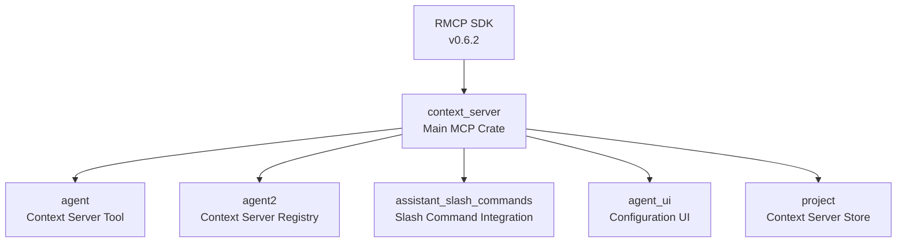

# Zed RMCP Migration Development Guide

## Project Overview

**Project**: Migrate Zed editor's Model Context Protocol (MCP) implementation from custom stdio-only implementation to the official RMCP SDK, adding support for HTTP/SSE transports while maintaining full backward compatibility.

**Repository**: https://github.com/zed-industries/zed
**RMCP SDK**: https://crates.io/crates/rmcp (v0.6.2)
**RMCP GitHub**: https://github.com/modelcontextprotocol/rust-sdk
**License**: GPL-3.0-or-later
**Rust Edition**: 2024

## Migration Strategy & Architecture

### Core Design Principles

1. **Direct Replacement, Not Adaptation**: RMCP types should become Zed's MCP types directly
2. **Backward Compatibility**: All existing MCP configurations must continue working
3. **Feature Flag Control**: Use `rmcp` feature flag for gradual rollout
4. **Minimal UI Changes**: Most UI should work without modification
5. **Code Reduction**: Remove ~800 lines of custom MCP implementation

### Migration Phases

|Phase|Description|Status|
|---|---|---|
|**Phase 1**|Add RMCP SDK dependency and core implementation|✅ Completed|
|**Phase 2**|Direct type replacement throughout codebase|🚧 In Progress|
|**Phase 3**|Add configuration support for new transports|✅ Completed|
|**Phase 4**|Update UI for transport selection|📋 TODO|

## Crate Dependency Graph & Relationships



## Affected Crates & Components

### 1. **`crates/context_server/` - Core MCP Implementation**

The main crate undergoing complete transformation:

#### Files Being Deleted
```
src/
├── types.rs              # ENTIRE FILE DELETED - ~300 lines
├── protocol.rs           # ENTIRE FILE DELETED - ~200 lines
├── client.rs            # ENTIRE FILE DELETED - ~250 lines
└── transport/           # ENTIRE DIRECTORY DELETED - ~150 lines
    └── stdio_transport.rs
```

#### Files Modified/Added
```
src/
├── context_server.rs    # Modified - now uses RMCP directly
├── settings.rs          # NEW - Enhanced transport settings
└── test.rs             # NEW - Test utilities with RMCP types
```

#### Cargo.toml Changes
```toml
[features]
default = ["rmcp"]
test-support = []
rmcp = ["dep:rmcp", "dep:tokio"]

[dependencies]
# RMCP SDK with full feature set
rmcp = { version = "0.6.2", optional = true, features = [
    "client",
    "transport-sse-client-reqwest",
    "reqwest",
    "transport-streamable-http-client-reqwest",
    "transport-child-process",
    "tower",
    "auth"
] }
tokio = { workspace = true, optional = true }
```

### 2. **`crates/agent/` - Agent Context Server Tool**

**File**: `context_server_tool.rs`

#### Before Migration
```rust
use context_server::{types, ContextServerId};
use context_server::types::{Tool, CallToolParams, CallToolResponse};

pub struct ContextServerTool {
    tool: types::Tool,  // Custom Zed type
}

impl Tool for ContextServerTool {
    fn input_schema(&self) -> serde_json::Value {
        self.tool.input_schema.clone()
    }
}
```

#### After Migration
```rust
use rmcp::model::{Tool, CallToolRequestParam, CallToolResult};
use context_server::ContextServerId; // Keep only ID wrapper

pub struct ContextServerTool {
    tool: rmcp::model::Tool,  // Direct RMCP type
}

impl Tool for ContextServerTool {
    fn input_schema(&self) -> serde_json::Value {
        self.tool.input_schema.clone()
    }
}
```

### 3. **`crates/agent2/` - Context Server Registry**

**File**: `context_server_registry.rs`

Manages registration and discovery of context servers. Updated to use RMCP types directly for server descriptors.

### 4. **`crates/assistant_slash_commands/` - Slash Command Integration**

**File**: `context_server_command.rs`

#### Before Migration
```rust
// Manual protocol request
let response = protocol
    .request::<context_server::types::requests::PromptsGet>(
        context_server::types::PromptsGetParams {
            name: prompt_name.clone(),
            arguments: Some(prompt_args),
            meta: None,
        },
    )
    .await?;
```

#### After Migration
```rust
// Direct RMCP service call
let response = service
    .get_prompt(rmcp::model::GetPromptRequestParam {
        name: prompt_name.clone(),
        arguments: Some(rmcp::object!(prompt_args)),
    })
    .await?;
```

### 5. **`crates/agent_ui/` - Configuration UI**

**Files**:
- `agent_configuration.rs` - Main configuration management
- `configure_context_server_modal.rs` - Server configuration modal

#### UI Changes Required
- Add transport type selector (stdio/http/sse)
- Show URL field for HTTP/SSE transports
- Hide command field for remote transports
- Add authentication fields for HTTP

### 6. **`crates/project/` - Context Server Store**

**File**: `context_server_store.rs`

Core management layer for context servers within projects.

#### Key Components
```rust
pub struct ContextServerStore {
    context_server_settings: HashMap<Arc<str>, ContextServerSettings>,
    servers: HashMap<ContextServerId, ContextServerState>,
    worktree_store: Entity<WorktreeStore>,
    project: WeakEntity<Project>,
    registry: Entity<ContextServerDescriptorRegistry>,
    // ...
}

pub enum ContextServerState {
    Starting { server: Arc<ContextServer>, configuration: Arc<ContextServerConfiguration> },
    Running { server: Arc<ContextServer>, configuration: Arc<ContextServerConfiguration> },
    Stopped { server: Arc<ContextServer>, configuration: Arc<ContextServerConfiguration> },
    Error { server: Arc<ContextServer>, configuration: Arc<ContextServerConfiguration>, error: Arc<str> },
}
```

## Core Implementation: ContextServer Structure

### New Simplified Structure
```rust
// context_server/src/context_server.rs
pub struct ContextServer {
    id: ContextServerId,
    #[cfg(feature = "rmcp")]
    service: RwLock<Option<Arc<RunningService<RoleClient, ()>>>>,
    #[cfg(not(feature = "rmcp"))]
    client: RwLock<Option<()>>, // Placeholder when RMCP not enabled
    configuration: ContextServerTransport,
}

pub enum ContextServerTransport {
    Stdio(ContextServerCommand, Option<PathBuf>),
    #[cfg(feature = "rmcp")]
    Http { url: String, headers: HashMap<String, String> },
    #[cfg(feature = "rmcp")]
    Sse { url: String, headers: HashMap<String, String> },
}
```

### Transport Initialization
```rust
impl ContextServer {
    #[cfg(feature = "rmcp")]
    async fn initialize(&self) -> Result<()> {
        let service = match &self.configuration {
            ContextServerTransport::Stdio(command, working_directory) => {
                let mut cmd = Command::new(&command.path);
                cmd.args(&command.args);

                if let Some(env) = &command.env {
                    cmd.envs(env);
                }

                if let Some(working_directory) = working_directory {
                    cmd.current_dir(working_directory);
                }

                let transport = TokioChildProcess::new(cmd.configure(|_| {}))?;
                ().serve(transport).await?
            }
            ContextServerTransport::Http { url, headers } => {
                // TODO: Implement HTTP transport
                return Err(anyhow!("HTTP transport not yet implemented"));
            }
            ContextServerTransport::Sse { url, headers } => {
                // TODO: Implement SSE transport
                return Err(anyhow!("SSE transport not yet implemented"));
            }
        };

        *self.service.write() = Some(Arc::new(service));
        Ok(())
    }
}
```

## Transport Configuration System

### Settings Structure
```rust
// project_settings.rs
#[derive(Debug, Clone, PartialEq, Eq, Serialize, Deserialize, JsonSchema)]
#[serde(untagged)]
pub enum ContextServerSettings {
    Custom {
        enabled: bool,
        command: ContextServerCommand,
    },
    Extension {
        enabled: bool,
        settings: serde_json::Value,
    },
}

#[derive(Deserialize, Serialize, Clone, PartialEq, Eq, JsonSchema)]
pub struct ContextServerCommand {
    #[serde(rename = "command")]
    pub path: PathBuf,
    pub args: Vec<String>,
    pub env: Option<HashMap<String, String>>,
    pub timeout: Option<u64>, // milliseconds
}
```

### Configuration Examples

#### Legacy Format (Backward Compatible)
```json
{
  "context_servers": {
    "servers": [{
      "name": "filesystem",
      "command": "mcp-server-filesystem",
      "args": ["--root", "/home/user"]
    }]
  }
}
```

#### New Format with Transport Specification
```json
{
  "context_servers": {
    "servers": [{
      "name": "remote-server",
      "transport": {
        "type": "http",
        "url": "https://api.example.com/mcp",
        "headers": {
          "Authorization": "Bearer token"
        }
      }
    }]
  }
}
```

## RMCP API Usage Patterns

### Direct Service Calls
```rust
impl ContextServer {
    #[cfg(feature = "rmcp")]
    pub async fn list_tools(&self) -> Result<Vec<rmcp::model::Tool>> {
        let service = self.service.read();
        let service = service
            .as_ref()
            .ok_or_else(|| anyhow!("Context server not initialized"))?;
        Ok(service.list_all_tools().await?)
    }

    #[cfg(feature = "rmcp")]
    pub async fn call_tool(
        &self,
        params: rmcp::model::CallToolRequestParam,
    ) -> Result<rmcp::model::CallToolResult> {
        let service = self.service.read();
        let service = service
            .as_ref()
            .ok_or_else(|| anyhow!("Context server not initialized"))?;
        Ok(service.call_tool(params).await?)
    }

    #[cfg(feature = "rmcp")]
    pub async fn list_prompts(&self) -> Result<Vec<rmcp::model::Prompt>> {
        let service = self.service.read();
        let service = service
            .as_ref()
            .ok_or_else(|| anyhow!("Context server not initialized"))?;
        Ok(service.list_all_prompts().await?)
    }
}
```

### Type Mapping (Direct Usage)

|Old Zed Type|New RMCP Type|Notes|
|---|---|---|
|`context_server::types::Tool`|`rmcp::model::Tool`|Direct replacement|
|`context_server::types::Prompt`|`rmcp::model::Prompt`|Direct replacement|
|`context_server::types::Resource`|`rmcp::model::Resource`|Direct replacement|
|`CallToolParams`|`rmcp::model::CallToolRequestParam`|Parameter structure|
|`CallToolResponse`|`rmcp::model::CallToolResult`|Result structure|
|Custom protocol requests|Direct service method calls|Simplified API|

## Test Support Implementation

### Test Utilities
```rust
// context_server/src/test.rs
pub fn create_test_tool(name: impl Into<String>) -> rmcp::model::Tool {
    let schema_map = serde_json::json!({
        "type": "object",
        "properties": {
            "message": {
                "type": "string",
                "description": "Message to echo"
            }
        },
        "required": ["message"]
    })
    .as_object()
    .unwrap()
    .clone();

    rmcp::model::Tool {
        name: name.into().into(),
        description: Some("Test tool".into()),
        input_schema: Arc::new(schema_map),
        output_schema: None,
        annotations: None,
    }
}

pub fn create_test_prompt(name: impl Into<String>) -> rmcp::model::Prompt {
    rmcp::model::Prompt {
        name: name.into().into(),
        description: Some("Test prompt".into()),
        arguments: Some(vec![rmcp::model::PromptArgument {
            name: "input".into(),
            description: Some("Input parameter".into()),
            required: Some(true),
        }]),
    }
}
```

### Fake Server Support
```rust
#[cfg(any(test, feature = "test-support"))]
impl ContextServer {
    pub fn test_fake(id: ContextServerId) -> Self {
        Self {
            id,
            service: RwLock::new(None),
            configuration: ContextServerTransport::Stdio(
                ContextServerCommand {
                    path: format!("fake_server_{}", id.0).into(),
                    args: vec!["--test".to_string()],
                    env: Some(HashMap::default()),
                    timeout: Some(30000),
                },
                None,
            ),
        }
    }
}
```

## Migration Workflow

### Step-by-Step Migration Process

1. **Update Dependencies**
   ```bash
   # Add RMCP to workspace Cargo.toml
   rmcp = { version = "0.6.2", features = [...] }
   ```

2. **Enable Feature Flag**
   ```bash
   # Build with RMCP support
   cargo build -p context_server --features rmcp

   # Build legacy only (for testing)
   cargo build -p context_server --no-default-features
   ```

3. **Update Imports Throughout Codebase**
   ```rust
   // Find and replace in all crates
   - use context_server::types::*;
   + use rmcp::model::*;
   ```

4. **Update Method Calls**
   ```rust
   // Replace protocol requests with service calls
   - protocol.request::<PromptsGet>(params).await?
   + service.get_prompt(params).await?
   ```

5. **Test Migration**
   ```bash
   # Run tests with RMCP
   cargo test -p context_server --features rmcp

   # Test backward compatibility
   cargo test -p context_server --no-default-features
   ```

## Common Pitfalls & Solutions

### DON'T

- Create conversion functions between Zed types and RMCP types
- Maintain parallel type systems
- Keep old protocol implementation alongside RMCP
- Add unnecessary abstraction layers
- Mix async runtimes (smol vs tokio)

### DO

- Use RMCP types directly throughout the codebase
- Delete old implementation files completely
- Use feature flags for gradual rollout
- Test both with and without RMCP feature
- Maintain backward compatibility for configs
- Use conditional compilation for compatibility

## Current Status & Next Steps

### ✅ Completed

- RMCP SDK dependency added with full features
- Core ContextServer structure updated
- Transport configuration system implemented
- Feature flag setup for gradual rollout
- Test utilities with RMCP types
- Conditional compilation for backward compatibility

### 🚧 In Progress

- Direct type replacement throughout codebase
- Testing with actual MCP servers (filesystem, git, sqlite)
- Integration testing with existing configurations

### 📋 TODO

- Implement HTTP transport with authentication
- Implement SSE transport for streaming
- Update configuration modal UI
- Add connection retry logic
- Add connection status indicators
- Create user documentation
- Performance optimization
- Add WebSocket transport support (future)

### 🐛 Known Issues

1. **HTTP/SSE Transports**: Not yet implemented, returns error
2. **UI Modal**: Still shows only stdio configuration
3. **Notification Handling**: RMCP handles notifications differently, needs adaptation

## Build & Test Commands

### Development Workflow

```bash
# Full build with RMCP
cargo build -p context_server --features rmcp

# Build without RMCP (legacy)
cargo build -p context_server --no-default-features

# Run specific tests
cargo test -p context_server --features rmcp test_context_server_status

# Build entire Zed with RMCP
cargo build --release

# Run with debug logging
RUST_LOG=context_server=debug ./target/release/zed
```

### Testing with Real MCP Servers

```python
#!/usr/bin/env python3
# test_server.py - Simple MCP test server
import sys, json

while True:
    line = sys.stdin.readline()
    if not line: break
    request = json.loads(line)

    if request.get("method") == "initialize":
        response = {
            "jsonrpc": "2.0",
            "id": request["id"],
            "result": {
                "protocolVersion": "0.1.0",
                "serverInfo": {"name": "test", "version": "1.0"},
                "capabilities": {"tools": {}}
            }
        }
        print(json.dumps(response))
        sys.stdout.flush()
```

## Performance Considerations

### Before Migration
- Custom implementation: ~800 lines of code
- Limited to stdio transport
- Manual protocol handling
- Custom type system

### After Migration
- RMCP SDK: Battle-tested implementation
- Multiple transport options
- Automatic protocol compliance
- Standardized types
- Better error handling
- Future updates automatic

## Security Considerations

### Authentication Support
- HTTP Bearer tokens via headers
- OAuth support (planned)
- JWT token support (planned)
- Session management built-in

### Environment Variable Handling
```rust
impl std::fmt::Debug for ContextServerCommand {
    fn fmt(&self, f: &mut std::fmt::Formatter<'_>) -> std::fmt::Result {
        let filtered_env = self.env.as_ref().map(|env| {
            env.iter()
                .map(|(k, v)| (k, if should_redact(k) { "[REDACTED]" } else { v }))
                .collect::<Vec<_>>()
        });
        // ... format with redacted sensitive values
    }
}
```

## Quick Reference

### Key Types & Imports

```rust
// Core RMCP imports
use rmcp::{
    ServiceExt,
    service::{RoleClient, RunningService},
    transport::{ConfigureCommandExt, TokioChildProcess},
    model::{
        Tool, Prompt, Resource,
        CallToolRequestParam, CallToolResult,
        GetPromptRequestParam, GetPromptResult,
        ListToolsRequestParam, ListPromptsRequestParam,
    },
};

// Zed-specific (kept)
use context_server::{ContextServerId, ContextServerCommand};
```

### Common Patterns

```rust
// Initialize service
let service = ().serve(transport).await?;

// List all tools
let tools = service.list_all_tools().await?;

// Call a tool
let result = service.call_tool(params).await?;

// Get server info
let info = service.peer_info();
```

## Contributing Guidelines

### For Contributors

1. Always use RMCP types directly, never create wrappers
2. Test with both `--features rmcp` and `--no-default-features`
3. Update documentation when adding transport features
4. Follow existing error handling patterns
5. Use `anyhow::Result` for error types
6. Add integration tests for new transports

### Code Review Checklist

- [ ] No custom type conversions added
- [ ] Old implementation files deleted
- [ ] Feature flags properly used
- [ ] Backward compatibility maintained
- [ ] Tests pass with and without RMCP
- [ ] Documentation updated

## References & Resources

- [MCP Specification](https://modelcontextprotocol.io/specification)
- [RMCP SDK Documentation](https://docs.rs/rmcp)
- [RMCP GitHub Repository](https://github.com/modelcontextprotocol/rust-sdk)
- [Zed Contributing Guide](https://github.com/zed-industries/zed/blob/main/CONTRIBUTING.md)
- [Zed Discord](https://discord.gg/zed) - For questions and discussions

## Migration Timeline

|Date|Milestone|Status|
|---|---|---|
|Sept 2025|Initial RMCP integration|✅ Done|
|Sept 2025|Core implementation|🚧 In Progress|
|Oct 2025|HTTP/SSE transport|📋 Planned|
|Oct 2025|UI updates|📋 Planned|
|Nov 2025|Full release|📋 Target|

---

**Document Version**: 1.0.0
**Last Updated**: September 15, 2025
**Maintained By**: RMCP Migration Team
**License**: GPL-3.0-or-later
