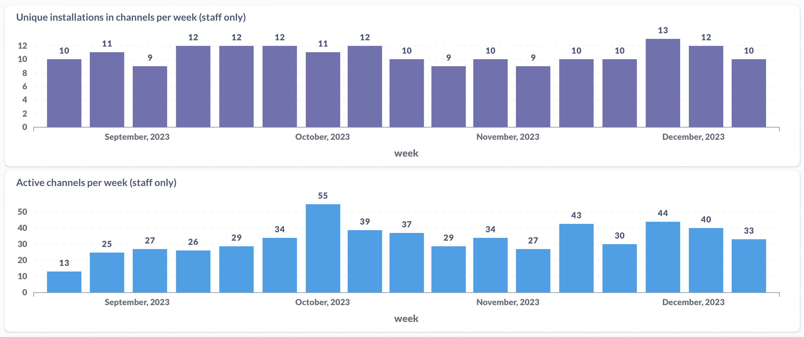

# CONTRIBUTING

Thanks for your interest in contributing to Zed, the collaborative platform that is also a code editor!

## Contribution ideas

If you already have an idea of what you'd like to contribute, you can skip this section, otherwise, here are a few resources to help you find something to work on:

- Our public roadmap [include link] details what features we plan to add to Zed.
- Our [Top-Ranking Issues issue](https://github.com/zed-industries/community/issues/52) shows the most popular feature requests and issues, as voted on by the community.

*If you are a plugin developer looking to contribute by building out the Zed ecosystem, have a look at these [issues](https://github.com/zed-industries/community/issues?q=is%3Aopen+is%3Aissue+label%3A%22potential+plugin%22+sort%3Areactions-%2B1-desc).*

In the short term, we want to provide a generalized solutions to these problems (plugin system/theme system), so we are not looking to add these features to Zed itself

- Adding languages
- Themes

## Resources

### Bird-eye's view of Zed

Zed is made up of several smaller crates - let's go over those you're most likely to interact with:
- [gpui](/crates/gpui) is a GPU-accelerated UI framework which provides all of the building blocks for Zed.
- [editor](/crates/editor) contains the core `Editor` type that drives both the code editor and all various input fields within Zed. It also handles a display layer for LSP features such as Inlay Hints or code completions.
- [project](/crates/project) manages files and navigation within the filetree. It is also Zed's side of communication with LSP.
- [workspace](/crates/workspace) handles local state serialization and groups projects together.
- [vim](/crates/vim) is a thin implementation of Vim workflow over `editor`.
- [lsp](/crates/lsp) handles communication with external LSP server.
- [language](/crates/language) drives `editor`'s understanding of language - from providing a list of symbols to the syntax map.
- [collab](/crates/collab) is the collaboration server itself, driving the collaboration features such as project sharing.
- [rpc](/crates/rpc) defines messages to be exchanged with collaboration server.

// Let's try to make whoever we come into contact with for the first time
// well-equiped to discuss basic concepts around Zed
// Ideally these should link to mdbook/source code docs (doubtful given how source code docs might be more in-depth than necessary)
### Important concepts

- Views vs Models
- Contexts
- Action
- UI
    - Render vs RenderOnce
    - ui crate
    - storybook
- Workspace
- Project
    - Worktree
- vim crate
    - Editor
        - Multibuffers
- Settings

## Zed channels

Once you have an idea of what you'd like to contribute, you'll want to communicate this to the team. If you're new to Zed's channels, here's a guide [link to up-to-date docs] to help bring you up to speed.

[Since ~February 2022, the Zed Industries team has been exclusively using Zed to build Zed](https://x.com/nathansobo/status/1497958891509932035). We've built these tools to specifically address our own issues and frustrations with the current state of collaborative coding. These are not features we've built to simply look flashy, we work in channels every day of the workweek, aggressively dogfooding everything.

*Channel metrics were not collected prior to August 2023*

While we still have improvements to make, we believe we've sanded down a lot of the sharp edges and that the experience is both smooth and enjoyable - one that gets you as close to hypothetically sitting next to your teammates as possible, even if you're potentially on different sides of the globe. We want to continue working this way amongst ourselves and we are extremely excited to work with *you* in this way. We invite you to contribute to Zed *through* Zed.

### Proposal & Discussion

To do that, find a public channel [link to list of all public channels] that is relevant to your contribution, check the channel notes to see which Zed team members typically work in that channel, and post a message in the chat. If you're not sure which channel is best, you can post in the <whatever-general> channel. *Please wait to begin working on your contribution until you've received feedback from the team. Turning down a contribution that was not discussed beforehand is a bummer for everyone.*

## Implementation & Help

Once approved, feel free to begin working on your contribution. If you have any questions, you can post in the channel you originally proposed your contribution in, or you can post in the <whatever-general> channel. If you need help, reach out to a Zed teammate - we're happy to pair with you to help you learn the codebase and get your contribution merged.

Reviewing code in a pull request, after the fact, is hard and tedious - the team generally likes to build trust and review code through pair programming. We'd prefer have conversations about the code, through Zed, while it is being written, so decisions can be made in real-time and less time is spent on fixing things after the fact. Ideally, GitHub is only used to merge code that has already been discussed and reviewed in Zed.

--- Piotr's original contribution guide ---

Read on if you're looking for an outline of your first contribution - from finding your way around the codebase and asking questions, through modifying and testing the changes, finishing off with submitting your changes for review and interacting with Zed core team and Zed community as a whole.

### Getting in touch
We believe that journeys are best when shared - hence there are multiple outlets for Zed users and developers to share their success stories and hurdles.

If you have questions, ask them away on our [Discord](https://discord.gg/XTtXmZYEpN) or in a dedicated [Zed channel](https://zed.dev/preview/channel/open-source-81). We also plan to organise office hours on a weekly basis - they will take place in forelinked Zed channel.

All activity in Zed communities is subject to our [Code of Conduct](https://docs.zed.dev/community/code-of-conduct).

If you're just starting out with Zed, it might be worthwhile to look at some of the other crates that implement bits of UI - such as [go to line](/crates/go_to_line) modal that's bound to ctrl-g by default in Zed.

### Upstreaming your changes
Here be dragons :)
---
Other things to mention here
- [ ] Etiquette
- [ ] CLA
- [ ] Importance of tests
- [ ] Look over Piotr's PR and pull in what this is missing (tour of the codebase, etc.)
    - See above
- [ ] Ask people to check the PRs to see if something has already been started on
- [ ] Maybe have a channel that maps out what teammates / community users are working on what, so people can see what's being worked on
- [ ] Mention Discord or keep it only focused on Zed channels?
- [ ] Mention issue triage doc (https://github.com/zed-industries/community/blob/main/processes/issues_triage.md)?

Things to do:
- [ ] Put names devs who "own" each channel in the channel notes
