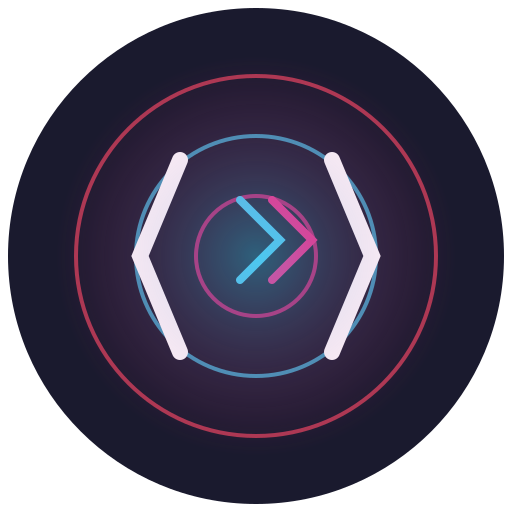

# CodeOrbit

[](https://opensource.org/licenses/MIT)
[](https://www.typescriptlang.org/)
[](https://nodejs.org/)

Welcome to **CodeOrbit**, a next-generation AI-powered code editor with multi-agent collaboration capabilities. Built with modern web technologies and designed for developer productivity.

<div align="center">
  
</div>

## ✨ Features

- **AI-Powered Code Completion** - Smart suggestions powered by advanced AI models
- **Multi-Agent System** - Collaborative AI agents for different development tasks
- **Real-time Collaboration** - Work together with your team in real-time
- **Extensible Architecture** - Built with plugins and extensions in mind
- **Cross-Platform** - Available on Windows, macOS, and Linux

## 🚀 Getting Started

### Prerequisites

- Node.js 16.0.0 or higher
- npm or yarn
- Git

### Installation

1. Clone the repository:
   ```bash
   git clone https://github.com/yourusername/codeorbit.git
   cd codeorbit
   ```

2. Install dependencies:
   ```bash
   npm install
   # or
   yarn
   ```

3. Start the development server:
   ```bash
   npm start
   # or
   yarn start
   ```

## 🛠 Development

### Available Scripts

- `npm start` - Start the development server
- `npm run build` - Build for production
- `npm test` - Run tests
- `npm run lint` - Lint the codebase
- `npm run format` - Format the code

## 🤝 Contributing

Contributions are welcome! Please read our [Contributing Guidelines](CONTRIBUTING.md) to get started.

## 📄 License

This project is licensed under the MIT License - see the [LICENSE](LICENSE) file for details.

## 🌐 Links

- [Documentation](https://docs.codeorbit.dev)
- [GitHub Repository](https://github.com/yourusername/codeorbit)
- [Issue Tracker](https://github.com/yourusername/codeorbit/issues)
- [Changelog](CHANGELOG.md)

## 🙏 Acknowledgments

- Built with ❤️ by the CodeOrbit Team
- Inspired by modern code editors and IDEs
- Thanks to all contributors who help make this project better!
