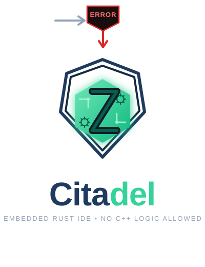

<p align="center">
  
</p>

# Citadel

*[日本語](./README.ja.md)*

**Citadel** (aka *Citadel-Duino*) is a fork of [Zed](https://github.com/zed-industries/zed), being reworked into a next-generation IDE dedicated to Arduino (AVR) embedded development.

> This is an independent, non-commercial fork. It is not affiliated with, endorsed by, or sponsored by Zed Industries, Inc. "Zed" is a trademark of Zed Industries, Inc.

### Philosophy

> "If it compiles, it runs safely. Never freeze the system, never lock the chip."

### Why Citadel exists

| Frustration | Countermeasure |
|---|---|
| IDEs are so heavy they kill productivity | Zed's GPU-accelerated rendering (GPUI) and a Rust-powered core cut through it |
| Code compiles fine, then freezes on real hardware for no clear reason | Core logic is written in Rust (no_std), eliminating memory corruption at compile time |
| A crash freezes the IDE and leaves the microcontroller's port locked up | Backend runs as a fully separate process; auto-inserted watchdog timer + rescue sequence provide fail-safety at both the process and hardware level |
| Small code changes are hard to track cleanly in Git | Zed's built-in inline Git integration and branch-linked builds keep progress traceable end to end |

Scope, developer-experience commitments, and what is deliberately out of scope: [RFC 0002](./docs/rfcs/0002-product-scope-and-dx.md). The open technical challenges that need to be resolved before this is buildable are tracked in [RFC 0001](./docs/rfcs/0001-hybrid-architecture.md).

### Architecture: the Rust/C boundary

Citadel draws a hard line between hardware I/O and logic — this is the core rule the whole project is built around:

- **C/C++** may only do direct, linear I/O hand-off: read a pin, write a pin, send a byte. No `if`, no `for`/`while`, no computed intermediate variables — pin numbers and other board-specific constants live here, nothing else. Writing real logic in C/C++ is simply too slow to make an entire embedded ecosystem safe in Rust; this boundary is what makes the tradeoff work.
- **Rust** owns all logic: state transitions, calculations, control decisions. Branching and computation are only allowed here.
- Values cross the boundary as plain data: C/C++ calls into `extern "C"` Rust functions, and Rust reads `extern "C"` variables/constants defined on the C/C++ side.
- The build rejects any C/C++ source containing logic constructs (`if`, `for`, `while`, ternaries, etc.) — this is a compile-time gate, not a style guideline.

| | Traditional Arduino/C++ | Citadel (hybrid + strict rules) |
|---|---|---|
| C++ assets (libraries) | Usable 100% as-is | Usable 100% as-is |
| I/O / peripheral control | Written in C++ (risk of bugs) | Written in C++, but straight-line calls only |
| Branching / state management | Written in C++ (breeding ground for memory corruption and bugs) | 100% written in Rust (compile-time safety) |
| Logic written in C++ | Compiles fine, misbehaves on real hardware | Parsed by the IDE and rejected as an error |
| ISR (interrupt) risk | Freezes from forgotten `volatile` or data races | Physically blocked by Rust's type system (`Mutex`) |
| A freeze/hang | Locks up the IDE and the microcontroller together | Process isolation + auto watchdog recover immediately |

The only shape of `loop()` Citadel allows:

```cpp
#include <Arduino.h>

const int SENSOR_PIN = A0;
const int MOTOR_PIN  = 9;

extern "C" int process_sensor_value(int raw); // logic lives in Rust

void setup() {
    pinMode(SENSOR_PIN, INPUT);
    pinMode(MOTOR_PIN, OUTPUT);
}

void loop() {
    int raw = analogRead(SENSOR_PIN);
    int out = process_sensor_value(raw); // no if/for/computation allowed here
    analogWrite(MOTOR_PIN, out);
}
```

```
[ 1. Input (C/C++) ]
   sensor reads / timer interrupts / received bytes
                │
                ▼ data hand-off
   ┌─────────────────────────┐
   │      2. Logic (Rust)    │  ◄── the fortress
   │  type-safe state machine│
   │  zero memory corruption │
   │  calculation & control  │
   └─────────────────────────┘
                │
                ▼ return value
   [ 3. Output (C/C++) ]
   motor drive / display / transmission
```

That diagram is the runtime data flow. At build time, the two sides are compiled separately and stitched back together as one binary, triggered by a single button in the IDE:

```
[ User ] ──(one button press)──> [ Citadel IDE ]
                                         │
    ┌────────────────────────────────────┴────────────────────────────────────┐
    ▼                                                                         ▼
[ 1. I/O / sketch ]                                                  [ 2. Logic ]
  built with avr-g++                                                  built with cargo build
  (existing C++ libraries used as-is)                                 (compiler enforces memory safety)
    │                                                                         │
    └────────────────────────────────────┬────────────────────────────────────┘
                                         ▼
                             [ 3. Static link & convert ]
                               avr-gcc merges both into one .hex
                                         │
                                         ▼
                             [ 4. Auto-flash ]
                               avrdude writes it to the board
```

### Status

Early-stage fork — not yet functional as an Arduino IDE. Currently at the RFC / toolchain-verification stage.

### Developing

Build instructions are currently unchanged from upstream Zed:

- [Building on macOS](./docs/src/development/macos.md)
- [Building on Linux](./docs/src/development/linux.md)
- [Building on Windows](./docs/src/development/windows.md)

### Licensing

Citadel is a fork of Zed and inherits its licensing as-is: source code is licensed primarily under **GPL-3.0-or-later**, with **Apache-2.0** components where marked (see [LICENSE-GPL](./LICENSE-GPL) and [LICENSE-APACHE](./LICENSE-APACHE)).

Note for users: GPL applies to the IDE itself, not to code you write and compile with it. Sketches/firmware you build using Citadel are **not** subject to GPL just because the IDE is.

License information for third-party dependencies must be correctly provided for CI to pass. We use [`cargo-about`](https://github.com/EmbarkStudios/cargo-about) to automatically comply with open source licenses — see upstream Zed's `script/licenses/zed-licenses.toml` for the mechanism, inherited unchanged for now.
