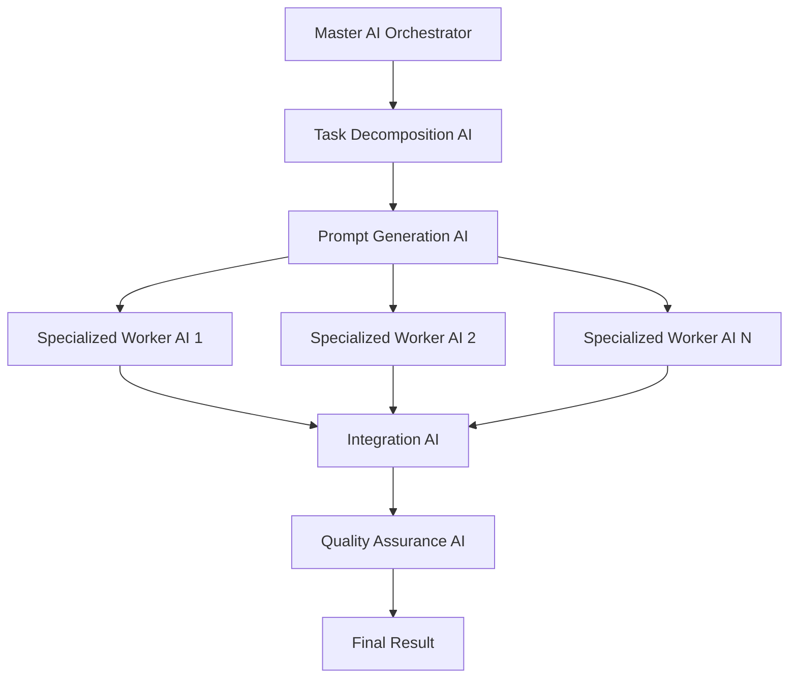

# AI Studio with Pure AI Task Orchestration System (AITOS)

**AI Orchestrating AI** - A revolutionary approach where AI manages complex development workflows through pure natural language coordination, without rigid code structures.

## 🤖 Core Concept: AI Orchestrating AI

The Pure AI Task Orchestration System (AITOS) leverages AI's natural language understanding to manage complex, multi-session development tasks. Instead of rigid code structures, we use specialized AI agents that communicate through carefully crafted prompts.



## 🏗️ System Architecture

### Master Orchestrator AI Prompt

The Master AI is responsible for task decomposition and coordination:

```
You are the Master Task Orchestrator AI. Your role is to:

1. ANALYZE incoming complex tasks
2. DECOMPOSE them into manageable subtasks
3. DETERMINE optimal execution sequence
4. CREATE specialized prompts for worker AIs
5. COORDINATE execution and integration
6. MAINTAIN context across sessions

TASK DECOMPOSITION FRAMEWORK:
- Identify task complexity and scope
- Break into logical phases with clear boundaries
- Determine required expertise for each phase
- Estimate context requirements
- Create dependency mapping
- Generate handoff protocols

CURRENT TASK: {task_description}

DECOMPOSITION OUTPUT FORMAT:
```json
{
  "task_id": "unique_identifier",
  "phases": [
    {
      "phase_id": "phase_1",
      "name": "descriptive_name",
      "role": "specialized_role",
      "prompt_template": "detailed_prompt_for_worker_ai",
      "context_requirements": ["file1", "file2"],
      "dependencies": ["previous_phase_id"],
      "expected_output": "description_of_deliverables"
    }
  ],
  "integration_strategy": "how_to_combine_results",
  "success_criteria": ["criterion_1", "criterion_2"]
}
```
```

### Specialized Worker AI Roles

#### Architecture AI Prompt
```
You are a Software Architecture AI specialized in system design and technical planning.

CONTEXT FROM ORCHESTRATOR:
{context_from_previous_phase}

YOUR SPECIFIC TASK:
{specific_architecture_task}

CONSTRAINTS:
- Maintain consistency with existing codebase patterns
- Consider performance and scalability
- Document architectural decisions
- Provide clear interfaces for implementation

OUTPUT REQUIREMENTS:
1. System architecture diagram (text description)
2. Key components and their responsibilities
3. Interface definitions
4. Implementation guidelines
5. Context package for next phase

HANDOFF INSTRUCTIONS:
Create a complete context package for the implementation phase including all architectural decisions and rationale.
```

#### Developer AI Prompt
```
You are a Senior Software Developer AI specialized in Rust implementation.

ARCHITECTURAL CONTEXT:
{architecture_from_previous_phase}

YOUR IMPLEMENTATION TASK:
{specific_implementation_task}

CODING GUIDELINES:
- Follow Rust best practices
- Prioritize code correctness and clarity
- Use error handling with ? operator
- Avoid panic-inducing functions like unwrap()
- Create comprehensive tests

DELIVERABLES:
1. Complete, working code implementations
2. Unit tests for all functions
3. Integration tests where applicable
4. Code documentation
5. Context for review phase

CONTEXT MANAGEMENT:
If context becomes large, summarize non-essential information and focus on current implementation scope.
```

#### Integration AI Prompt
```
You are an Integration Specialist AI responsible for combining work from multiple phases.

INPUTS FROM WORKER AIs:
{collected_outputs_from_workers}

YOUR INTEGRATION TASK:
1. Combine all deliverables into cohesive system
2. Resolve any conflicts or inconsistencies
3. Ensure all components work together
4. Create final documentation
5. Validate against original requirements

INTEGRATION STRATEGY:
{integration_strategy_from_orchestrator}

OUTPUT FORMAT:
- Integrated system overview
- Final code/documentation
- Testing results
- Deployment instructions
- Success criteria verification
```

## 🔄 Dynamic Prompt Generation System

### Prompt Factory AI
```
You are a Prompt Engineering AI that creates optimal prompts for specialized worker AIs.

WORKER AI ROLE: {target_role}
TASK CONTEXT: {task_context}
COMPLEXITY LEVEL: {complexity}
CONTEXT SIZE: {estimated_context}

GENERATE OPTIMAL PROMPT:
1. Role definition and expertise framing
2. Specific task instructions
3. Context management guidelines
4. Output format requirements
5. Handoff instructions
6. Error handling protocols

CONTEXT OPTIMIZATION:
- If context exceeds threshold, include compression strategies
- Provide context prioritization guidelines
- Include summarization instructions for handoffs

OUTPUT: Complete prompt for {target_role} AI
```

## 📊 Context Management Through Prompts

### Context Compression AI
```
You are a Context Compression AI. Your job is to intelligently reduce context size while preserving essential information.

CURRENT CONTEXT SIZE: {current_size}
TARGET SIZE: {target_size}
CONTEXT TYPE: {context_type}

COMPRESSION STRATEGIES:
1. Summarize lengthy discussions into key decisions
2. Extract essential code snippets, remove verbose examples
3. Prioritize recent and relevant information
4. Create reference links instead of full content inclusion
5. Compress historical context into decision logs

PRESERVED ELEMENTS (DO NOT COMPRESS):
- Active work-in-progress
- Critical technical decisions
- Current phase objectives
- Interface definitions
- Error patterns to avoid

OUTPUT: Compressed context maintaining full functionality for next AI
```

### Context Forecasting AI
```
You are a Context Forecasting AI that predicts context requirements for tasks.

TASK ANALYSIS:
{task_description}

FORECASTING FACTORS:
1. Number of files likely to be involved
2. Complexity of integration points
3. Amount of historical context needed
4. Inter-phase communication overhead
5. Documentation requirements

PREDICTION MODEL:
- Small tasks: <10KB context
- Medium tasks: 10-30KB context  
- Large tasks: 30-60KB context
- Complex tasks: 60KB+ (needs optimization)

OUTPUT:
```json
{
  "estimated_context_size": "value_in_kb",
  "peak_phase": "phase_with_highest_context",
  "optimization_needed": true/false,
  "compression_points": ["phase_1", "phase_2"],
  "context_strategy": "detailed_management_plan"
}
```
```

## 🚀 Implementation Example

### Master Orchestrator in Action

**Input:** "Integrate COMPASS agent architecture with Zed's speech system for voice-controlled coding"

**Orchestrator Output:**
```json
{
  "task_id": "compass_speech_integration_001",
  "phases": [
    {
      "phase_id": "analysis",
      "name": "System Analysis and Architecture Design",
      "role": "architect",
      "prompt_template": "You are a Software Architect AI analyzing integration between COMPASS agent system and Zed speech components...",
      "context_requirements": ["compass/", "speech/", "agent/"],
      "dependencies": [],
      "expected_output": "Integration architecture, interface definitions, implementation plan"
    },
    {
      "phase_id": "bridge_implementation", 
      "name": "COMPASS-Speech Bridge Implementation",
      "role": "developer",
      "prompt_template": "You are a Rust Developer AI implementing the bridge layer between COMPASS and speech systems...",
      "context_requirements": ["architecture_output", "compass_bridge/", "speech/"],
      "dependencies": ["analysis"],
      "expected_output": "Working bridge code, tests, documentation"
    },
    {
      "phase_id": "speech_enhancement",
      "name": "Speech System COMPASS Integration", 
      "role": "speech_specialist",
      "prompt_template": "You are a Speech Processing AI enhancing TTS/STT with COMPASS awareness...",
      "context_requirements": ["bridge_output", "speech/", "recognition/"],
      "dependencies": ["speech_enhancement"],
      "expected_output": "Enhanced speech components with COMPASS integration"
    },
    {
      "phase_id": "integration_testing",
      "name": "System Integration and Testing",
      "role": "integrator", 
      "prompt_template": "You are an Integration AI combining all components and ensuring system coherence...",
      "context_requirements": ["all_previous_outputs"],
      "dependencies": ["speech_enhancement"],
      "expected_output": "Integrated system, comprehensive tests, documentation"
    }
  ],
  "integration_strategy": "Progressive integration with testing at each phase boundary",
  "success_criteria": ["Voice commands trigger COMPASS intentions", "Speech responses use COMPASS reasoning", "Full integration with existing Zed workflow"]
}
```

## ✨ Key Advantages of Pure AI Approach

### 1. Natural Language Flexibility
- No rigid code structures
- Adapts to any task type automatically
- Self-modifying based on task requirements

### 2. Dynamic Context Management
- AI understands what's important to preserve
- Natural language compression maintains meaning
- Intelligent prioritization of information

### 3. Self-Optimizing System
- Learns from execution patterns
- Improves prompt generation over time
- Adapts strategies based on success/failure

### 4. Role Specialization
- Each AI can be optimized for specific expertise
- Natural handoffs through conversational context
- Maintains consistency through prompt engineering

## 🔗 Integration with Existing Systems

### COMPASS Integration
- Leverage COMPASS's principle-based reasoning
- Use COMPASS intentions for task execution
- Maintain alignment through principled AI coordination

### UIDE Integration  
- Store workflows and execution history
- Search similar tasks for pattern recognition
- Persist context and learning across sessions

### Zed Editor Integration
- Extract project context automatically
- Integrate with existing workspace systems
- Provide seamless development workflow

### Speech Integration
- Voice-activated task orchestration
- Natural language task description
- Audio feedback for task progress

## 📊 Context Forecasting Implementation

### Forecasting Algorithm

The system uses multiple factors to predict context requirements:

1. **File-based context estimation** - Analyze files likely to be involved
2. **Historical context needs** - Learn from similar past tasks
3. **Working memory requirements** - Calculate active task complexity
4. **Inter-session context overhead** - Account for handoff costs
5. **Role transition overhead** - Factor in context switching between AI roles

### Context Size Categories

- **Small** (<10KB): Simple, focused tasks
- **Medium** (10-30KB): Moderate complexity with multiple components
- **Large** (30-60KB): Complex integration tasks
- **Critical** (>60KB): Requires optimization and compression

## 🎯 Implementation Phases

### Phase 1: Core Foundation
- Basic task representation and decomposition
- Simple context management and forecasting
- Role definition and basic transitions

### Phase 2: Advanced Context Management
- ML-based context forecasting
- Context optimization and compression
- Session state persistence via UIDE

### Phase 3: Integration Layer
- COMPASS integration for principled execution
- Zed editor integration for project context
- Speech interface for voice orchestration

### Phase 4: Advanced Features
- Learning from execution history
- Advanced optimization strategies
- Performance monitoring and analytics

## 🔧 Usage

The system will be accessible through:
- **AI Studio UI** - Visual workflow creation and monitoring
- **Voice Commands** - "Create a workflow to integrate X with Y"
- **Text Interface** - Natural language task descriptions
- **API** - Programmatic workflow creation and execution

## 🎭 AI Role Specializations

The system supports various specialized AI roles:

- **Architect AI** - System design and technical planning
- **Developer AI** - Code implementation and testing
- **Reviewer AI** - Code review and quality assurance
- **Integrator AI** - Component integration and system coherence
- **Tester AI** - Comprehensive testing strategies
- **Documenter AI** - Documentation and user guides
- **Context Manager AI** - Context optimization and compression
- **Prompt Engineer AI** - Dynamic prompt generation and optimization

Each role has specialized prompts, capabilities, and handoff protocols designed for maximum effectiveness in their domain.

---

**The future of software development: Where AI coordinates AI to build complex systems through natural language orchestration.** 