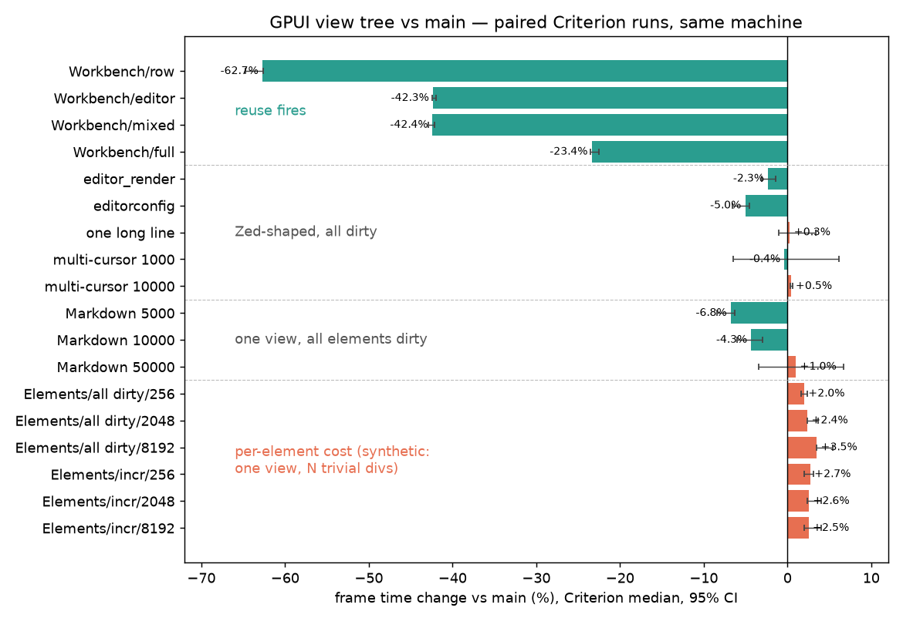
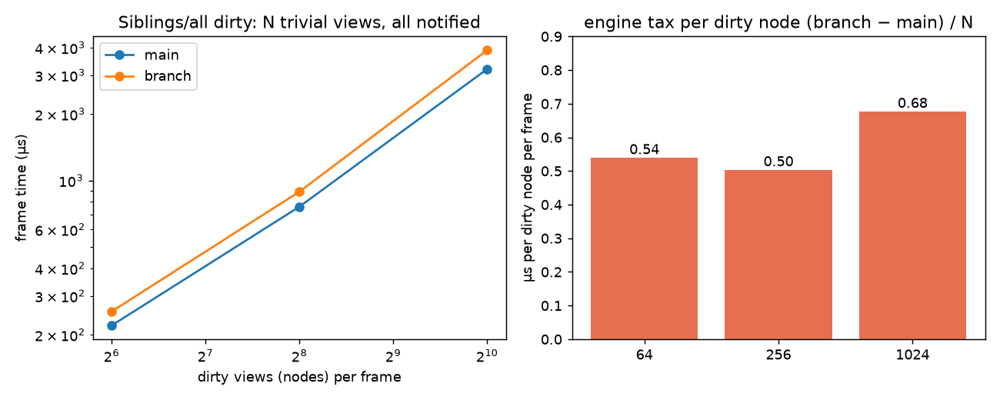
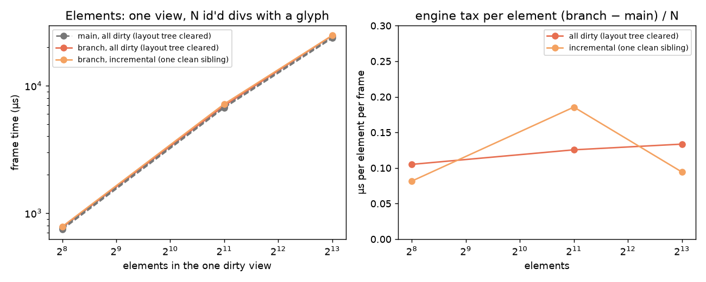
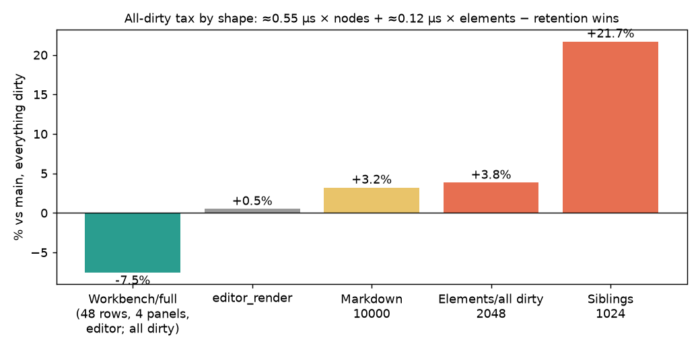
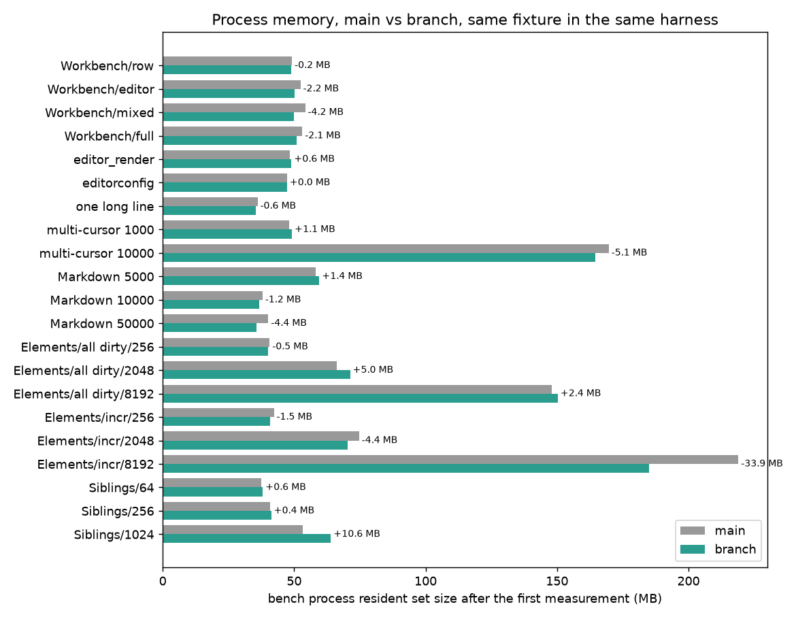

# View tree

GPUI is immediate-mode: `render` describes the whole frame every time it runs. The
view tree memoises views. Each mounted view occurrence is a **node** that keeps the
entities its render read, its Taffy subtree, and a recording of the frame effects it
produced (scene operations, hitboxes, listeners, dispatch nodes, text layouts). When a
frame is requested, a node whose inputs have not changed replays its recording instead
of rendering; dirty nodes rebuild and their ancestors rebuild with them.

This document records the decisions the design rests on and the work that remains.
The first half should stay true as the code changes; the second half is a plan and
should be edited by the PRs that complete it.

## Vocabulary

- **Node** – one mount of a view at one place in the tree. The same `Entity<V>`
  rendered in two places is two nodes.
- **Memoised** – a node's output was reused. Not "retained": the authoring model is
  unchanged, and "retained" is used only where Taffy subtrees are literally kept
  across frames.
- **Mounted / unmounted** – a node exists / has been removed. This is the lifecycle
  that local state, images, and hooks hang off.
- **Dirty** – a node must rebuild. **Notified** – an entity announced a change.
  These are different things; see below.

## Decisions

### Reads establish dirtiness; notify establishes change

While a node renders, every entity read is recorded as a dependency of that node.
`cx.notify(entity)` does what it always did: it marks the windows that read the
entity dirty and runs the entity's observers. It does not notify anything downstream.
When the window next draws, the engine expands the dirty set through its
source → consumer map and marks the consuming nodes, and their ancestors, dirty.

The only bridge between the two is the consumer map. Nothing in `App` walks render
dependencies, and no node is ever the target of `Effect::Notify`. A future change
that makes a view (rather than a node) a consumer must not start firing that view's
observers when a dependency changes.

### Notify is the contract

A view that mutates state without `cx.notify()` is stale until it notifies. The
engine does not compensate for missing notifications (no revision counters, no
"any `update` is a change" rule), because that rule cannot tell a read-only
`update` from a mutation and forces side doors like `ElementInputHandler::query`.
Missing notifications are application bugs, found with the oracle (below) and fixed
where they occur.

### Everything a render reads is tracked, in one of three ways

1. It is an entity read, recorded as a dependency.
2. It is part of `ViewNodeCacheKey` (bounds, content mask, text style, rem size,
   scale factor, opacity, image cache) and compared before reuse.
3. It is an ambient input whose mutation invalidates the nodes that read it.

There is no fourth category. Adding an ambient input to `Window` or `App` that
renders can observe means adding it to (2) or (3). Falling back to `Window::refresh`
is acceptable only as a stopgap and must be listed in the plan.

### Mount lifecycle

- A node is created the first time its occurrence renders and removed at the end of
  the first frame in which its parent rendered without it.
- Unmount happens in `finish_frame` / `reconcile_children`, after the frame, never
  mid-render.
- A full refresh rebuilds every recording but does **not** unmount. Local state
  survives `window.refresh()`.
- Node-local state (`use_keyed_state`, components) is dropped at unmount. Its
  entities' release callbacks are therefore the unmount hook for anything they own.

### Nodes are engine storage, not entities

`NodeId` is an engine-local slotmap key. `EntityId` is for things renders read.
Nodes have no refcounts, no observers, no access tracking, and cannot appear in
dependency sets. Keyed local state remains real entities, owned by the node.

### Identity is positional within a node

An element's identity is `(node, Location::caller(), nth occurrence)`, overridden by
an explicit key where children reorder. The full path — what `GlobalElementId`
encodes today — is computed on demand by walking node parents, for the inspector
and accessibility only.

### Components

There are two things a render can put in the tree. **Entities** you can refer to, so
you manage them, and notify is their contract. **Components** (`Component`,
`render(&self, window, cx)`) are managed for you and cannot be referred to: a value
built by the parent's render, plus the `use_state` entities it creates. It has no state
of its own to notify about, so it gets `&mut App`, not a `Context`.

A component renders inline by default, as part of its parent's node, in an element-id
scope of `(type name, nth inline view of that type in the node)` — Flutter's
type-and-position identity — so two siblings of one type keep separate `use_state`.
(Every inline view, `RenderOnce` included, gets this scope; it fixes the sibling
collision `RenderOnce` had.) `.cached()` mounts a component as a node of its own with
an entity holding the value, and requires `PartialEq`: when the parent renders again,
the node is re-rendered only if the new value differs from the one it last rendered, or
something it read was notified. That is SwiftUI's `.equatable()`; it is the one place
props equality exists, and the type system makes it opt-in, since callbacks cannot be
compared and a hand-written `PartialEq` has to choose to skip them.

Where `.cached()` shows up in practice is the data for deciding what to promote
automatically. Auto-promotion would key on local state (`use_state`) only; promoting
on entity reads would promote everything, since every render reads the theme.

### The oracle

The reference implementation is the view tree under full refresh. A frame produced
incrementally must equal the frame produced by `window.refresh()` from the same
state. `VisualTestContext::assert_incremental_matches_full_refresh` asserts it;
`view_tree::oracle_tests` drives it over a seeded gpui-only fixture, and
`test_workspace_rendering_stress` in `editor` over a 3-pane workspace.

## Measuring

### Micro-benchmarks

`cargo bench -p benchmarks --bench editor_render` (and `--bench markdown_renderer`).
Compare against `main` with Criterion baselines: check out `main` in a second worktree
with this branch's `benches/editor_render.rs` copied over (the `Workbench`, `Siblings` and
`Elements` fixtures are new here), build both, then run `docs/view_tree/matrix.sh`,
which runs every fixture paired — `main` then branch, back to back, so both see the same
machine state — and writes `matrix.csv`; `charts.py` draws the figures below from it.
Check the load average first: another build on the machine widens the intervals past
the effects being measured (a `main`-against-`main` run should report under 0.5%).

The fixtures separate three things. `Workbench/update/{row,editor,mixed}` are where
reuse fires. `Workbench/update/full`, `editor_render`, the multi-cursor and Markdown
fixtures dirty everything, so they show what a Zed-shaped or text-heavy frame pays when
nothing is reused. `Siblings/all dirty/N` is N trivially cheap *views* all notified every
frame, which isolates the fixed cost of a node; `Elements/{all dirty,incremental}/N` is
one view rendering N plain id'd `div`s, which isolates the cost per element. The two
synthetic sweeps are reported as what they measure — microseconds per node and per
element — rather than as a percentage of a frame made of nothing else; the element cost
is also given as a share of a trivial `div`, since that is a real penalty on a real
element. Neither shape is how GPUI is meant to be used (a view is a component with
state, rendering many elements), so a window sees the per-node cost amortized away and
the per-element cost partly returned by retention.

| Fixture | `main` | branch | change (95% CI) |
| --- | ---: | ---: | ---: |
| Workbench/update/row | 765 µs | 285 µs | **−64%** (−64.7, −62.6) |
| Workbench/update/editor | 1.56 ms | 899 µs | **−42%** (−42.4, −42.0) |
| Workbench/update/mixed | 1.19 ms | 685 µs | **−43%** (−42.9, −42.1) |
| Workbench/update/full (all dirty) | 1.62 ms | 1.24 ms | **−23%** (−23.5, −22.6) |
| editor_render | 692 µs | 676 µs | **−2.2%** (−3.1, −1.4) |
| editor_render_with_editorconfig | 1.52 ms | 1.45 ms | **−5.5%** (−6.6, −4.6) |
| open_editor_with_one_long_line | 816 µs | 819 µs | +1.0% (−1.1, +3.4) |
| Multi-cursor input 1000 / 10000 | 73 ms / 678 ms | 72 ms / 682 ms | −0.3% / +0.5% |
| Markdown render 5000 / 10000 / 50000 | 1.17 / 1.63 / 6.64 ms | 1.09 / 1.56 / 6.71 ms | **−7.3% / −4.4%** / +1.5% (−3.5, +6.7) |
| Elements/all dirty 256 / 2048 / 8192 | 754 µs / 6.84 ms / 25.1 ms | 769 µs / 7.00 ms / 25.9 ms | **+2.0% / +3.1% / +4.6%** |
| Elements/incremental 256 / 2048 / 8192 | 758 µs / 6.93 ms / 25.5 ms | 778 µs / 7.11 ms / 26.1 ms | **+2.6% / +3.1% / +3.0%** |
| Elements: tax per element 256 / 2048 / 8192 | 2.95 / 3.34 / 3.06 µs per element | | **+0.06 / +0.08 / +0.11 µs** (±0.01 / 0.02 / 0.03) |
| Siblings/all dirty 64 / 256 / 1024 | 213 µs / 758 µs / 3.21 ms | 248 µs / 898 µs / 3.81 ms | **+0.55 / +0.55 / +0.59 µs per dirty node** |

`main` at `5a9b9558db`, branch at `b7f55c0437`, M-series laptop, load average 3–7
(other builds running; the intervals are still narrow because the pairs run back to
back). Since the previous run of this table (at `46c3ffa866`), the rendered frame
became the scene cache and the dispatch tree is snapshotted rather than rewritten from
ops: the reuse rows gained 6–14 points, the Zed-shaped all-dirty rows turned from
+0.5–1.6% to −2–5%, Markdown from +2–4% to −7–+1%, and the synthetic per-element tax
roughly halved. The per-element tax rises with N (0.06 → 0.11 µs from 256 to 8192):
not reallocation, since every container keeps its capacity across frames on both sides,
but the per-primitive arrays the branch adds (a kind byte, a `u32` position, the sort
keys) leaving cache along with `main`'s own ones at that size, plus the log N in the
lane sort — both sides sort, but the branch's sort-then-gather touches more bytes per
primitive.

**The cost model.** Two synthetic sweeps pin the engine's tax on a frame in which nothing
is reused:

A node costs about **0.55–0.6 µs per dirty node per frame**, flat in the node's size
(occurrence lookup, cache key, three phases of begin/end, dependency recording, the
dispatch snapshot, layout retention).

An element costs about **0.06–0.11 µs per rendered element per frame** (a hitbox item,
the primitive-kind byte recorded beside the frame's lane, and its text line's handle) —
2–3.5% of an id'd `div` with a glyph, which costs `main` about 2.9 µs, and less than
the retention wins on Markdown's heavier elements. The incremental variant, where the
retained layout tree is kept and the view's previous tree retired subtree by subtree,
is within noise of the cleared one.

So an all-dirty frame pays roughly `0.55 µs × dirty nodes + 0.08 µs × dirty elements`,
less what retention saves it (kept text layouts, kept Taffy trees for clean subtrees).
A Zed window has tens of nodes and a few thousand elements, so the tax is well under a
hundred microseconds on a frame of one to several milliseconds — and `Workbench/full`,
the Zed-shaped all-dirty fixture, comes out 23% *faster* than `main`, `editor_render`
2–5% faster, because the retention wins are larger than that. The tax is visible only
where nodes are many and trivial (`Siblings`) or a single view is thousands of cheap
elements (`Elements`). By ablation, no single mechanism is more than 15% of it; the
passes taken (the line layout cache behind `RefCell`s, no reseeding of text still
cached, no bubbling of reads into the parent, empty dispatch nodes dropped, node flags
instead of hash sets, `SmallVec` dependency sets, occurrence keys from a running path
hash, 56-byte items, generation-stamped element states, the frame as the scene cache,
the dispatch tree snapshotted instead of rewritten) took the per-node cost from ≈0.75 µs to
≈0.55 µs and halved the per-element cost. Getting materially lower needs the per-node steps
themselves to go — fused per-phase choreography — which is follow-up work.
`crates/gpui/docs/view_tree_render_path.md` walks the render path step by step.

### Memory

Every GPUI bench report ends with the process's resident set size — what `ps` or a
system monitor shows — sampled when the first measurement starts and ends and at most
after any measurement. The samples are taken with profiler tracing off, after its frame
ring has been freed, so they reflect the app and not the harness, and `matrix.sh`
records them next to the timings (`main_rss`, `branch_rss` columns, MB after the first
measurement; `*_rss_max`).

In the same paired run as the table above, the process is the same size on both sides:
across the 21 fixtures the branch is between −5 MB and +5 MB of `main` after the first
measurement (−0.2 to −4.2 MB on the four Workbench fixtures, +0.6 MB on
`editor_render`, −4.4 MB on Markdown 50000), except `Siblings/1024` at +10.6 MB and
`Elements/incremental/8192` at −34 MB — both within what two runs of the *same* binary
show, since a fresh process lands anywhere in a ±5 MB band and the two 8192-element
fixtures in a wider one. Two repeats of `Siblings/1024` put the growth during the first
measurement at +1.9/+2.6 MB on `main` and +2.0/+2.3 MB on the branch. The one
systematic difference is in the `*_rss_max` columns, the high-water mark after all
~20 Criterion samples (each a fresh app in the same process): `Siblings/1024` ends 10%
higher on the branch (240–245 vs 260–275 MB), which is a thousand nodes' records that
the allocator keeps around between apps; the Zed-shaped fixtures end equal or lower
(`Workbench/full` 140 vs 130 MB, `editor_render` 155 vs 150 MB).

**What a node weighs.** Probing a trivial leaf view (one id'd `div` with one glyph) at
that measurement put it at about 2.5 KB, of which 1488 bytes was the `ViewNode` struct
itself: three 296-byte `PhaseOutput`s each carrying a four-`Vec` `TextUse` and a scene
record although text is used in one phase and the scene only by paint, and a cache key
holding a whole `TextStyle`. The struct is now 680 bytes (`const`-asserted under 704):
the dispatch record and the scene live once in `NodeOutput`, the mid-paint run state
lives in the `Scene`'s recorder, `TextUse` is one list, the cache key stores a 64-bit
hash of the text style, and scene runs use `u32` ranges. What remains per trivial node is
~680 inline + ~450 of record heap (segments, text handles, kinds) + ~150 of tree
bookkeeping (`consumers`, `occurrences`) + ~200 of element state that `main` keeps too.

There is no in-engine byte count: an estimate from container capacities was a second
bookkeeping to keep in step with every structure, and the process number is what
matters. What is counted is structural — `ViewTreeStats::live_nodes` and
`layout_nodes` — and `view_tree_is_flat_across_reuse` checks both stay constant over a
thousand frames that redraw one row at a time (a 3-pane workspace at 1600×1000 with
three editors holds 20 nodes). For real use, sample RSS during the session below
(`ps -o rss= -p <pid>` once a second) alongside the frame log.

### Real use

Zed already logs every drawn frame when `ZED_MEASUREMENTS=1` is set (`frame duration:
…` on stderr, from `Window::draw` through `present`), and `dev: toggle fps overlay`
shows a live readout (current, p90, p99, max over the last 1000 frames; `dev: reset
frame overlay stats` restarts it). To compare two builds:

1. Build both: `cargo build --release -p zed` on `main` and on this branch; keep the
   two binaries apart.
2. Run each with the same project and the log redirected:
   `ZED_MEASUREMENTS=1 <zed> --foreground <project> 2> frames-<build>.log`.
3. Drive the same session in each, roughly three minutes, keyboard-led so it repeats:
   open a large file from the file finder; hold `down` for ten seconds; hold
   `shift-down` for five; search for a symbol and step through matches; type a line and
   delete it; type `self.` and wait for completions, then escape; open the project
   panel and arrow through twenty entries; split the pane and open a second file in
   it; open the terminal, run `ls`, close it; hover along the tab bar and the gutter
   for five seconds; scroll-wheel through the file for ten seconds; open the theme
   selector, move through a few themes, escape; resize the window twice; quit.
4. `script/frame-times frames-main.log frames-branch.log` prints frame count, p50 /
   p90 / p95 / p99 / max, frames over the 120 Hz and 60 Hz budgets, and the change.

Mouse-led steps are not identical between runs, so judge the distribution, not single
frames, and run the session two or three times per build. The p50 is the number that
reflects reuse; the tail reflects full refreshes (focus, hover, resize), which cost
what a `main` frame costs.

## Plan

Ordered by dependency. Items marked **critical path** unblock several others.

### Engine shape

- [x] **Critical path.** Store nodes in a `SlotMap<ViewNodeId, ViewNode>` inside
  `ViewTree`; ancestor dirtiness through the node's `parent`. Deleted
  `NodeRenderDecision` (now `reuse` / `reuse_layout` returning `Option`), the
  access-scope pool (`App::track_reads` fills a caller-owned set), the `Window`
  forwarding layer, and node ids in dependency sets. Measured 715 → 699 µs on
  `editor_render`; the single-node fixture barely exercised entity-map traffic, so
  the remaining full-rebuild overhead is elsewhere. Still open: `consumers` values
  are `FxHashSet`s and could be `SmallVec`s; DFS-order node layout.
- [x] Recordings own their listeners and input handlers (`OutputItem::MouseListener`,
  `OutputItem::InputHandler`, leased out of their slot for a call). `PlatformInputHandler`
  resolves the rendered frame's input handler through its context on every call. A
  nested mouse-event dispatch runs no listeners, as before the view tree.
- [x] **Critical path.** Notify is the contract: removed entity revisions,
  `dependency_revisions`, `EntityMap::end_query`, `ElementInputHandler::query`.
  The oracle (gpui, editor at 200 stress steps, workspace, project/outline panel,
  terminal, title bar) surfaced no missing `cx.notify()` in those suites. Interactive
  use of Zed is the remaining discovery surface; a view that goes stale under the node
  engine is a mutation without notify at that site.
- [x] Collapse the access API to `cx.track_reads(&mut set, |cx| …)`;
  `begin/end_access_scope` remain as its private halves. Still open:
  `suspend/restore_access_tracking` is used once, around a render's notifications
  (`render_notifications`), which could instead dirty the intersection of
  `pending_notifications` and the frame's reads at the end of draw.
- [x] Profile the full-rebuild overhead. `Workbench/update/full` (the only multi-node
  fixture) was 12.5% slower than `main` on this machine; the cause was the line layout
  cache evicting text that reused views never looked up, so every rebuild reshaped it
  (CoreText at 12.5% of samples vs 0.9% on `main`). Resolved by node-owned text (below).
  Engine bookkeeping measures at ~1.5% on `editor_render`.
- [x] **Nodes are the frame.** Each node owns what it drew, per phase, in one
  `Vec<OutputItem>` (hitboxes, tooltips, cursor styles, window controls, tab stop
  operations, mouse listeners, input handlers, dispatch push/pop, test debug bounds),
  with `Child(node, phase)` items marking where a child's output belongs, plus element
  states, the text it looked up, its scene, and a lane of recorded dispatch nodes. A
  reused node's output stays where it is; a redrawn node overwrites its own. Queries
  (`hit_test`, `cursor_style`, `mouse_listeners`, `focused_input_handler`,
  `hit_window_control`, `tab_stops`) walk the frame in drawing order or reverse. A frame
  is its roots, in drawing order (`roots` for the frame events are dispatched against,
  `next_roots` for the one being drawn): the window's root view, the roots attached by
  `defer_draw` in priority order, then the prompt, drag overlay or tooltip; nothing is
  recorded outside a node except the dispatch node an element pushes around a root
  view, which is rebuilt every frame. `Frame` is down to focus, window-active, the
  dispatch tree, the deferred-draw work queue, and the scene linearization. Gone: `RecordedMetadata`, `capture_metadata`, `PaintIndex`,
  `PrepaintStateIndex`, `ViewNodeRecording`, `LineLayoutRecording`, `record/replay_subtree`,
  `assert_metadata_unique`, `Frame::finish`'s state carry-over, `NodeLocalState`.
  - `DispatchTree` is unchanged from before the view tree: a flat per-frame tree with
    unstable ids. A node records its pushes and pops; once it has painted, the recorded
    nodes are refreshed from the live tree, and reuse walks the items pushing them back
    under the active node. Making the dispatch tree itself node-owned is a possible
    follow-up; it is not needed for correctness or the measured performance.
  - `use_state`/`use_keyed_state` are `with_element_state` storing
    `(Entity, Subscription)`; there is one element-state map, per node.
  - Text: the node is the retention. Each phase holds the `(key, layout)` pairs its
    elements looked up (`TextUse`), including text shaped inside Taffy measure closures
    (attributed to the node that requested the measured layout, since measuring runs
    outside the traversal). A redraw seeds the node's text into the frame cache first.
    The cache is back to one previous frame, as before the view tree.
  - One flat list vs. lanes: measured on `Workbench/update/full` (223 elements, 814
    items, `OutputItem` 88 bytes after moving dispatch node snapshots to their own lane),
    a hit test walks the frame in ~0.85µs and collecting mouse listeners ~1.2µs, about
    1ns per item; items are ~55% dispatch push/pop, ~30% mouse listeners, ~10%
    hitboxes. A real window is perhaps 10–30k items, so ~10–30µs per query and two or
    three queries per mouse event. Per-kind lanes with a shared splice table would let a
    hit test touch only hitboxes (~10× less) at the cost of a counts table per splice;
    do it if a walk shows up in a profile of real use, not before.
- [ ] Any per-frame-"use" cache in GPUI (atlas tiles; text is now node-owned) is a
  proxy for "still on screen" that reused views do not refresh. Audit for the same
  eviction pattern.
- [x] **Critical path.** Cut the legacy engine. `Option<ViewTree>` becomes
  `ViewTree`; delete the non-node branches of `ViewElement`, the duplicate
  `use_keyed_state`, and the `Window` forwarding layer. Tests wanting a reference
  frame force a refresh (`ViewTree::new_eager` remains as the test reference).
- [x] `.cached(style)` becomes the ordinary node path with `style` refining the root
  layout; deprecate afterwards.
- [x] Deferred draws mark the current scope frame-bound instead of forcing a
  whole-window refresh. Prompts, accessibility, and the inspector still refresh.
- [x] **A frame is an ordered list of roots; deferred draws are roots.** `defer_draw`
  mounts a root node keyed by the element-id scope it was called from, under the node
  being drawn (the owner), and records `DispatchOp::Root(node, priority, parent)` in the
  owner's prepaint dispatch lane. That op is the whole relationship: rendering the owner emits it,
  replaying the owner (`graft_view_node_prepaint`'s walk) sees the same op and
  re-attaches the root, and a root survives a frame iff some drawn output attached it
  (the existing root reconciliation). The deferred pass draws a fresh attachment inside
  the root node's prepaint and paint, or replays the node when the owner was replayed;
  the dispatch parent is whatever is active when the walk reaches the item, since the
  owner's pushes have been replayed up to that point. The root's `parent` is the owner,
  so whatever dirties the root dirties the owner, which attaches it afresh; a deferred
  root never re-renders by itself, because its element is gone with the frame arena.
  That holds while ancestors rebuild; under fine-grained caching a deferred root must
  instead capture the ambient context it was attached in (element-id stack, text style
  stack, rem size, content mask, offset, dispatch parent) and re-render there. Nodes
  mounted while laying out the deferred element are the owner's children already.
  `transact` rollback abandons the roots of truncated fresh attachments and leaves
  re-attached ones, which the retry's walk attaches again. `mark_frame_bound` walks
  `parent` links as well as the traversal stack: during the deferred pass only the
  deferred root is on the stack, and a measure closure inside it lives in the owner's
  retained Taffy subtree. Anchoring needs no re-run: a clean owner has the same bounds,
  and a viewport change is a full refresh. `VisualTestContext::draw` draws its element
  as a root of the frame that follows. Gone: the frame root output and its
  rendered/next pair, `set_frame_phase`, `swap_frame_outputs`, `OutputSlot.owner`'s
  `None`. An embedded GPUI surface is one more root with an offset.
- [ ] Record positions relative to the node origin and translate on replay, so a
  clean subtree that moves is replayed rather than rebuilt and the cache key becomes
  size-only. `position: absolute` children resolve inside the node and deferred draws
  re-run through their frame-bound owner, so both stay correct. Everything recorded
  with a position needs the translate: scene primitives (paths per vertex, or an
  insertion offset), hitboxes, input-handler bounds, tooltip and cursor requests.
  `layout_unchanged` then ignores the root's `location`. After ownership and identity.
- [ ] Fine-grained caching: a dirty descendant rebuilds through clean ancestors.
  Containment, read dependencies, and layout consequences become three separate
  relations. Replay is mostly ready (recordings reference children by id); what is
  missing is the ambient context at each child reference (element offset, dispatch
  parent, element-id stack, image cache) and layout change reporting from Taffy (try
  upstream before forking) to schedule the scopes a relayout actually moved. Keep the
  parent walk until change reporting exists; validate with the oracle across flex
  reflow, unchanged outer bounds with inner changes, parent movement, clipping, and
  mount/unmount. Measure with `Workbench/update/row`: rebuilding a tiny node alone can
  cost more than its parent's rebuild saved. After ownership, identity, and offsets.
- [ ] `uniform_list` and `list` use `request_retained_measured_layout` (their
  captures are plain values).
- [ ] `next_occurrence` uses a per-location counter instead of `siblings.contains`.
- [x] Trim `TaffyLayoutEngine` bookkeeping. `stale_layouts` is gone (stale nodes are
  removed in one reverse pass over `allocated_nodes`) and `clear_retained` folded into
  `clear`. What remains is intrinsic: Taffy has no node iteration, so `allocated_nodes`
  stays; `previous_layouts` is the snapshot of the kept subtrees, whose key set *is* the
  kept set, so using it as the marker in `retain` is one structure rather than two;
  `layout_inputs` holds one entry per live root.

### Correctness

- [x] A grafted layout whose bounds or ambient inputs then differ at prepaint calls
  `restart_render` before rendering, so `next_children` and the dependency set start
  clean.
- [ ] The `expect`s in `taffy.rs` (`replace_layout`: "retained layout was computed
  before prepaint") are engine invariants, kept as panics so a violated invariant is
  found rather than papered over by a fallback render.
- [ ] Track remaining ambient inputs as dependencies instead of `refresh()`: focus,
  window active state, viewport size, mouse position, input modality, hover. Focus is
  the largest source of full rebuilds. Globals are already tracked. Cut from the first
  PR: a full refresh costs what every frame cost before the view tree, so these are
  a missed win rather than a regression. Sketch: an `AmbientInput` read set per node
  (`Focus`, `WindowActive`, `ViewportSize`, `MousePosition`, `Hover(HitboxId)`),
  recorded through a `Cell` since the readers take `&Window`; the same
  dirty-then-ancestors expansion as entities, keyed by input. Mouse moves diff the
  hovered hitbox set (hitbox ids are stable across reuse) and dirty readers of hitboxes
  that entered or left it, which retires the `refresh()` in `div`'s hover listeners; a
  modality flip dirties every hover reader. After a layout change moves elements under
  a still mouse, the post-prepaint hit test must run the same diff and schedule a frame.

### Identity on the node tree

- [ ] Element identity → `(node, Location::caller(), nth)`; `GlobalElementId` shrinks
  to the local suffix and full paths are computed on demand.
- [x] Separate mount identity from state identity. `View::element_id()` says where a
  node mounts and `View::entity()` which entity backs it; a cached component mounts by
  `(type, nth)` and owns its instance entity, so it never impersonates its inputs. An
  `Entity<T: Render>` uses its own id for both, as before the view tree; a repeated
  mount of one entity gets the next occurrence, and element state is per node, so
  sibling mounts of one entity keep separate recordings and local state.
- [ ] Inspector: identity and per-element overrides on node state; overrides read as
  entities so edits dirty exactly one node. Deletes the inspector full-refresh
  fallback.
- [ ] Accessibility: stable per-mount ids; partial `TreeUpdate`s for rebuilt
  subtrees. Deletes the accessibility full-refresh fallback.

### Capabilities the lifecycle enables

- [ ] Images: node-local `Entity` holding the load; completion notifies; release
  calls `drop_image`; a per-window `WeakEntity` lookup shares tiles between nodes.
  Retire `ImageCache`'s lifecycle logic; keep a decode cache as a plain LRU.
- [ ] `window.on_unmount` for plain `Entity<V>` views (components already get it via
  `on_release`).
- [ ] GPU damage regions from `changed_bounds` through submission and presentation,
  with backend buffer-age handling.
- [x] `Component`: inline by default, `.cached()` mounts a node and compares inputs
  with `PartialEq`. See Decisions.
- [ ] Retire `RenderOnce` in favour of `Component` (separate PR): mechanical migration
  of `#[derive(IntoElement)]` and the `ui` crate, then deprecate. The `component`
  crate's preview-registry trait shares the name; disambiguate imports as they bite.
- [ ] Auto-promote components that hold local state to nodes, once `.cached()` usage
  shows where it pays. Needs same-frame re-render of a promoted node and state
  hand-off from the parent's element-state map.

### Testing and housekeeping

- [x] Oracle helper `VisualTestContext::assert_incremental_matches_full_refresh`;
  `test_workspace_rendering_stress` in `editor` is its consumer (48 steps by default,
  `GPUI_STRESS_STEPS` to raise it).
- [x] A gpui-only oracle fixture: `view_tree::oracle_tests` (nested views mounted and
  unmounted, `uniform_list`, wrapped text, focus, hover, scroll, a deferred popover on a
  nested owner so it gets replayed, resize) driven by a seeded step sequence; 5 seeds
  in CI, `ITERATIONS=100` sweeps clean. It fails within two steps if roots are not
  re-attached on graft.
