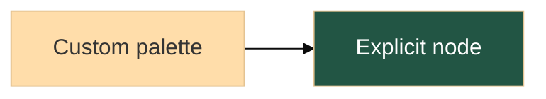

# Mermaid rendering

Zed's theme supplies the default diagram colors. Explicit `style`, `classDef`,
`linkStyle`, front matter, and init-directive colors take precedence. For example:

Merman validates these values before rendering. Color-valued `themeVariables`,
plain `fontFamily` lists, positive pixel `fontSize`, and boolean `darkMode` are
supported. Named Mermaid themes use their own palette. Arbitrary `themeCSS` and
other non-color theme variables remain disabled.

Sequence and packet configuration is forwarded to the renderer, including packet
colors, `bitsPerRow`, and `bitWidth`. Closed Mermaid fences are no longer filtered
by a diagram-type allowlist; unsupported syntax displays an error with its source.

The engine is pinned to the [upstream XML compatibility fix](https://github.com/Latias94/merman/commit/4c2ac78177f3429ed78abb864a1f9f13d415c55c)
on merman 0.8.0-alpha.6 (Mermaid 11.17.2 baseline). ELK layouts and mathematical
labels use merman's optional backends.

The rendering corpus covers the previously blocked families and aliases in both
light and dark themes. This is not complete Mermaid 12 compatibility: newer
syntax such as `usecase-beta` is unavailable in the native engine. Some
families retain Mermaid's own colors, notably C4 and ZenUML. Mermaid itself also
lets its global font size override `sequence.noteFontSize` in some cases.
