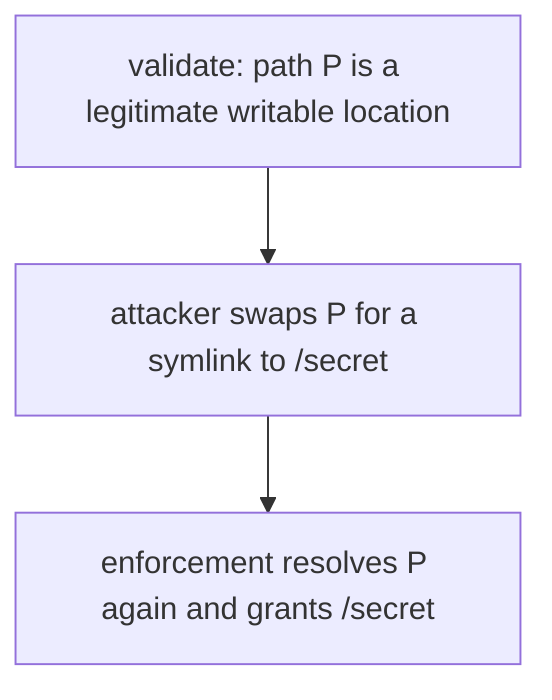
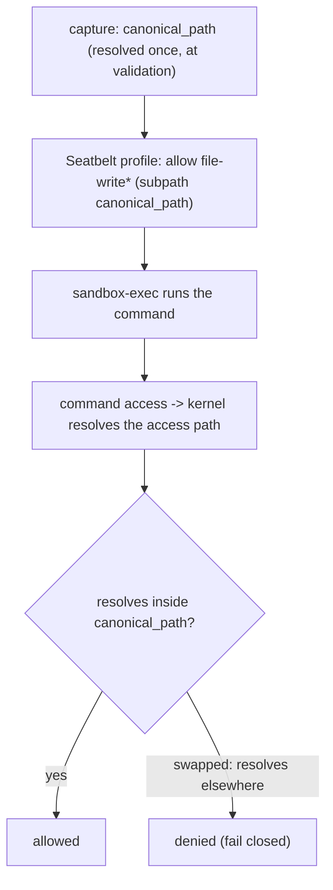
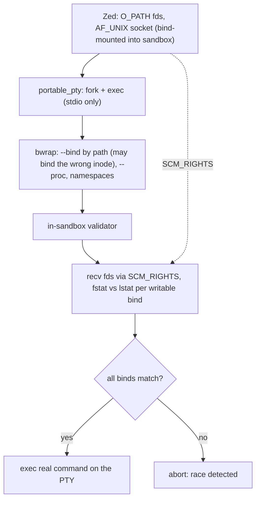
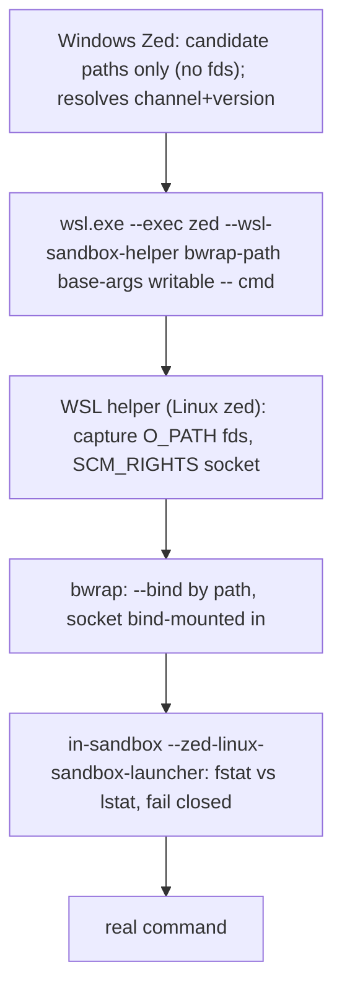

# `sandbox`

Cross-platform sandboxing for shell commands that the agent runs on the user's
behalf. Callers describe **intent** (what a command may touch); the crate decides
how to enforce it on each OS.

> Status: this document describes the **target state**. See
> [Implementation status](#implementation-status) for what is actually wired up
> today.

## Contents

- [What it does](#what-it-does)
- [Public surface](#public-surface)
- [Threat model](#threat-model)
- [The core hazard: bind-source TOCTOU](#the-core-hazard-bind-source-toctou)
- [Key types](#key-types)
- [Capture-at-validation](#capture-at-validation)
- [Per-platform design](#per-platform-design)
  - [macOS (Seatbelt)](#macos-seatbelt)
  - [Linux (Bubblewrap)](#linux-bubblewrap)
  - [Windows (Bubblewrap in WSL)](#windows-bubblewrap-in-wsl)
- [Implementation status](#implementation-status)

## What it does

A [`SandboxPolicy`] expresses three independent dimensions of intent:

- **Filesystem** — either unrestricted writes, or reads-everywhere with writes
  confined to a set of locations.
- **Network** — blocked, unrestricted, or restricted to an allowlist of hosts
  (enforced by an in-process HTTP/HTTPS proxy the crate owns).
- **Git metadata** — the project's `.git` directories, either protected
  (read-only / write-denied) or made writable.

`Sandbox::wrap` turns a `CommandAndArgs` into a `WrappedCommand` (plain
`program` + `args` + `env` + `cwd`) that the caller spawns however it likes (a
PTY, `std::process`, …). Resources that must outlive the spawned process (the
network proxy, captured file descriptors, the macOS policy file) live in the
`Sandbox`, which the caller keeps alive for the command's duration.

How each dimension is enforced — Seatbelt rules, Bubblewrap flags, a loopback
proxy — is an implementation detail behind that intent-based surface.

## Public surface

- `SandboxPolicy { fs, network, git }` and the per-dimension enums.
- `HostFilesystemLocation` / `SandboxFilesystemLocation` — see
  [Key types](#key-types). **All filesystem grants in the policy are
  `HostFilesystemLocation`, never bare paths.**
- `Sandbox::new`, `Sandbox::can_create`, `Sandbox::wrap`, `Sandbox::execute`.
- `run_sandbox_launcher_if_invoked()` — call at the top of `main`; handles the
  re-exec modes this crate uses inside the sandbox.

## Threat model

The command being sandboxed is **assumed hostile** (it may be driven by a
prompt-injected or otherwise malicious model). It may also have left a
**concurrent process running** from an earlier tool call. Either can attempt to
race the sandbox while it is being set up.

The user has approved a specific, bounded set of capabilities (these writable
paths, this network, this git access). The sandbox's job is to ensure the
command gets **exactly** those capabilities and no more — in particular, that an
approved grant cannot be redirected to an unapproved location.

Out of scope: kernel/bwrap/Seatbelt vulnerabilities, and anything the invoking
user could already do outside the sandbox (the sandbox never grants *more* than
the user's own ambient authority).

## The core hazard: bind-source TOCTOU

Restricting the filesystem means making specific host locations available inside
the sandbox. On Linux/WSL that is a **bind mount**; on macOS it is a Seatbelt
allow-rule. Both, naively, name the location by **path string**.

A path is a *name that is re-resolved on every use*, so there is a gap between
when we validate a location and when the enforcement layer resolves it:

If granted writable, the command can now write `/secret` — an escalation from a
project-scoped grant to an arbitrary-path write (within the user's uid). This is
a classic time-of-check-to-time-of-use (TOCTOU) bug, and it affects **every
writable grant** (worktree roots, writable `.git` dirs, extra write paths), not
just `.git`. Read-only grants are not affected: the whole host is already bound
read-only, so re-exposing a path read-only grants nothing new.

The fix everywhere is the same idea: **bind the validated grant to a kernel
*handle* (an inode), not to a re-resolvable name.** The platforms differ only in
*how* that handle is obtained and checked.

## Key types

### `HostFilesystemLocation`

An **opaque** handle to a location on the *host* that the sandbox may grant
access to. It captures the security-relevant identity of the location **once**,
so the enforcement layer never has to re-resolve a path later. It is
platform-specific inside:

| Platform | Captured identity |
| --- | --- |
| macOS | the fully-canonicalized path (used verbatim as the Seatbelt rule literal) |
| Linux | an `O_PATH` file descriptor pinned to the inode |
| Windows | nothing (the WSL design captures inside WSL — see below) |

It does **not** `Deref` and never hands out its trusted value. The only readable
thing is `untrusted_path_display()`, for showing the user which location is being
granted — that string must **never** be fed back into a sandbox API as the
location's identity. Equality compares the *actual filesystem object* (the inode
behind the fd on Linux; the canonical path on macOS), not the textual path.

### `SandboxFilesystemLocation`

A thin wrapper over a `PathBuf` naming a location *inside* the sandbox (e.g. a
bind-mount destination). It needs no hardening: the worst a tampered in-sandbox
path can do is expose already-granted host files at a different in-sandbox path —
it can never widen which host files are reachable.

## Capture-at-validation

The single most important rule: **validate and capture together, then pass the
captured value around unchanged.**

The producer (the agent, for native Linux/macOS) computes candidate paths from
its own state, validates them (e.g. confirms a `.git` is a real, untampered git
dir), and immediately constructs `HostFilesystemLocation`s. From that point on,
nothing re-derives a location from a path — the `O_PATH` fd / canonical path is
the identity, and it is what eventually reaches the policy.

Pinning the fd at validation time also keeps the inode alive, so its identity
cannot be recycled out from under a later check.

## Per-platform design

### macOS (Seatbelt)

Seatbelt matches the **resolved path of each access** against literal allow-rule
subpaths, and **fails closed**: if a granted path is swapped for a symlink, the
command's accesses resolve *out of* the allowed subpath and are denied — the
grant is never redirected.

So macOS is sealed simply by emitting the captured `canonical_path` as the rule
literal and **never re-canonicalizing** at profile-generation time. There is no
fork/exec or fd handling involved.

### Linux (Bubblewrap)

bwrap performs the mounts with ordinary `--bind <path> <path>`, and `bwrap`
itself is launched by an external PTY (`portable_pty`) that we cannot make
inherit extra file descriptors. So we cannot use bwrap's own `--bind-fd` (which
requires the fd *inside* bwrap). Instead we **detect** a redirected bind and
**fail closed**, replicating what `--bind-fd` does internally but in our own
in-sandbox code:

1. The `Sandbox` holds the captured `O_PATH` fds and listens on a private host
   `AF_UNIX` socket; that socket is bind-mounted into the sandbox.
2. Every restricted-filesystem run re-execs an **in-sandbox validator** (a
   generalization of the existing restricted-network bridge) before the real
   command.
3. After bwrap's mounts, the validator connects to the socket and receives the
   real fds via `SCM_RIGHTS`. For each writable bind it compares
   `fstat(received_fd)` against `lstat(mounted_path)`.
4. Match → `exec` the command. Mismatch (the source was swapped, so bwrap bound
   the wrong inode) → abort; the command never runs.

This is detection, not prevention — but it is sound: the validator runs *after*
the mounts and *before* the command, and a bind mount is frozen once
established, so what the validator stats is exactly what the command would
access.

Network (restricted) is handled by the same in-sandbox re-exec, which also runs
the HTTP-CONNECT bridge to the host proxy; validation and bridging are two duties
of one in-sandbox helper.

### Windows (Bubblewrap in WSL)

bwrap runs inside a WSL distro, launched via `wsl.exe --exec`. Two facts shape
the design:

- Zed is a Windows process: it has **no Linux file descriptors** and cannot see
  WSL inode identity. So a `HostFilesystemLocation` captured on Windows is empty;
  the real capture must happen **inside WSL**.
- Validating on Windows and capturing in WSL would split check from capture
  across the process/OS boundary, reopening the TOCTOU. Therefore **the WSL-side
  helper must validate *and* capture atomically**, using only the candidate paths
  from Windows as untrusted intent.

The design runs the **same Linux host side** as native Linux, but inside WSL:
`wsl.exe` execs a Linux `zed` in `--wsl-sandbox-helper` mode *instead of* bwrap,
and that helper does exactly what `Sandbox::wrap` + the validation-fd sender do
in-process on native Linux — capture the writable binds' `O_PATH` fds (WSL-side,
since Windows holds none), stand up the `SCM_RIGHTS` validation socket, run
bwrap, and let the in-sandbox `--zed-linux-sandbox-launcher` validate after the
mounts. So WSL uses the same `--bind` + post-mount `SCM_RIGHTS` detection as
native Linux, not `--bind-fd`.

Distribution: Zed ships no Linux binary into the distro. The Windows side
provisions one on demand — if `zed` is already on the WSL `PATH` it's used as-is;
otherwise the standard Linux install script (`https://zed.dev/install.sh`) is run
inside WSL, pinned to the running channel + version (dev builds, which have no
matching release, pull the latest nightly). One managed copy is kept, tracked by
a marker file so an exact version match is reused rather than re-downloaded. We
ship no `bwrap` either; a missing one is surfaced to the user, same as native
Linux.

## Implementation status

| Area | Status |
| --- | --- |
| `HostFilesystemLocation` / `SandboxFilesystemLocation` types | implemented |
| macOS canonical-path seal | implemented |
| Linux SCM_RIGHTS in-sandbox validator | implemented |
| WSL helper (`--wsl-sandbox-helper`: capture+validate in WSL, same SCM_RIGHTS detection as native Linux) | implemented (Windows-only; not exercised by the Linux/macOS CI) |
| WSL helper provisioning (download a matching Linux `zed` via the install script) | implemented (Windows-only) |

Implementation notes for the Linux validator:

- The in-sandbox launcher (`--zed-linux-sandbox-launcher`) is a re-exec of the
  Zed binary that runs after bwrap's mounts and before the command. It performs
  bind validation and, when needed, the restricted-network HTTP bridge — the two
  duties of one helper. The command runs directly under bwrap when neither is
  needed.
- The writable bind-destination *paths* are passed to the launcher as trusted
  argv (the host sets them before any untrusted code runs); the captured
  `O_PATH` *descriptors* are passed out-of-band over the validation socket via
  `SCM_RIGHTS`. The launcher compares `fstat(received fd)` against
  `lstat(mounted path)` for each, both inside the sandbox, and fails closed on
  any mismatch or missing descriptor.
- Only **writable** binds are validated. Read-only re-binds (protected `.git`
  dirs) need no check: the whole root is already read-only, so re-exposing a
  path read-only can't widen access even if its source was swapped.
- The host keeps the `O_PATH` descriptors alive for the sandbox's whole lifetime
  (in the `ValidationServer`), which also keeps the captured inodes pinned so
  they can't be recycled out from under the check.

WSL note: when the helper can't be provisioned (no `Some` release info, or the
install fails), the WSL path falls back to exec'ing bwrap directly — binding
writable locations by path string, which carries the same bind-source TOCTOU as
un-hardened Linux. The hardened path requires the helper above.
