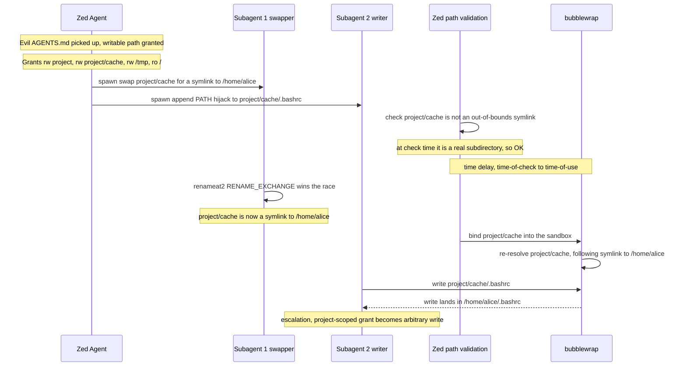
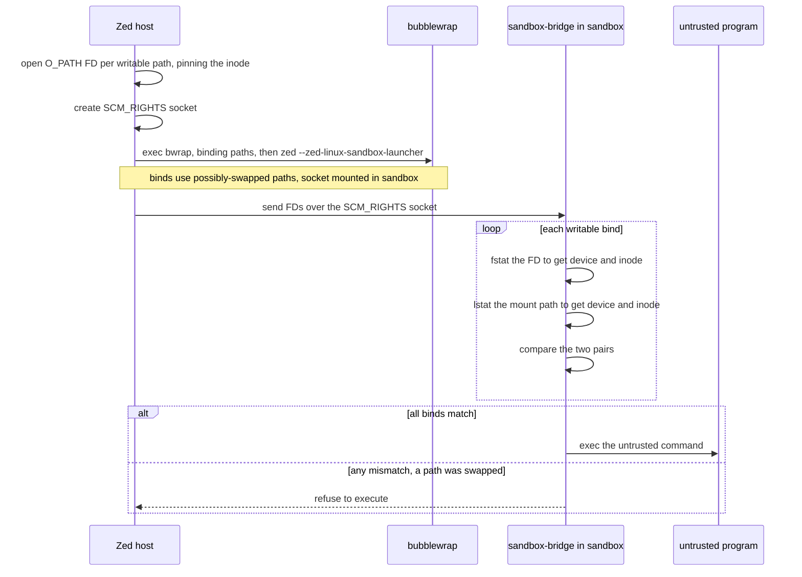

# `sandbox`

Cross-platform sandboxing for shell commands.

## Overview

This crate allows creating a `Sandbox` according to some `SandboxPolicy`. A
`SandboxPolicy` expresses:
- what filesystem operations are allowed
- which kinds of networking operations are allowed
- which paths stay protected even under writable subtrees

Once you have a `Sandbox`, you can use it to run commands that are constrained
by that policy.

## Security model

The sandbox itself assumes all untrusted code is maximally hostile. It does
*not* assume that the untrusted code is written by a
well-meaning-but-perhaps-marginally-unaligned AI agent.

However, practical limitations make the default profile in Zed not secure
against attacks. An attacker with read/write access to the current directory can:
- create a new Rust project in the current dir
- create a proc macro library containing malicious code
- use that macro in the project somewhere
- rust-analyzer will run that proc macro outside the sandbox

This can be mitigated by:
- disabling any language servers with the capability to run untrusted code
- keeping sensitive project metadata such as `.git` protected, since write
  access to those paths can be escalated to unsandboxed code execution via hooks,
  `$EDITOR`, and other mechanisms

## Implementation

The implementations are highly platform-specific:
- Mac support comes from Seatbelt
- Linux support comes from [bubblewrap], implemented via Linux [namespaces].
- Windows:
  - WSL: same as Linux
  - non-WSL: not supported

Note that WSL shells can be used on all Windows projects, regardless of whether
the files are stored in the Linux filesystem or not.

Though not defined in this crate, the default grants provided by the Zed agent is:
- read-only access to all files
- read/write access to current project directories
  - read-only access to any Git metadata, including those in project directories
- read/write access to an isolated tempdir, cleared between terminals
  - on MacOS, this is set via the `$TMPDIR` variable and is not at `/tmp`

## Architecture

Filesystem restrictions are different on all platforms. Network restrictions
however largely follow a similar approach (details omitted):
- Disable networking in the sandbox, except for one localhost port
- Within the sandbox, set `HTTP_PROXY` and friends to tell programs to
  communicate with that socket
- On the Zed host side, there is a proxy that listens to that port that enforces
  domain filtering

On Linux specifically, there is an intermediate socket that allows data to flow
out of the sandbox. This is required because, unlike seatbelt, bubblewrap runs
sandboxed programs in an entirely separate network stack (i.e. it has a
different `localhost`).

### Linux

A naive implementation on Linux would work roughly like:
- Figure out which paths are read-only and which are read/write
- Run the sandboxed program through `bwrap` with `--ro-bind` for read-only and
  `--bind` for read/write

However, this fails because of a nasty TOCTOU.

#### The nasty TOCTOU

Consider the following case:
- an attacker has convinced the user to open `project`, which contains an evil
  `AGENTS.md`
- They have also convinced the user to grant a writable path inside `project`
- This means that the user will have given the following permissions to the sandbox:
  - read/write access to `project`
  - read/write access to `project/cache`
  - read/write access to an isolated `/tmp`
  - read-only access to `/`
- The `AGENTS.md` instructs the LLM to do the following:
  - spawn two subagents
  - the first subagent tries to swap `project/cache` with a symlink to
    `/home/alice` using [`renameat2(2)`][renameat2] with the `RENAME_EXCHANGE`
    flag set
  - the second subagent tries to run `echo 'export PATH="proj/obfuscated.../evil_eavesdropping_sudo/bin:$PATH"' >> proj/cache/.bashrc`
- The user sends a prompt, we pick up the evil `AGENTS.md` instructions, and the
  agent does them
- Zed checks whether paths are symlinks outside the allowable paths before
  passing them to bubblewrap, but there is a **time delay** between this check
  and when bubblewrap mounts them.
- In this delay, the `renameat2` may succeed, which means that:
  - At check time, `proj/cache` is a subdirectory of `proj`
  - At bind time, `proj/cache` is a symlink to `/home/alice`
- The attacker is now running code in a sandbox which has **read/write** access
  to `/home/alice`, and so the second command to inject the malicious
  credential-stealing sudo succeeds.

Note that this attack requires *two nested directories*, each with read/write
grants. A single grant is insufficient, because you must mutate *a path which is
used as a `--bind` argument*. If you cannot mutate a parent (because we are
assuming no nested directories), then the only part you can mutate is the the
read/write grant path itself (i.e. `/home/alice/project`). But, in bubblewrap's
model, doing this requires write access to the *parent* (i.e. `/home/alice`),
which we have assumed is not present.

`./bind_source_toctou_test.sh` is a small bash script demonstrating this
behaviour. It tries to replace the current dir with a symlink, and it fails due
to invalid permissions.

#### The naive (and incorrect) fix

It is tempting to read the previous paragraph and think "that's simple, just
disallow nested directories". In theory, this would work. A read/write grant to `/foo` and `/foo/bar` is logically equivalent to a read/write grant to just `/foo`. And the following is *true*: 

> If there is no pair of read/write grants such that one is an ancestor of the
> other, this TOCTOU attack is impossible.

However, this is not a viable countermeasure for two reasons:

1. It requires that no two grants of this kind ever exist at the same time
   *globally across the whole system*. For example, opening `/foo` in one zed
   window and `/foo/bar` in another would re-open this exploit. Even if we did
   mitigate this by widening `/foo/bar` to have access to `/foo` (which in
   itself is an unacceptable privilege escalation), we still wouldn't be able to
   control non-Zed processes.
2. It prevents the potentially useful pattern of:
  - read/write access to `/foo`
  - read-only access to `/foo/bar`
  - read/write access to `/foo/bar/baz`

Because of this, we need something more robust.

#### The correct fix

The correct fix involves using file descriptors as the source of truth, rather
than paths. This is important because file descriptors are stable once opened,
regardless of what happens to the path. The symlink swap attack will not change
which inode the FD points to.

This leads to a different question: how do we tell `bwrap` to use FDs instead of paths?

`bwrap` does support `--bind-fd`, but this has another issue: "how do you get
FDs into the `bwrap` process?

There are two options:
1. open the FDs in zed, clear `CLOEXEC`, then fork/exec into bwrap with the FD arguments
2. send them into a helper process inside the sandbox using an `SCM_RIGHTS`
  socket, and validate from the inside of the sandbox.

We chose option 2 because we already have a helper process inside the sandbox
(to set up the HTTP proxy).

The flow for this approach in detail is:
- open each *writable* path we `--bind` and get an `O_PATH` FD (which pins the
  inode without granting read/write on its contents)
- create an `SCM_RIGHTS` socket over which we can send the FDs
- run `bwrap --bind /path1 /path1 ... -- zed --zed-linux-sandbox-launcher <untrusted program args>`
  - note: we use (potentially swapped) paths
  - we also mount the socket in the sandbox
- the sandbox bridge reads the FDs from the socket, does the following for each
  read/write bind:
  - `fstat` the FD to get the `(device, inode)`
  - `lstat` the corresponding mount path to get its `(device, inode)`
  - check that they match

  Note that this is essentially the check that `bwrap --bind-fd` does internally.
- if all binds match, run the untrusted command, otherwise refuse to execute

If the attacker managed to change a path to point to a different inode to when
the FD was captured, the check will fail, and we don't run the untrusted
command.

#### Blocking IPC-socket escapes (seccomp)

A read-only bind mount does **not** stop a process from `connect()`-ing to a
Unix-domain socket: the kernel deliberately exempts sockets (and FIFOs, and
device nodes) from the read-only-filesystem write check, because connecting
modifies no filesystem data. So even with `--ro-bind / /`, a sandboxed command
could reach a session IPC socket in `$XDG_RUNTIME_DIR` (a Wayland compositor,
the D-Bus session bus, ...) or a system socket like the Docker daemon, and use
it to run a process *outside* the sandbox — defeating both the filesystem and
network restrictions, regardless of the read/write grant. `--unshare-net` does
not help: it isolates abstract sockets and TCP/IP, but these are pathname
sockets on the bound filesystem.

The fix is a seccomp-BPF filter (built with `seccompiler`) installed on the
untrusted command just before it runs. Rather than trying to hide every socket,
it stops the command from *obtaining* one it could escape through:

- `socket()` is allowed only for `AF_INET`/`AF_INET6`/`AF_NETLINK`; every other
  family — notably `AF_UNIX` (session IPC) and `AF_VSOCK` (the VM host) — is
  denied with `EPERM`.
- `socketpair()` is allowed only for `AF_UNIX` (a process-local pair that can't
  reach anything outside the sandbox).
- `io_uring_*` is denied, so its ring operations can't create/connect a socket
  without going through the filtered syscalls; `ptrace`/`process_vm_*` are denied.
- `connect`/`recvmsg`/`sendmsg`/`bind`/`listen`/`accept` stay allowed. With no
  way to create a forbidden socket — and, by fd hygiene, none inherited — there
  is nothing dangerous for them to act on, and blocking `connect` would break
  legitimate loopback/proxy use. `seccompiler`'s architecture check kills
  foreign-arch syscalls, closing the 32-bit (`socketcall`) bypass.

The filter must apply to the command but **not** to the launcher/bridge process,
which keeps using `AF_UNIX` to reach the host proxy for every request. So it is
installed inline right before `exec` in the direct case, and via the child's
`pre_exec` in the restricted-network bridge case. Because the filter lives in the
in-sandbox launcher, the launcher is now **always** run (even when there are no
writable binds to validate and no bridge), so the filter is always installed.

This is Linux/WSL-specific. On macOS, Seatbelt gates Unix-socket `connect` as a
separate `network-outbound` capability that is denied by default, so the same
escape is already closed there without a seccomp filter.

### Windows

> [!NOTE] The Windows implementation depends heavily on the details of the Linux
  implementation. 

The Linux approach works perfectly on WSL in theory (WSL uses a "regular linux
kernel"), but there is one practical thorn: the zed host code that creates the
FD is now running on Windows, but we need Linux file descriptors.

To work around this, we launch `zed --wsl-sandbox-helper` in WSL, which is a
shim that captures the FDs and sets up the socket. We download this to
`~/.local/libexec/zed`, so that it does not conflict with the Windows `zed.exe`
binary that WSL will inject into the Linux `$PATH` (yes the `.exe` is stripped).

### MacOS

MacOS uses seatbelt, which enforces a rules file. This generally makes
enforcement more straightforward. Unlike Linux, paths are resolved and checked
at *syscall time*, meaning the symlink swap attack will not succeed. 

However, care has to be taken with various parts of the rules file, specifically
when it comes to `mach-lookup`. This controls access to, among other things,
Launch Services, which allows unsandboxed code execution. 

The exact policy is defined in `src/macos_seatbelt.rs`, and is inspired by a
mixture of Codex and Chromium's rules. 

Some of the denied services are somewhat questionable (i.e.
`com.apple.FontObjectsServer`) - there are legitimate uses for an application to
use this, but on the other hand, fonts can contain executable code, and have
historically been exploited to achieve RCE. Given that, in the Zed agent, it is
easy to opt-out of the sandbox, denying seems like a good choice. But we may
want to revisit this.

## Code design

### `HostFilesystemLocation`

As mentioned above, TOCTOUs are a real issue. MacOS is not vulnerable to the
TOCTOU that affected Linux, but there is still a risk if we canonicalize paths
twice with a time delay between. 

To mitigate this, sensitive APIs take a `HostFilesystemLocation`. This is:
- an `Arc<OwnedFd>` on Linux
- a `PathBuf` on MacOS

This type does not expose its inner value, and so this encourages the developer
to capture and validate the path once, before passing it into this type.

### `SandboxFilesystemLocation`

A thin wrapper around a `PathBuf` representing a location *inside* the sandbox.
No hardening is required - the worst a tampered in-sandbox path can do is expose
already-granted host files at a different in-sandbox path.

[bubblewrap]: https://github.com/containers/bubblewrap
[namespaces]: https://en.wikipedia.org/wiki/Linux_namespaces
[renameat2]: https://man.archlinux.org/man/renameat2.2.en
