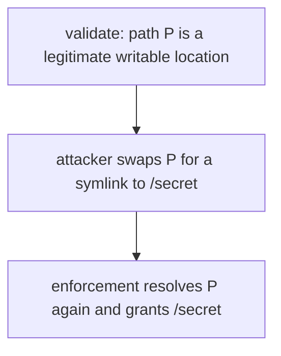
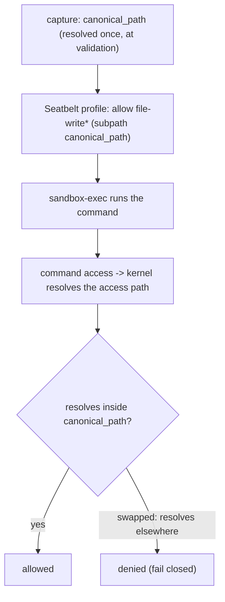
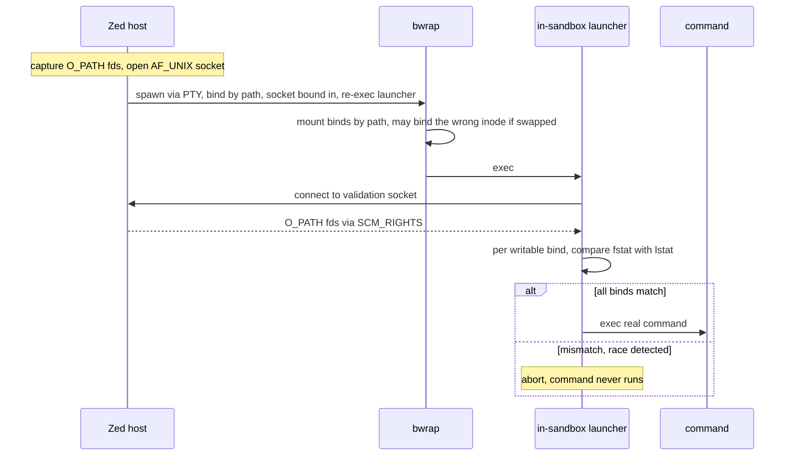
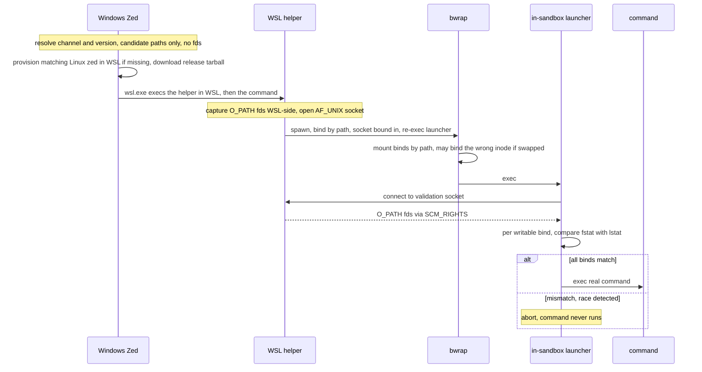

# `sandbox`

Cross-platform sandboxing for shell commands.

## Overview

This crate allows creating a `Sandbox` according to some `SandboxPolicy`. A
`SandboxPolicy` expresses:
- what filesystem operations are allowed
- which kinds of networking operations are allowed
- whether git metadata is protected

Once you have a `Sandbox`, you can use it to run commands that are constrained
by that policy.

## Security model

All untrusted code is assumed to be maximally hostile. We do *not* assume that
the untrusted code is written by a well-meaning-but-perhaps-marginally-unaligned
AI agent.

## Implementation

The implementations are highly platform-specific:
- Mac support comes from Seatbelt
- Linux support comes from [bubblewrap], implemented via Linux [namespaces].
- Windows:
  - WSL: same as Linux
  - non-WSL: not supported

Note that WSL shells can be used on all Windows projects, regardless of whether
the files are stored in the Linux filesystem or not.

## Architecture

Filesystem restrictions are different on all platforms. Network restrictions
however largely follow a similar approach (details omitted):
- Disable networking in the sandbox, except for one localhost port
- Within the sandbox, set `HTTP_PROXY` and friends to tell programs to
  communicate with that socket
- On the Zed host side, there is a proxy that listens to that port that enforces
  domain filtering

On Linux specifically, there is an intermediate socket that allows data to flow
out of the sandbox. This is required because, unlike seatbelt, bubblewrap runs
sandboxed programs in an entirely separate network stack (i.e. it has a
different `localhost`).

### Linux

A naive implementation on Linux would work roughly like:
- Figure out which paths are read-only and which are read/write
- Run the sandboxed program through `bwrap` with `--ro-bind` for read-only and
  `--bind` for read/write

However, this fails because of a nasty TOCTOU.

#### The nasty TOCTOU

Consider the following case:
- an attacker has convinced the user to open `project`, which contains an evil
  `AGENTS.md`
- They have also convinced the user to allow git access
- This means that the user will have given the following permissions to the sandbox:
  - read/write access to `project`
  - read/write access to `project/.git`
  - read/write access to an isolated `/tmp`
  - read-only access to `/`
- The `AGENTS.md` instructs the LLM to do the following:
  - spawn two subagents
  - the first subagent tries to swap `project/.git` with a symlink to
    `/home/alice` [`renameat2(2)`][renameat2] with the `RENAME_EXCHANGE`
    flag set
  - the second subagent tries to run `echo 'export PATH="proj/obfuscated.../evil_eavesdropping_sudo/bin:$PATH"' >> proj/.git/.bashrc`
- The user sends a prompt, we pick up the evil `AGENTS.md` instructions, and the
  agent does them
- Zed checks whether paths are symlinks outside the allowable paths before
  passing them to bubblewrap, but there is a **time delay** between this check
  and when bubblewrap mounts them.
- In this delay, the `renameat2` may succeed, which means that:
  - At check time, `proj/.git` is a subdirectory of `proj`
  - At bind time, `proj/.git` is a symlink to `/home/alice`
- The attacker is now running code in a sandbox which has **read/write** access
  to `/home/alice`, and so the second command to inject the malicious
  credential-stealing sudo succeeds.

Note that this attack requires *two nested directories*, each with read/write
grants. A single grant is insufficient, because you must mutate *a path which is
used as a `--bind` argument*. If you cannot mutate a parent (because we are
assuming no nested directories), then the only part you can mutate is the the
read/write grant path itself (i.e. `/home/alice/project`). But, in bubblewrap's
model, doing this requires write access to the *parent* (i.e. `/home/alice`),
which we have assumed is not present.

#### The naive (and incorrect) fix

It is tempting to read the previous paragraph and think "that's simple, just
disallow nested directories". In theory, this would work. A read/write grant to `/foo` and `/foo/bar` is logically equivalent to a read/write grant to just `/foo`. And the following is *true*: 

> If there is no pair of read/write grants such that one is an ancestor of the
> other, this TOCTOU attack is impossible.

However, this is not a viable countermeasure for two reasons:

1. It requires that no two grants of this kind ever exist at the same time
   *globally across the whole system*. For example, opening `/foo` in one zed
   window and `/foo/bar` in another would re-open this exploit. Even if we did
   mitigate this by widening `/foo/bar` to have access to `/foo` (which in
   itself is an unacceptable privilege escalation), we still wouldn't be able to
   control non-Zed processes.
2. It prevents the potentially useful pattern of:
  - read/write access to `/foo`
  - read-only access to `/foo/bar`
  - read/write access to `/foo/bar/baz`

Because of this, we need something more robust.

#### The correct fix

The correct fix involves using file descriptors as the source of truth, rather
than paths. This is important because file descriptors are stable once opened,
regardless of what happens to the path. The symlink swap attack will not change
which inode the FD points to.

This leads to a different question: how do we tell `bwrap` to use FDs instead of paths?

`bwrap` does support `--bind-fd`, but this has another issue: "how do you get
FDs into the `bwrap` process?

There are two options:
1. open the FDs in zed, clear `CLOEXEC`, then fork/exec into bwrap with the FD arguments
2. send them into a helper process inside the sandbox using an `SCM_RIGHTS`
  socket, and validate from the inside of the sandbox.

We chose option 2 because we already have a helper process inside the sandbox
(to set up the HTTP proxy).

The flow for this approach in detail is:
- open each *writable* path we `--bind` and get an `O_PATH` FD (which pins the
  inode without granting read/write on its contents)
- create an `SCM_RIGHTS` socket over which we can send the FDs
- run `bwrap --bind /path1 /path1 ... -- zed --sandbox-bridge <untrusted program args>`
  - note: we use (potentially swapped) paths
  - we also mount the socket in the sandbox
- the sandbox bridge reads the FDs from the socket, does the following for each
  read/write bind:
  - `fstat` the FD to get the `(device, inode)`
  - `lstat` the corresponding mount path to get its `(device, inode)`
  - check that they match

  Note that this is essentially the check that `bwrap --bind-fd` does internally.
- if all binds match, run the untrusted command, otherwise refuse to execute

If the attacker managed to change a path to point to a different inode to when
the FD was captured, the check will fail, and we don't run the untrusted
command.

### Windows

> [!NOTE] The Windows implementation depends heavily on the details of the Linux
  implementation. 

The Linux approach works perfectly on WSL in theory (WSL uses a "regular linux
kernel"), but there is one practical thorn: the zed host code that creates the
FD is now running on Windows, but we need Linux file descriptors.

Restricting the filesystem means making specific host locations available inside
the sandbox. On Linux/WSL that is a **bind mount**; on macOS it is a Seatbelt
allow-rule. Both, naively, name the location by **path string**.

A path is a *name that is re-resolved on every use*, so there is a gap between
when we validate a location and when the enforcement layer resolves it:

If granted writable, the command can now write `/secret` — an escalation from a
project-scoped grant to an arbitrary-path write (within the user's uid). This is
a classic time-of-check-to-time-of-use (TOCTOU) bug, and it affects **every
writable grant** (worktree roots, writable `.git` dirs, extra write paths), not
just `.git`. Read-only grants are not affected: the whole host is already bound
read-only, so re-exposing a path read-only grants nothing new.

The fix everywhere is the same idea: **bind the validated grant to a kernel
*handle* (an inode), not to a re-resolvable name.** The platforms differ only in
*how* that handle is obtained and checked.

## Key types

### `HostFilesystemLocation`

An **opaque** handle to a location on the *host* that the sandbox may grant
access to. It captures the security-relevant identity of the location **once**,
so the enforcement layer never has to re-resolve a path later. It is
platform-specific inside:

| Platform | Captured identity |
| --- | --- |
| macOS | the fully-canonicalized path (used verbatim as the Seatbelt rule literal) |
| Linux | an `O_PATH` file descriptor pinned to the inode |
| Windows | nothing (the WSL design captures inside WSL — see below) |

It does **not** `Deref` and never hands out its trusted value. The only readable
thing is `untrusted_path_display()`, for showing the user which location is being
granted — that string must **never** be fed back into a sandbox API as the
location's identity. Equality compares the *actual filesystem object* (the inode
behind the fd on Linux; the canonical path on macOS), not the textual path.

### `SandboxFilesystemLocation`

A thin wrapper over a `PathBuf` naming a location *inside* the sandbox (e.g. a
bind-mount destination). It needs no hardening: the worst a tampered in-sandbox
path can do is expose already-granted host files at a different in-sandbox path —
it can never widen which host files are reachable.

## Capture-at-validation

The single most important rule: **validate and capture together, then pass the
captured value around unchanged.**

The producer (the agent, for native Linux/macOS) computes candidate paths from
its own state, validates them (e.g. confirms a `.git` is a real, untampered git
dir), and immediately constructs `HostFilesystemLocation`s. From that point on,
nothing re-derives a location from a path — the `O_PATH` fd / canonical path is
the identity, and it is what eventually reaches the policy.

Pinning the fd at validation time also keeps the inode alive, so its identity
cannot be recycled out from under a later check.

## Per-platform design

### macOS (Seatbelt)

Seatbelt matches the **resolved path of each access** against literal allow-rule
subpaths, and **fails closed**: if a granted path is swapped for a symlink, the
command's accesses resolve *out of* the allowed subpath and are denied — the
grant is never redirected.

So macOS is sealed simply by emitting the captured `canonical_path` as the rule
literal and **never re-canonicalizing** at profile-generation time. There is no
fork/exec or fd handling involved.

### Linux (Bubblewrap)

bwrap performs the mounts with ordinary `--bind <path> <path>`, and `bwrap`
itself is launched by an external PTY (`portable_pty`) that we cannot make
inherit extra file descriptors. So we cannot use bwrap's own `--bind-fd` (which
requires the fd *inside* bwrap). Instead we **detect** a redirected bind and
**fail closed**, replicating what `--bind-fd` does internally but in our own
in-sandbox code:

1. The `Sandbox` holds the captured `O_PATH` fds and listens on a private host
   `AF_UNIX` socket; that socket is bind-mounted into the sandbox.
2. Every restricted-filesystem run re-execs an **in-sandbox validator** (a
   generalization of the existing restricted-network bridge) before the real
   command.
3. After bwrap's mounts, the validator connects to the socket and receives the
   real fds via `SCM_RIGHTS`. For each writable bind it compares
   `fstat(received_fd)` against `lstat(mounted_path)`.
4. Match → `exec` the command. Mismatch (the source was swapped, so bwrap bound
   the wrong inode) → abort; the command never runs.

This is detection, not prevention — but it is sound: the validator runs *after*
the mounts and *before* the command, and a bind mount is frozen once
established, so what the validator stats is exactly what the command would
access.

Network (restricted) is handled by the same in-sandbox re-exec, which also runs
the HTTP-CONNECT bridge to the host proxy; validation and bridging are two duties
of one in-sandbox helper.

### Windows (Bubblewrap in WSL)

bwrap runs inside a WSL distro, launched via `wsl.exe --exec`. Two facts shape
the design:

- Zed is a Windows process: it has **no Linux file descriptors** and cannot see
  WSL inode identity. A `HostFilesystemLocation` captured on Windows therefore
  holds no real identity — only the requested path, carried across as **untrusted
  intent**; the real capture must happen **inside WSL**.
- So everything security-relevant — pinning the inodes and detecting a redirected
  bind — happens WSL-side. Splitting capture (in WSL) from validation (on
  Windows) would drive a process/OS boundary through the middle of the check and
  reopen the TOCTOU, so both stay inside WSL. The helper there reuses the exact
  native-Linux mechanism: capture at startup, then **post-mount** `SCM_RIGHTS`
  detection (not `--bind-fd`).

The design runs the **same Linux host side** as native Linux, but inside WSL:
`wsl.exe` execs a Linux `zed` in `--wsl-sandbox-helper` mode *instead of* bwrap,
and that helper does exactly what `Sandbox::wrap` + the validation-fd sender do
in-process on native Linux — capture the writable binds' `O_PATH` fds (WSL-side,
since Windows holds none), stand up the `SCM_RIGHTS` validation socket, run
bwrap, and let the in-sandbox `--zed-linux-sandbox-launcher` validate after the
mounts. So WSL uses the same `--bind` + post-mount `SCM_RIGHTS` detection as
native Linux, not `--bind-fd`.

Distribution: Zed ships no Linux binary into the distro; the Windows side
provisions one on demand. It deliberately **ignores** the WSL `PATH` — inside
WSL `zed` usually resolves to the *Windows* `zed.exe` via interop, which is not a
Linux binary and can't be the helper — and it does **not** use the public
install script (which puts `zed` on `PATH` and writes desktop entries). Instead
it resolves the running channel + version (dev builds, which have no matching
release, track the latest nightly) and downloads that release's Linux tarball
straight from `cloud.zed.dev/releases`, unpacking it into an off-`PATH` location
(`~/.local/libexec/zed/<channel>`, the conventional spot for executables run by
other programs rather than directly by the user). One managed copy per channel is
kept, tracked by a marker file so an exact version match is reused rather than
re-downloaded. We ship no `bwrap` either; a missing one is surfaced to the user,
same as native Linux.

## Implementation status

| Area | Status |
| --- | --- |
| `HostFilesystemLocation` / `SandboxFilesystemLocation` types | implemented |
| macOS canonical-path seal | implemented |
| Linux SCM_RIGHTS in-sandbox validator | implemented |
| WSL helper (`--wsl-sandbox-helper`: capture+validate in WSL, same SCM_RIGHTS detection as native Linux) | implemented (Windows-only; not exercised by the Linux/macOS CI) |
| WSL helper provisioning (download a matching Linux `zed` release into an off-`PATH` location) | implemented (Windows-only) |

Implementation notes for the Linux validator:

- The in-sandbox launcher (`--zed-linux-sandbox-launcher`) is a re-exec of the
  Zed binary that runs after bwrap's mounts and before the command. It performs
  bind validation and, when needed, the restricted-network HTTP bridge — the two
  duties of one helper. The command runs directly under bwrap when neither is
  needed.
- The writable bind-destination *paths* are passed to the launcher as trusted
  argv (the host sets them before any untrusted code runs); the captured
  `O_PATH` *descriptors* are passed out-of-band over the validation socket via
  `SCM_RIGHTS`. The launcher compares `fstat(received fd)` against
  `lstat(mounted path)` for each, both inside the sandbox, and fails closed on
  any mismatch or missing descriptor.
- Only **writable** binds are validated. Read-only re-binds (protected `.git`
  dirs) need no check: the whole root is already read-only, so re-exposing a
  path read-only can't widen access even if its source was swapped.
- The host keeps the `O_PATH` descriptors alive for the sandbox's whole lifetime
  (in the `ValidationServer`), which also keeps the captured inodes pinned so
  they can't be recycled out from under the check.

WSL note: the WSL path only falls back to exec'ing bwrap directly when there is
no release info to provision a helper from (`wsl_zed_release` is `None`, e.g. a
caller that doesn't supply it). That legacy path binds writable locations by path
string and carries the same bind-source TOCTOU as un-hardened Linux. When release
info *is* present but provisioning fails (no `curl`/`wget`, a download error),
that is surfaced to the user as a sandbox-creation failure — like a missing
`bwrap` — rather than silently downgraded.

[bubblewrap]: https://github.com/containers/bubblewrap
[namespaces]: https://en.wikipedia.org/wiki/Linux_namespaces
[renameat2]: https://man.archlinux.org/man/renameat2.2.en
