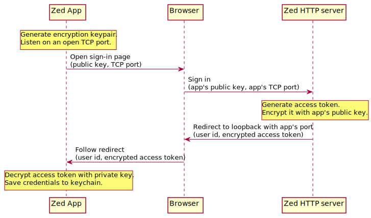
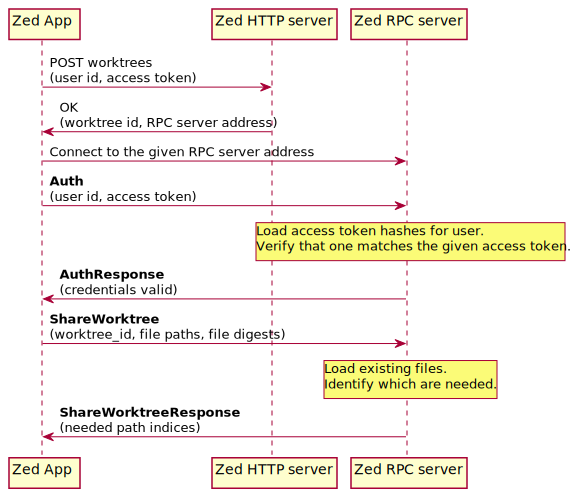

# Collaboration in Zed

## Login

Zed needs to know the identities of the people who are collaborating on a worktree. So the first time that you share a worktree (or try to join someone else's worktree), Zed will prompt you to log in to `zed.dev`.

### Message Flow

Zed relies on a web browser to handle login. This lets you take advantage of the GitHub cookies stored in your browser. It's also recommended by the IETF (see the [Oauth 2 For Native Apps RFC](https://www.rfc-editor.org/rfc/rfc8252.txt)).

This diagram shows what happens when you log in:



## Sharing

Once you're logged in you can share your worktrees. We'll start by providing a *Share* application menu item to share the (first?) worktree in a given window. Clicking this will copy a URL to your clipboard. You can give this URL to other people to let them collaborate on the worktree.

### Semantics

While sharing, the entire state of your worktree is replicated and stored forever on the Zed server. Other collaborators can freely read the last state of your worktree, even after you've quit Zed.

__Potential Scope Cut__ - For now, we won't store the history locally, as this isn't needed for collaboration. Later, we may explore keeping a partial history locally as well, to support using the history while offline. A local history would allow:
* Undo after re-opening a buffer.
* Avoiding redundant uploads when re-opening a buffer while sharing.

When you begin sharing:
* You may or may not have shared a given worktree before. If you *have* shared it before, Zed will have saved a `worktree_id` for this worktree in `~/Library/Application\ Support/Zed/worktrees.toml` (or something like that). If you haven't shared the worktree before, then you need to ask the Zed server for new `worktree_id` to associate with this directory.
* Immediately, you upload a list of all the paths in your worktree, along a digest of each path. The server responds with a list of paths that needs
* First, you upload the contents of all of your open buffers.
* At this point, sharing has begun - you are shown a URL (or it is copied to your clipboard).
* Asynchronously, you upload the contents of all other files in your worktree that the server needs.

While you're sharing:
* Buffer operations are streamed to the Zed server.
* When FS changes are detected to files that you *don't* have open:
  * You again upload to the server a list of the paths that changed and their new digests.
  * The server responds with a list of paths that it needs
  * Asynchronously, you upload the new contents of these paths.
* If a peer requests to open one of your files that you haven't yet asynchronously uploaded, then the server tells you to upload the contents of that file immediately.

When you stop sharing:
  * You immediately stop uploading anything to the Zed server.

This diagram shows the messages that would be sent in the case of a *new* worktree.



### RPC implementation details

The API will consist of resources named with URL-like paths, for example: `/worktrees/1`. You'll be able to communicate with any resource in the following ways:

* `send`: A "fire-and-forget" message with no reply. (We may not need this)
* `request`: A message that expects a reply message that is tagged with the same sequence number as the request.
* `request_stream`: A message that expects a series of reply messages that are tagged with the same sequence number as the request. Unsure if this is needed beyond `subscribe`.
* `subscribe`: Returns a stream that allows the resource to emit messages at any time in the future. When the stream is dropped, we unsubscribe automatically.

Any resource you can subscribe to is considered a *channel*, and all of its processing needs to occur on a single machine. We'll recognize channels based on their URL pattern and handle them specially in our frontend servers. For any channel, the frontend will perform a lookup for the machine on which that channel exists. If no machine exists, we'll select one. Maybe it's always the frontend itself?. If a channel already exists on another server, we'll proxy the connection through the frontend and relay and broadcasts from this channel to the client.

The client will interact with the server via a `api::Client` object. Model objects with remote behavior will interact directly with this client to communicate with the server. For example, `Worktree` will be changed to an enum type with `Local` and `Remote` variants. The local variant will have an optional `client` in order to stream local changes to the server when sharing. The remote variant will always have a client and implement all worktree operations in terms of it.

```rs
enum Worktree {
    Local {
        remote: Option<Client>,
    }
    Remote {
        remote: Client,
    }
}

impl Worktree {
    async fn remote(client, id, cx) -> anyhow::Result<Self> {
        // Subscribe to the stream of all worktree events going forward
        let events = client.subscribe::<WorktreeEvent>(format!("/worktrees/{}", worktree_id)).await?;
        // Stream the entries of the worktree
        let entry_chunks = client.request_stream()

        // In the background, populate all worktree entries in the initial stream and process any change events.
        // This is similar to what we do 
        let _handle = thread::spawn(smol::block_on(async move {
            for chunk in entry_chunks {
                // Grab the lock and fill in the new entries
            }

            while let Some() = events.recv_next() {
                // Update the tree
            }
        }))

        // The _handle depicted here won't actually work, but we need to terminate the thread and drop the subscription
        // when the Worktree is dropped... maybe we use a similar approach to how we handle local worktrees.

        Self::Remote {
            _handle,
            client,
        }
    }
}
```