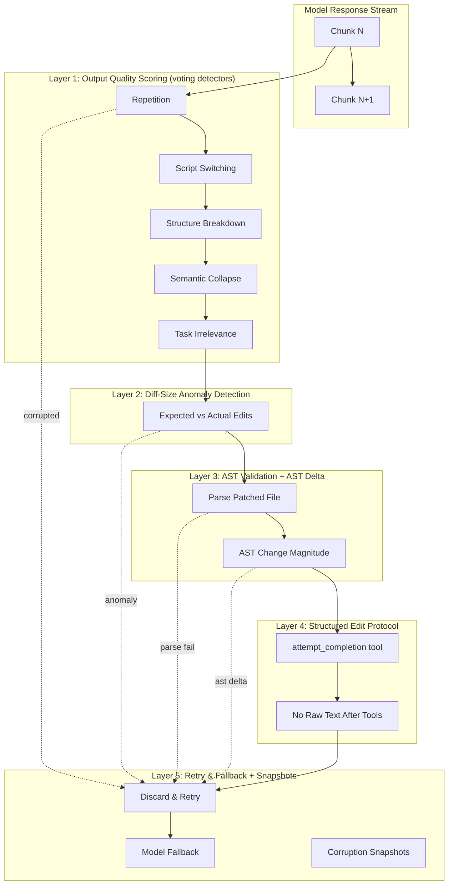

# Agent Corruption Defense System - Design (v2)

## Overview

We propose a **defense-in-depth** architecture with five independent layers, each
catching a different class of corruption. Each layer is self-contained and can be
shipped independently.



---

## Layer 1: Output Quality Scoring (Multiple Detector Votes)

### Purpose
Fast, stateless heuristics applied to a rolling window as the model streams.
Instead of a magical composite score, **each detector votes independently** and
triggers by combined vote count / confidence.

### Design
```
crates/agent/src/output_quality.rs
```

```rust
#[derive(Debug, Clone, Copy, PartialEq, Eq)]
pub enum CorruptionSignal {
    Repetition,
    ScriptSwitching,
    StructureBreakdown,
    SemanticCollapse,
    TaskIrrelevance,
    CharacterClassChaos,
}

/// Report from a single detector.
pub struct DetectorReport {
    pub signal: CorruptionSignal,
    /// 0.0 to 1.0; higher means the detector is more certain
    pub confidence: f32,
}

/// Overall corruption assessment computed from detector votes.
pub struct CorruptionAssessment {
    /// Which detectors fired
    pub triggered_signals: Vec<DetectorReport>,
    /// Combined confidence (e.g., max or average of triggered detectors)
    pub overall_confidence: f32,
}

impl CorruptionAssessment {
    /// True if enough high-confidence signals fired.
    pub fn is_corrupted(&self, config: &CorruptionConfig) -> bool {
        let high_confidence_count = self.triggered_signals.iter()
            .filter(|r| r.confidence >= config.confidence_threshold)
            .count();
        high_confidence_count >= config.min_required_signals
    }
}
```

### Detectors

| Detector | Signal | Confidence | Rationale |
|----------|--------|------------|-----------|
| **Repetition** | `Repetition` | 0.95 | Token loops, degenerate output. Very strong signal. |
| **Script Switching** | `ScriptSwitching` | 0.90 | Rapid Latin → Han → Cyrillic transitions. Hallmark of collapse. |
| **Structure Breakdown** | `StructureBreakdown` | 0.85 | Invalid JSON bracket balance, broken diff structure. |
| **Semantic Collapse** | `SemanticCollapse` | 0.80 | Crude topic drift over rolling window (TF-IDF-ish). |
| **Task Irrelevance** | `TaskIrrelevance` | 0.80 | Output completely unrelated to current task/files. |
| **Character Class Chaos** | `CharacterClassChaos` | 0.75 | Repeated class transitions: code → prose → symbols → code. |

### Rolling Window

```rust
fn handle_text_event(&mut self, new_text: String, event_stream: &ThreadEventStream) {
    // LAYER 1: Output Quality Scoring (rolling window, not per-chunk)
    self.rolling_window.push(&new_text);
    let window_text = self.rolling_window.content();

    let assessment = OutputQualityScorer::assess(window_text, &self.task_context);
    if assessment.is_corrupted(&self.config) {
        event_stream.send_error(
            OutputCorruptionError::QualityAssessment(assessment)
        );
        return;
    }
    // ...existing text handling...
}
```

> **Key**: Individual chunks of JSON/diffs often look malformed in isolation
> but are perfectly valid in aggregate. Score on a **rolling window** (2–8 KB).

### Configuration
```json
{
  "agent": {
    "corruption_defense": {
      "enabled": true,
      "window_size_kb": 4,
      "voting": {
        "min_required_signals": 2,
        "confidence_threshold": 0.75
      }
    }
  }
}
```

---

## Layer 2: Diff-Size Anomaly Detection

### Purpose
Detect when the model returns an edit scope wildly out of proportion to the task.

### Enhancement: Dual Source Estimation

```rust
impl ExpectedEditScope {
    /// Estimate from the user's prompt text.
    pub fn from_prompt(prompt: &str) -> Self { ... }

    /// Estimate from the agent's own plan (if one exists).
    /// Dramatically more accurate because we know what the agent
    /// *intended* to do, not what the user vaguely asked.
    pub fn from_agent_plan(plan: &AgentPlan) -> Self { ... }
}
```

### Heuristics
- **Task keywords**: "rename" → 1 file, few lines; "add feature" → multiple files; "refactor" → unknown
- **Prompt length**: longer prompts often correlate with larger expected changes
- **Agent plan**: if the agent already planned specific edits, use that as the authoritative scope

---

## Layer 3: AST Validation + AST Delta

### Purpose
Before finalizing any edit to a known language file, validate that the patched
result is syntactically valid **and** that the change magnitude matches expectations.

### Enhancement: AST Delta

```rust
/// Computes how much the AST actually changed.
pub struct AstDelta {
    /// Fraction of nodes that changed (0.0 = none, 1.0 = all)
    pub node_change_ratio: f32,
    /// True if a "rename variable" task rewrote 80% of the tree.
    pub suspiciously_large: bool,
}

pub trait AstValidator {
    fn validate(&self, content: &str) -> Result<(), AstValidationError>;
    
    /// New: compare AST before and after to detect suspiciously large changes.
    fn compute_delta(&self, before: &str, after: &str) -> AstDelta;
}
```

### Example

```text
User request: "rename variable x to y"

If AST delta shows:
- 80% of nodes changed

→ Suspicious. Block or flag for confirmation.
```

---

## Layer 4: Structured Edit Protocol (attempt_completion)

### Purpose
Force the model to explicitly signal it's done via a tool call, eliminating open-ended raw text output.

### Design

> **Layer 4 is the cleanest part of the design.** No changes from v1.

```rust
/// A tool the model MUST call to finish its turn.
pub struct AttemptCompletionTool;

impl AgentTool for AttemptCompletionTool {
    const NAME: &'static str = "attempt_completion";
    type Input = AttemptCompletionInput;
    type Output = AttemptCompletionOutput;

    fn description() -> SharedString {
        "Call this tool when you have finished all your work. You must use this tool to complete your turn. Do not output raw text after using tools.".into()
    }
}
```

### System Prompt Changes

> **Important**: After you have finished making all necessary edits, you MUST call the `attempt_completion` tool. Do not output any raw text after your final tool call. If you output raw text without calling `attempt_completion`, your response will be rejected and retried.

### Enforcement

```rust
// After tool results are processed, check if attempt_completion was called
if !this.turn_had_attempt_completion() {
    return Err(CompletionError::MissingCompletionTool);
}
```

---

## Layer 5: Retry-on-Corruption + Snapshots

### Purpose
When any layer detects corruption, discard the response, retry, and optionally fall back.

### Enhancement: Corruption Snapshots

Store the last 4 KB of output when corruption is detected. Redacted if needed, but invaluable for debugging.

```rust
/// Preserved evidence of a corruption event for later analysis.
pub struct CorruptionSnapshot {
    pub model_id: String,
    pub provider: String,
    pub prompt_hash: u64,
    /// Last 4 KB of model output before trigger
    pub last_output: String,
    pub triggered_signals: Vec<CorruptionSignal>,
    pub confidence: f32,
    pub timestamp: Instant,
}

/// Stored alongside CorruptionEvent for telemetry.
pub struct CorruptionEvent {
    pub timestamp: Instant,
    pub layer: &'static str,
    pub model_id: String,
    pub provider: String,
    pub retry_count: u8,
    pub resolved: bool,
    pub snapshot: Option<CorruptionSnapshot>,
}
```

> **Future you**: Without snapshots, questions like "why is GPT-X triggering?" become impossible to answer.

---

## Dual Phase: Implementation Order (ROI)

### Phase A: Ship Immediately (first week) — Highest ROI

```
attempt_completion          ← structural guarantee
retry path                  ← reuse existing infrastructure
telemetry + snapshots       ← cheap and invaluable
```

### Phase B: Core Detectors (week 2)

```
repetition detector
script_switching detector
task_irrelevance detector
```

> These three catch ~80% of genuine corruption events.

### Phase C: Edit-Level Defense (week 3)

```
AST validation
scope anomaly detection
AST delta checking
```

### Phase D: Refinement Layers (week 4+)

```
semantic coherence          ← stateful, more complex
advanced anomaly detection
fallback models             ← reuse existing refusal fallback
```

---

## Files to Modify

| Layer | Files |
|-------|-------|
| 1 | `crates/agent/src/output_quality.rs` (new), `crates/agent/src/thread.rs` |
| 2 | `crates/agent/src/anomaly_detection.rs` (new), `crates/agent/src/tools/edit_file_tool.rs` |
| 3 | `crates/agent/src/ast_validation.rs` (new), `crates/agent/src/tools/edit_session.rs` |
| 4 | `crates/agent/src/tools/attempt_completion_tool.rs` (new), `crates/agent/src/thread.rs` |
| 5 | `crates/agent/src/thread.rs`, `crates/agent_settings/src/` |

---

## Dependencies

- Tree-sitter for AST validation (already in workspace)
- No new external crates needed
