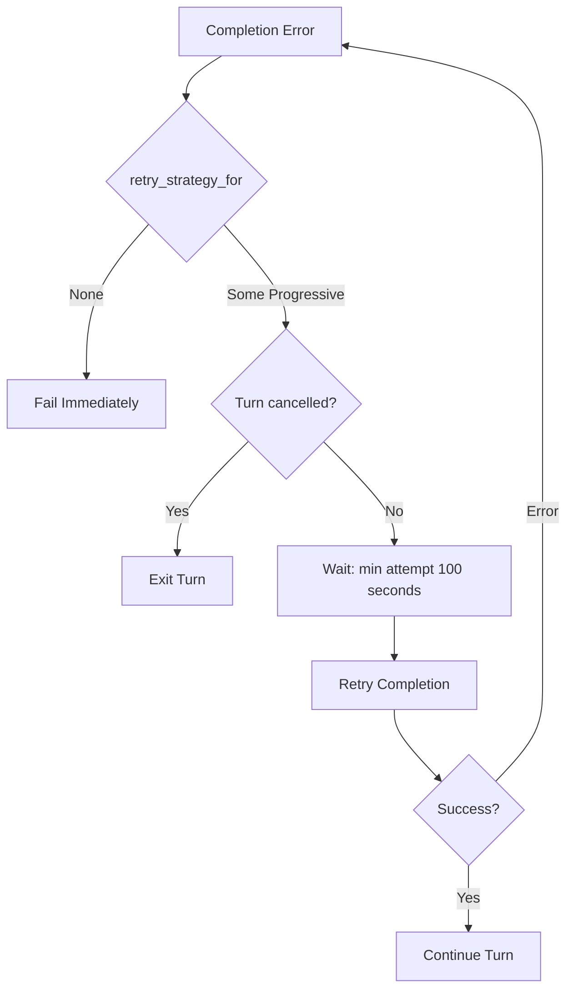

# Forever-Retry with Progressive Timeout - Design

## Overview

Replace the existing `RetryStrategy` variants (`ExponentialBackoff`, `Fixed`)
with a single `Progressive` variant that has no `max_attempts` and computes
delay as `min(attempt, MAX_PROGRESSIVE_DELAY_SECS)` seconds. The retry loop in
`retry_completion_error` already handles cancellation and has no upper-bound
check in the loop itself — the cap lives in `handle_completion_error`. Removing
the cap there makes the loop infinite by default.



---

## Constants

```rust
/// Maximum delay between retries (100 seconds).
pub(crate) const MAX_PROGRESSIVE_DELAY_SECS: u64 = 100;
```

---

## RetryStrategy Redesign

### Current

```rust
enum RetryStrategy {
    ExponentialBackoff { initial_delay: Duration, max_attempts: u8 },
    Fixed { delay: Duration, max_attempts: u8 },
}
```

### Proposed

```rust
enum RetryStrategy {
    /// Linear progressive timeout: delay = min(attempt, MAX_PROGRESSIVE_DELAY_SECS) seconds.
    /// No max_attempts — retries forever until cancelled.
    Progressive,
}
```

All retryable error branches in `retry_strategy_for` return
`Some(RetryStrategy::Progressive)`. Non-retryable branches continue to return
`None`.

---

## handle_completion_error Changes

### Current

`handle_completion_error` checks `attempt > max_attempts` and returns
`Err(anyhow!(error))` if exceeded. It computes delay from the strategy variant.

### Proposed

```rust
fn handle_completion_error(
    &mut self,
    error: LanguageModelCompletionError,
    attempt: u8,
    plan: Option<Plan>,
) -> Result<acp_thread::RetryStatus> {
    let Some(model) = self.model() else {
        return Err(anyhow!(error));
    };

    let auto_retry = if model.provider_id() == ZED_CLOUD_PROVIDER_ID {
        plan.is_some()
    } else {
        true
    };

    if !auto_retry {
        return Err(anyhow!(error));
    }

    let Some(_strategy) = Self::retry_strategy_for(&error) else {
        return Err(anyhow!(error));
    };

    // Progressive delay: 1s, 2s, 3s, ..., 99s, 100s (capped)
    let delay_secs = (attempt as u64).min(MAX_PROGRESSIVE_DELAY_SECS);
    let delay = Duration::from_secs(delay_secs);
    log::debug!("Retry attempt {attempt} with delay {delay:?}");

    Ok(acp_thread::RetryStatus {
        last_error: error.to_string().into(),
        attempt: attempt as usize,
        max_attempts: 0, // 0 = no limit
        started_at: Instant::now(),
        duration: delay,
        meta: None,
    })
}
```

Key changes:
- `attempt` is 1-based on first call (matches existing increment pattern).
- No `max_attempts` check — always returns `Ok(RetryStatus)`.
- `max_attempts` field set to `0` to signal infinite retry.
- `retry_strategy_for` return value is only used for the `None` / `Some`
  distinction; the `RetryStrategy` enum no longer carries delay/attempts data.

---

## retry_strategy_for Changes

### Current

Returns `Some(RetryStrategy::ExponentialBackoff { ... })` or
`Some(RetryStrategy::Fixed { ... })` with varying `max_attempts` (1–4) and
`delay` values.

### Proposed

All `Some(...)` branches return `Some(RetryStrategy::Progressive)`. The delay
and attempt cap are no longer per-error-type — they're universal for retryable
errors.

```rust
fn retry_strategy_for(error: &LanguageModelCompletionError) -> Option<RetryStrategy> {
    use LanguageModelCompletionError::*;
    use http_client::StatusCode;

    match error {
        // Non-retryable: retrying won't help
        HttpResponseError {
            status_code: StatusCode::TOO_MANY_REQUESTS,  // 429 still retryable
            ..
        } => Some(RetryStrategy::Progressive),
        ServerOverloaded { .. } | RateLimitExceeded { .. } => Some(RetryStrategy::Progressive),
        UpstreamProviderError { status, .. } => match *status {
            StatusCode::TOO_MANY_REQUESTS
            | StatusCode::SERVICE_UNAVAILABLE
            | StatusCode::INTERNAL_SERVER_ERROR => Some(RetryStrategy::Progressive),
            status if status.as_u16() == 529 => Some(RetryStrategy::Progressive),
            _ => Some(RetryStrategy::Progressive),
        },
        ApiInternalServerError { .. } => Some(RetryStrategy::Progressive),
        ApiReadResponseError { .. }
        | HttpSend { .. }
        | DeserializeResponse { .. }
        | BadRequestFormat { .. } => Some(RetryStrategy::Progressive),
        SerializeRequest { .. } | BuildRequestBody { .. } | StreamEndedUnexpectedly { .. } => {
            Some(RetryStrategy::Progressive)
        }
        // Catch-all for other 4xx/5xx
        HttpResponseError { status_code, .. }
            if status_code.is_client_error() || status_code.is_server_error() =>
        {
            Some(RetryStrategy::Progressive)
        }

        // Non-retryable — return None
        HttpResponseError {
            status_code: StatusCode::PAYLOAD_TOO_LARGE | StatusCode::FORBIDDEN | StatusCode::UNAUTHORIZED,
            ..
        }
        | AuthenticationError { .. }
        | PermissionError { .. }
        | NoApiKey { .. }
        | ApiEndpointNotFound { .. }
        | PromptTooLarge { .. }
        | PaymentRequired
        | DataRetentionConsentRequired { .. } => None,

        // Unknown / other: still retryable
        HttpResponseError { .. } | Other(..) => Some(RetryStrategy::Progressive),
    }
}
```

> The exact match arm structure is preserved — only the `Some(...)` payload
> changes from `RetryStrategy::Fixed { delay, max_attempts }` or
> `RetryStrategy::ExponentialBackoff { .. }` to `RetryStrategy::Progressive`.

---

## retry_completion_error Changes

### Current

```rust
async fn retry_completion_error(
    this: &WeakEntity<Self>,
    event_stream: &ThreadEventStream,
    cancellation_rx: &mut watch::Receiver<bool>,
    error: LanguageModelCompletionError,
    attempt: u8,
    cx: &mut AsyncApp,
) -> Result<ControlFlow<()>> {
    let retry = this.update(cx, |this, cx| {
        let user_store = this.user_store.read(cx);
        this.handle_completion_error(error, attempt, user_store.plan())
    })??;
    let timer = cx.background_executor().timer(retry.duration);
    event_stream.send_retry(retry);
    futures::select! {
        _ = timer.fuse() => {}
        _ = cancellation_rx.changed().fuse() => {
            if *cancellation_rx.borrow() {
                log::debug!("Turn cancelled during retry delay, exiting");
                return Ok(ControlFlow::Break(()));
            }
        }
    }
    Ok(ControlFlow::Continue(()))
}
```

### Proposed

**No changes needed.** The function already:
1. Delegates to `handle_completion_error` for delay/max computation.
2. Waits on the timer (now progressive).
3. Checks `cancellation_rx` — the only way the infinite loop exits.
4. Returns `Continue` to signal "retry again".

The loop in `run_turn_internal` that calls `retry_completion_error` also needs
no structural change — it already increments `attempt` and loops back on
`Continue`.

---

## retry_after Header Support

When the error provides a `retry_after` hint (e.g., `RateLimitExceeded {
retry_after, .. }`), we should respect it as a **floor** — use whichever is
larger: the progressive delay or the `retry_after` value.

```rust
// In handle_completion_error, after computing progressive delay:
let delay = if let Some(retry_after) = error.retry_after() {
    delay.max(retry_after)
} else {
    delay
};
```

This requires adding a `retry_after()` method on `LanguageModelCompletionError`,
or inspecting the error variant in `handle_completion_error`. The simplest
approach: pass `retry_after` through `RetryStatus.meta` or extend
`retry_strategy_for` to return an optional `Duration` alongside the strategy.

For v1, we can skip this and always use the progressive delay — it will
naturally converge to a value larger than any reasonable `retry_after` within
a few attempts.

---

## Corruption Retry Path (Unchanged)

The corruption retry path in `run_turn_internal` uses its own
`corruption_attempt` counter and `MAX_CORRUPTION_RETRY_ATTEMPTS` cap. It does
**not** call `retry_strategy_for` or `handle_completion_error`. This spec does
not touch it.

```
// Corruption path — still uses BASE_RETRY_DELAY and MAX_CORRUPTION_RETRY_ATTEMPTS
let timer = cx.background_executor().timer(BASE_RETRY_DELAY);
event_stream.send_retry(acp_thread::RetryStatus {
    last_error: error_string.into(),
    attempt: corruption_attempt as usize,
    max_attempts: MAX_CORRUPTION_RETRY_ATTEMPTS as usize,
    started_at: Instant::now(),
    duration: BASE_RETRY_DELAY,
    meta: None,
});
```

---

## Files to Modify

| File | Change |
|------|--------|
| `crates/agent/src/thread.rs` | Replace `RetryStrategy` enum; update `retry_strategy_for`, `handle_completion_error`; add constant; update `retry_completion_error` call sites |
| `crates/agent/src/tests/corruption_retry.rs` | No changes (corruption path unaffected) |
| `crates/acp_thread/src/acp_thread.rs` | No structural changes — `max_attempts = 0` reuses existing `usize` field |

---

## Delay Sequence Example

```
Attempt  Delay   Cumulative
  1       1s      1s
  2       2s      3s
  3       3s      6s
  4       4s      10s
  5       5s      15s
  10     10s      55s
  20     20s     210s  (~3.5 min)
  50     50s    1275s  (~21 min)
  100   100s    5050s  (~84 min)
  101   100s    5150s  (capped from here)
```

After 100 attempts cumulative wait is ~84 minutes — well within reasonable
bounds for a background retry that the user can cancel at any time.
