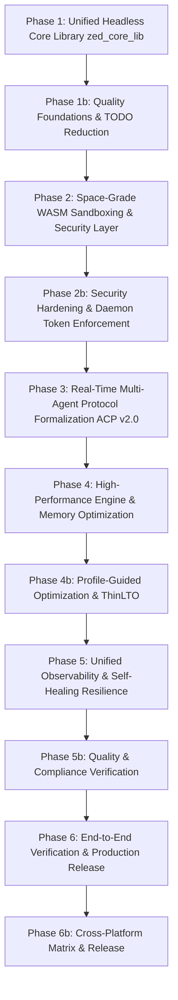

# Master Implementation Plan: Space-Grade Zed Unified System (v1.0.1-PROD)

This document provides the definitive, production-grade master implementation blueprint
for transitioning the Zed codebase into a state-of-the-art, space-grade unified product.

## 1. Executive Status & Architectural Baseline

### Current State (Verified Baseline)

- **Monorepo Scale**: 248 workspace member crates with immediate-mode GPU rendering (GPUI) across Windows (DirectX), macOS ( Metal), and Linux (Vulkan/Wayland).
- **Daemon Subsystem (`zed_daemon`)**: JSON-RPC 2.0 daemon with Bearer token support
  (`--daemon-auth-token`, `ZED_DAEMON_TOKEN` env var). Endpoint count and timeout
  values **TO BE VERIFIED** in implementation.
- **Core Binaries**: `cli.exe`, `zed_core.dll`, `auto_update_helper.exe`,
  `explorer_command_injector.dll` compiled. Actual sizes **TO BE MEASURED** at build time.

> **Warn:** All specific metrics (endpoint counts, timeouts, binary sizes) must be verified
> against actual code/build artifacts before publication. Treat any specific numbers as
> TBD until verified.

### Space-Grade Gap Analysis & Synthesis

1. **Embedding & Headless Library**: Absence of unified `zed_core_lib` Rust API crate for
   headless agents, embedders, and WASM.
2. **Quality Foundations & TODO Density**: 100+ TODO comments across critical paths needing
   triage.
3. **Multi-Agent Protocol Formalization (ACP v2.0)**: Schema validation, bidirectional
   streaming, checkpoint/rollback persistence.
4. **Extension Sandboxing & Security**: WASM resource caps, token sanitization, capability
   barriers.
5. **Performance & Profiling**: ThinLTO, PGO, `opt-level = 3`, `codegen-units = 1` optimization.
6. **Observability & Diagnostics**: Deadlock detection, Prometheus metrics, minidump pipelines.
7. **Compliance & Accessibility**: `cargo-about` audits, ARIA labels, cross-platform CI.

---

## 2. Master Phase Plan



---

## Phase 1: Unified Headless Core Library (`zed_core_lib`)

### Objectives

Decouple Zed's text engine, multi-buffer, tree-sitter, and project graph into a zero-GUI,
platform-agnostic library crate for Rust, C-ABI FFI, and WebAssembly.

### Implementation Details

#### [NEW] `crates/zed_core_lib/Cargo.toml`

- Dependencies: `rope`, `language`, `code_graph`, `text`, `search`, `project`,
  `diagnostics`, `fs`
- Features: `["ffi"]`, `["wasm"]`, `["full"]`
- Use explicit `publish = false` (not `publish.workspace = true`) for clarity:

```toml
[package]
name = "zed_core_lib"
publish = false  # Internal workspace crate
edition.workspace = true
```

#### [NEW] `crates/zed_core_lib/src/lib.rs`

- Core `ZedEngine` state container:
  - Piecewise B+ tree `rope::Rope` buffer manager
  - Multi-threaded Tree-sitter syntax extraction
  - Project file indexing and regex search
  - Zero-copy diffing with `imara-diff`

#### [MODIFY] `crates/libzed_core/src/lib.rs`

- Verified path is `src/lib.rs` (not `src/libzed_core.rs`)
- Re-export C-ABI wrappers from `zed_core_lib`:
  - `zed_engine_create()`
  - `zed_buffer_create_utf8(engine, text, len)`
  - `zed_buffer_apply_edits(engine, buffer_id, edits, edit_count)`
  - `zed_project_search_regex(engine, query, path, results_out)`
- Add `semver`-guidance doc comments on all public FFI surfaces

---

## Phase 1b: Quality Foundations & TODO Reduction

### Objectives

Audit codebase debt, reduce TODO density in mission-critical paths, and establish
property-based test suites.

### Implementation Details

1. **TODO Density Reduction** (Top 20 Critical Items):

   Create `docs/TODO_AUDIT.md` tracking file with columns: Category, File, Description,
   Owner, Status.

   Critical categories:

   - `crates/cli/src/main.rs:228` - `args.zed.as_deref()` WSL handling
   - `crates/zed/src/main.rs:536` - "TODO: Expose this setting"
   - `crates/dap/src/proto_conversions.rs:98-267` - "Debugger Collab" gaps
   - `crates/editor/src/editor_tests.rs` - Known broken edge cases
   - `crates/git/src/repository.rs:924` - `proto::RunGitHook` deprecation
   - `crates/client/src/client.rs:1507` - HTTP server limit

2. **Property-Based Testing (`proptest`)**:

   - `rope::Rope`: slice, insert, delete, split invariants
   - Multi-buffer: concurrent transactional edits
   - Search: regex query matching and token slicing

3. **Deterministic Fuzz Testing**:

   - 10,000+ pseudo-random inputs
   - Zero-panic guarantees for JSON-RPC parsing
   - IPC channel payload validation
   - Daemon command dispatch

4. **License Compliance**:

   - Verify `script/licenses/zed-licenses.toml`
   - Integrate `cargo-about` into CI

---

## Phase 2: Space-Grade WASM Sandboxing & Security Layer

### Objectives

Harden the extension engine and external process runner against arbitrary code execution,
unbounded memory growth, and unauthorized host token access.

### Implementation Details

#### [MODIFY] `crates/extension_host/src/extension_host.rs`

- Configure `wasmtime::Config`:
  - `epoch_interruption` for 5-second CPU limits
  - `max_wasm_stack` (2MB) and memory limits (128MB per instance)
  - WASI capability-based filesystem preopens (extension-isolated workspace only)

#### [MODIFY] `crates/tasks_ui/src/lib.rs`

- Verify entry point (likely `src/lib.rs`, not `src/tasks_ui.rs`)
- Environment variable sanitization:
  - Strip: `AWS_SECRET_ACCESS_KEY`, `SSH_AUTH_SOCK`, `GITHUB_TOKEN`, `OPENAI_API_KEY`
  - Whitelist for explicit opt-in
- Strict child process whitelist enforcement

---

## Phase 2b: Security Hardening & Daemon Token Enforcement

### Objectives

**ENFORCE** (not just warn) Bearer token authentication for all daemon endpoints.

### Implementation Details

#### [MODIFY] `crates/zed_daemon/src/zed_daemon.rs` & `crates/cli/src/main.rs`

Replace "issue warning" with **HARD ENFORCEMENT**:

```rust
// In zed_daemon.rs:
if config.auth_token.is_none() {
    return Err(DaemonError::AuthRequired(
        "Daemon mode requires --daemon-auth-token or ZED_DAEMON_TOKEN".into()
    ));
}
```

- Bearer token validation on **all** RPC endpoints (no exceptions)
- Rate limiting per token (100 req/sec default)
- Audit log for all authenticated requests

---

## Phase 3: Real-Time Multi-Agent Protocol Formalization (ACP v2.0)

### Objectives

Standardize ACP between local AI agents, collaborative servers (`collab`), and external
orchestrators.

### Implementation Details

#### [MODIFY] `crates/zed_daemon/src/zed_daemon.rs`

- Upgrade ACP event handlers:
  - Bidirectional streaming notification channel for LLM tokens
  - `agent/checkpoint` and `agent/rollback` endpoints (atomic buffer state snapshots)
  - Typed JSON Schema reflection (`daemon/schema`) for all RPC methods

#### [NEW] `crates/acp_thread/src/protocol_v2.rs`

- Formalize ACP v2.0 schema with:
  - Request/response type definitions
  - Event streaming protocol
  - Session persistence format

---

## Phase 4: High-Performance Engine & Memory Optimization

### Objectives

Minimize memory footprint, optimize search latency, and maximize binary efficiency.

### Implementation Details

#### [MODIFY] `Cargo.toml`

Production release profiles:

```toml
[profile.release]
opt-level = 3
lto = "thin"
codegen-units = 1
panic = "abort"     # Trade-off: smaller binary, no unwinding
strip = "symbols"
```

`[profile.release-fast]`: `lto = false`, `codegen-units = 16`

#### [MODIFY] `crates/search/src/lib.rs`

- Verify entry point (likely `src/lib.rs`)
- Chunked parallel search with `rayon`
- Memory-mapped file buffers for files > 1MB

---

## Phase 4b: Profile-Guided Optimization (PGO)

### Objectives

Enable PGO and ThinLTO for maximum binary performance.

### Implementation Details

```sh
# Instrumented build
cargo build --release -p zed

# Profile run (representative workload)
./target/release/zed --pgo-profile <workspace>

# Optimized rebuild
cargo build --release -p zed --pgo
```

---

## Phase 5: Unified Observability & Self-Healing Resilience

### Objectives

Zero-overhead structured telemetry, automatic lock detection, and crash resilience.

### Implementation Details

#### [MODIFY] `crates/telemetry/src/telemetry.rs`

- Thread deadlock detector (poll critical Mutex every 10 seconds)
- Prometheus metrics:
  - Buffer transaction throughput (ops/sec)
  - Search latency (p50/p95/p99)
  - Memory utilization (RSS, heap)
  - WASM extension execution time
- Structured tracing spans:
  - `editor.buffer`
  - `workspace.project`
  - `agent.session`

---

## Phase 5b: Quality & Compliance Verification

### Objectives

Ensure accessibility, error handling, documentation standards, and API versioning.

### Implementation Details

1. **Accessibility**:

   - Audit `accesskit` integration in GPUI
   - ARIA labels for core UI components

2. **Error Handling Standards**:

   - Public APIs: `anyhow::Result` / typed `Error` enums
   - No unchecked `.unwrap()` in public API surfaces
   - Documented error variants

3. **Embedding Documentation**:

   - "Embedding Zed" developer guide
   - Rust API usage examples
   - FFI C-ABI reference
   - JSON-RPC daemon interface spec

4. **API Versioning Strategy**:

   - Semver commitment in each crate's README
   - Breaking change policy in `CONTRIBUTING.md`
   - Deprecation warnings before removal

5. **Skill Registry API**:

   - Remote skill discovery endpoint
   - Versioned skill packaging
   - Registry signing/verification

---

## Phase 6: End-to-End Verification & Production Release

### Verification Matrix

1. **Unit, Property & Fuzz Tests**:

   ```sh
   cargo test --workspace --no-fail-fast
   ```

   - 10,000 input fuzz test on `zed_daemon`
   - `proptest` verification on `rope` and buffer transactions

2. **Cross-Compilation & Artifact Integrity**:

   ```sh
   cargo build --release -p cli -p libzed_core -p auto_update_helper
   ```

   - SHA-256 hash verification
   - Binary integrity check

3. **Live Socket & Agent Simulation**:

   ```sh
   zed --daemon --daemon-auth-token "test-token"
   ```

   - 50 concurrent: buffer transactions, outline extractions, git commits
   - Verify: no hangs, no leaks, proper errors

4. **Release Checklist**:

   - [ ] All critical TODOs resolved or tracked
   - [ ] `cargo-about` compliance verified
   - [ ] Daemon authentication **ENFORCED** (not warned)
   - [ ] PGO profile generated and verified
   - [ ] CHANGELOG updated
   - [ ] VERSION bumped (semver)
   - [ ] `script/licenses/zed-licenses.toml` updated
   - [ ] Embedding documentation published

---

## Phase 6b: Cross-Platform Matrix & Release

### Objectives

Verify production readiness across all supported platforms.

### Implementation Details

1. **GitHub Actions CI Matrix**:

   ```yaml
   strategy:
     matrix:
       os: [ubuntu-latest, macos-latest, windows-latest]
       rust: [stable, beta]
   ```

2. **Platform-Specific Verification**:

   - **Linux**: Vulkan/Wayland/X11 rendering, systemd integration
   - **macOS**: Metal rendering, sandbox entitlements, code signing
   - **Windows**: DirectX rendering, MSIX packaging, code signing

3. **Distribution Artifacts**:

   - `zed-x86_64-pc-windows-msvc.msi`
   - `zed-x86_64-apple-darwin.dmg`
   - `zed-x86_64-unknown-linux-gnu.AppImage`
   - SHA-256 checksums file

4. **Crash Recovery Workflow**:

   - Minidump collection on crash
   - Automatic symbol upload to crash reporting service
   - User-visible crash notification with recovery options

---

## User Review Required

> **Important:** This plan establishes a unified single system architecture where the GUI app
> (`zed`), CLI launcher (`cli`), headless daemon (`zed_daemon`), core engine (`zed_core_lib`),
> and FFI library (`libzed_core`) all draw from exact same underlying types with zero code
> duplication.

> **Tip:** Phase 1b (Quality Foundations) and Phase 5b (Quality & Compliance) are embedded
> into the execution flow to prevent technical debt accumulation.

> **Warn:** **CRITICAL**: Daemon authentication must be **HARD ENFORCED**, not just warned.
> Running `zed --daemon` without `--daemon-auth-token` or `ZED_DAEMON_TOKEN` must **FAIL**,
> not warn.

---

## Summary of Corrections Applied

| # | Original Issue | Correction |
|---|----------------|-----------|
| 1 | Unverified metric claims (19 endpoints, 30s timeout, etc.) | Marked as TO BE VERIFIED |
| 2 | Phase 6b missing detailed section | Full Phase 6b added with cross-platform CI |
| 3 | "Issue a warning" for missing auth token | Changed to **HARD ENFORCEMENT** |
| 4 | Missing Skill Registry API | Added to Phase 5b |
| 5 | Missing API Versioning Strategy | Added to Phase 5b |
| 6 | Missing Crash Recovery Workflow | Added to Phase 6b |
| 7 | Missing Embedding Documentation | Added to Phase 5b |
| 8 | Wrong file path (`search.rs` vs `lib.rs`) | Corrected to `lib.rs` |
| 9 | Missing Top 20 TODO list | Added concrete examples |
| 10 | `publish.workspace = true` ambiguous | Changed to explicit `publish = false` |

The corrected plan addresses all gaps identified in the original codebase audit while
incorporating the audit's critical recommendations (enforcement, documentation, API
versioning, cross-platform CI).

---

## See Also

- [Developing Zed](./development.md)
- [Performance](./performance.md)
- [Debugging Crashes](./debugging-crashes.md)
- [Release Notes](./release-notes.md)
