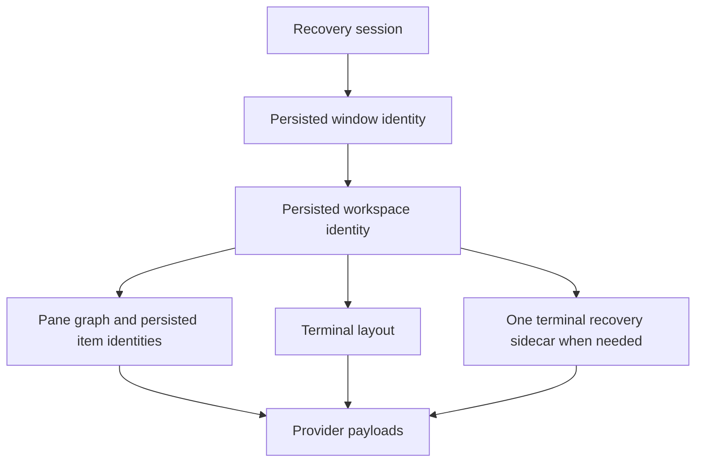

# Serialization and recovery: review map

## Status

Implementation tip: `9705328c1532dce794fbaba67600a4fe181676d6` on `kb/serialization-fixes`.
The upstream-main baseline is `25b5569dd231e740922cfebafa26b1a6c08531e8`, selected before implementation.
There are 24 implementation/test commits: the original 17 plus seven append-only convergence repairs.
The earlier audit's readiness assessment was disproved by further review and is superseded by this document.
The final source passed 2,008 tests, with two existing tests ignored, and affected-package project Clippy.
Each new commit also passed targeted validation against its own cumulative tree, without later working-tree changes.
Native and visual behavior remains unverified.
This is a review branch, not a claim of lossless recovery under every interruption or storage failure.

## The persistence contract

Recovery requires saved contents and a saved route to those contents.
Runtime entity IDs alone cannot identify that route across launches.



The implementation has five responsibilities:

1. **Identity and ownership.**
   Window IDs are reserved before window construction, and allocation failure propagates without changing GPUI's construction APIs (`crates/session/src/session.rs:213`).
   Saved-item reservations cover graph references and provider rows, while live owners and in-flight writes are tracked separately (`crates/workspace/src/workspace.rs:8227–8244`, `:8130–8168`, `crates/workspace/src/item.rs:502–510`).
   Provider table keys use `(workspace_id, item_id)`, not globally unique item IDs.
2. **Ordered publication.**
   Workspace publication waits for captured payload tasks before writing the graph (`crates/workspace/src/workspace.rs:8099–8100`).
   Terminal payload admission applies to both panel publication and the independent item queue (`crates/terminal_view/src/persistence.rs:27`, `crates/terminal_view/src/terminal_view.rs:423`).
   These are coordinated writes, not one transaction spanning every payload, window, and session.
3. **Owned restoration.**
   Restoration survives cancellation of an outer waiter and preserves panes created while it awaits (`crates/workspace/src/workspace.rs:8391–8412`, `:8490–8502`).
   Item failures become visible retained references alongside healthy items, rather than hiding the healthy panes (`crates/workspace/src/persistence/model.rs:431`).
   Setup retry and final-publication retry are separate; publication retry does not deserialize the installed panes again (`crates/workspace/src/workspace.rs:7887`, `:12532`).
4. **Explicit disposition.**
   Failed references cannot report successful Save or Save As; Cancel retains them and explicit Discard removes them (`crates/workspace/src/item.rs:171`, `crates/workspace/src/pane.rs:2311`).
   Retry cannot overwrite newer editor text, steal an existing pane item's persisted identity, or complete into a closed tab (`crates/editor/src/items.rs:1417–1432`, `crates/workspace/src/invalid_item_view.rs:89`).
   Failed center tabs cannot move into a destination that cannot persist them, and failed terminals cannot move to another workspace (`crates/workspace/src/pane.rs:3950`, `crates/terminal_view/src/terminal_view.rs:2022–2028`).
5. **Close and transfer barriers.**
   Explicit Save/Discard is not invalidated by an unrelated center-graph publication failure.
   Terminal publication remains fallible before closing or unbinding (`crates/workspace/src/workspace.rs:3932`).
   An explicit project move waits for restoration, publication, and detach completion, then reopens the captured saved ID (`crates/workspace/src/multi_workspace.rs:1067`).

### Independent opens versus restoration

An independent open of an already-owned saved workspace gets a fresh saved identity and opens the requested paths without copying the owner's tabs or recovery metadata (`crates/workspace/src/workspace.rs:2229–2251`, `:12573–12615`).
The original owner keeps its dirty editors.
An unowned saved workspace restores normally, while an explicit by-ID open joins or reuses its owner.
Explicit project moves use the transfer barrier described above rather than this independent-open path.

## Why the follow-up repairs were necessary

| Review counterexample                                          | Final correction                                                                          |
| -------------------------------------------------------------- | ----------------------------------------------------------------------------------------- |
| Two workspaces use the same provider item ID                   | Remove global uniqueness from seven payload tables and keep workspace-scoped reads/writes |
| Different item kinds allocate the same graph ID                | Reserve one workspace-wide graph namespace                                                |
| A normal nonserializable editor or preview enters the graph    | Make eligibility explicit and omit items with no restorable source                        |
| One saved item fails                                           | Install healthy panes and retain an actionable failed tab                                 |
| Retry meets a newer live editor buffer                         | Keep differing recovery text in a separate fileless buffer                                |
| A source queue drains after an item moves                      | Reject stale editor and terminal owners before rebinding or writing                       |
| A terminal graph is unreadable while new terminals are created | Preserve the primary value and publish new state through one recovery sidecar             |
| A terminal batch fails after its first split                   | Prepare the complete batch before pane activation or installation                         |
| A repaired graph collides with a queued new terminal           | Check admission before every terminal payload submission                                  |
| Empty hidden terminal panel is flushed and reopened            | Do not create an unsolicited shell for an entirely empty graph                            |
| Old detached publication races a replacement owner             | Keep ownership through publication and final unbinding                                    |
| Startup is interrupted after the back window restores first    | Preserve the saved relative window order while restoration is incomplete                  |
| A Markdown preview moves without its source editor             | Resolve its saved path from the source editor and replace its workspace subscription      |
| Cleanup treats all reserved IDs as live forever                | Retain committed, unresolved, live, and in-flight references, not bare reservations       |

The failed-item presentation extends the existing `InvalidItemView` UI.
The terminal recovery presentation follows the existing failed-terminal UI rather than adding a separate recovery window.
The terminal design uses at most two graph keys per workspace: primary and one recovery sidecar.
Successful reconciliation writes the primary graph and deletes the sidecar in one savepoint (`crates/terminal_view/src/persistence.rs`, `TerminalDb::save_panel`).
No extra journal, generic rollback framework, workspace-cloning framework, or fallible GPUI constructor layer was added.

## Commit map

| #   | Commit       | Scope                                                                         |
| --- | ------------ | ----------------------------------------------------------------------------- |
| 1   | `261aba00a7` | Startup admission and foreground-independent shutdown capture                 |
| 2   | `ea8ebc3089` | Ordered editor recovery writes                                                |
| 3   | `ec26da43b3` | Saved-text fallback when the backing file cannot open                         |
| 4   | `2960adbd88` | Persistent-storage requirement for hot exit                                   |
| 5   | `46dabb89fa` | Distinct workspaces with matching roots                                       |
| 6   | `8ed2a9364b` | GC candidate revalidation and metadata errors                                 |
| 7   | `55e90a5276` | Per-app Zed test database isolation                                           |
| 8   | `d64eb31dc8` | Logical session/window identity infrastructure                                |
| 9   | `f189c84545` | Persisted item-ID and publication primitives                                  |
| 10  | `4c66c75462` | Shared persisted graph/payload/metadata identities                            |
| 11  | `956d7f6243` | Ordered terminal-panel shutdown publication                                   |
| 12  | `550728123d` | Owned workspace restoration and hot-exit publication                          |
| 13  | `6ef18899d0` | Independent-open ownership claims                                             |
| 14  | `66c5fe5e9a` | Grouped close consent and session removal                                     |
| 15  | `c7640f345b` | By-ID local session restoration                                               |
| 16  | `932f9ec917` | Identifier-scoped remote mock endpoints                                       |
| 17  | `f4736cf323` | Inactive remote-member restoration                                            |
| 18  | `263ca68e9f` | Fresh mock starts versus reconnects                                           |
| 19  | `48cb1b345d` | Fallible window reservations and interrupted window order                     |
| 20  | `412ca9df70` | Workspace-scoped provider keys and payload-query errors                       |
| 21  | `bcc324985e` | Editor recovery metadata and live-buffer protection                           |
| 22  | `2f457a6bb5` | Failed-tab disposition, namespace liveness, Retry, and lifecycle repairs      |
| 23  | `f5ea7d71e3` | Terminal recovery, payload admission, atomic installation, and close flushing |
| 24  | `9705328c15` | Markdown eligibility and moved-preview ownership                              |

The series is substantial: before this audit update, 53 files, 21,820 insertions, and 1,965 deletions relative to the baseline.
The two largest new commits are core restoration and terminal recovery; their regression cases remain with the mechanisms they exercise.
Earlier commits were not rebased or rewritten.

### PR extraction constraints

The small startup, ordered-write/fallback, persistent-storage, GC, and test-isolation subjects can be reviewed separately.
Window reservations, provider schemas, editor recovery, core restoration, terminal recovery, and Markdown ownership are distinct follow-up review subjects.
Do not merge the item-identity switch without the provider-schema and core/terminal follow-up repairs.
Keep commits 22–23 in the same integration PR unless their intermediate behavior is explicitly accounted for.
The tested parents are the preceding commits in this branch, not arbitrary cherry-picks onto main.
Any extracted or reordered PR branch needs its own validation.
No PR was opened by this work.

## Automated evidence

| Suite             |    Passed | Ignored |
| ----------------- | --------: | ------: |
| Component preview |         6 |       0 |
| DB                |         9 |       0 |
| Editor            |     1,041 |       1 |
| Git UI            |       159 |       0 |
| Image viewer      |         6 |       0 |
| Keymap editor     |        45 |       0 |
| Markdown preview  |        34 |       0 |
| Onboarding        |         2 |       0 |
| Recent projects   |        35 |       0 |
| Remote            |        36 |       0 |
| Session           |        12 |       0 |
| Sqlez             |        20 |       0 |
| Terminal view     |       124 |       0 |
| Workspace         |       374 |       0 |
| Zed binary        |       105 |       1 |
| **Total**         | **2,008** |   **2** |

The affected-package `./script/clippy` run passed with release, all-targets, all-features, and denied warnings.
It covered the provider crates and the changed agent, debugger, search, settings, collab, and visual-runner constructor consumers.
Per-candidate validation also checked Zed targets and the component-preview example, using the existing runtime-shader feature where Command Line Tools lacked `metal`.
Service-backed collab integration runtime tests were not run.
The two ignored tests remain the existing editor line-joining and Zed restored-window edit-state tests.

Scheduler sweeps cover window reservations, owner transfer, publication retry, terminal admission and failed batches, empty-panel reload, and both moved-preview modes.
Red controls include the original provider-key constraints, project transfer without the detach barrier, failed publication without Retry, terminal installation before batch completion, empty-panel shell creation, and Markdown's destination-project path lookup.
These controls used the relevant parent/WIP implementation or narrowly disabled fixes, not uniformly pristine bare-main builds.
Expected outputs include exact text and filename/language values, unchanged failed payload bytes, saved workspace/item identities, pane selection/pins, and actual entity release before reopening.
Healthy restored terminals may update their cwd; failure-preservation tests distinguish that legitimate update from mutation of an unresolved payload.

Local logs, candidate patches, tree hashes, and validation manifests are under `target/serialization-series/`.
The final candidate manifest is `convergence-split-final/final_validation.json`.
Those ignored artifacts are not uploaded CI evidence.
Temporary candidate overlays preserved all tracked file contents and logical index entries.
Raw index bytes changed during the first overlay through an unverified writer; no source or staged-content change resulted, and the exception is recorded in that manifest.

## Unchanged limits

- Native shutdown still allows **200 ms** for quit futures (`crates/gpui/src/app.rs:75`, `:1007–1014`).
  Pending work beyond that deadline is not guaranteed to complete.
- Database policy remains WAL with `synchronous=NORMAL` (`crates/db/src/db.rs:168–173`).
  No power-loss durability experiment was performed.
- Historical local-workspace GC still has its existing seven-day eligibility threshold (`crates/workspace/src/persistence.rs:2759`).
  The proposed indefinite workspace-retention policy was not included.
- Unreadable persistence is reported rather than overwritten speculatively.
  An unrepaired storage fault can prevent pre-close publication and keep the window open.
- Native Windows session-end and real SSH/WSL/Docker behavior remain unverified.

## Manual checks still required

Use disposable data and an application built from this branch.
These checks take about two minutes each after the build and any remote connection setup.

### Local recovery and movement

```sh
mkdir -p /tmp/zed-recovery-review
printf 'ON_DISK\n' > /tmp/zed-recovery-review/note.txt
```

1. Open the folder, change `note.txt` without saving, and create an untitled editor with different text in another pane.
2. Pin a tab and use **Open Project in New Window**.
3. Verify both texts, the pane arrangement, and the pin survive the move.
4. Quit and reopen twice, verifying the texts and active workspace.
5. With Terminal Panel unused, reload once and verify that no shell tab appears automatically.

### Failed terminal recovery

1. Create two named terminal tabs in a split and pin one.
2. In workspace settings, set `terminal.shell` to `{"program":"/nonexistent-zed-review-shell"}`, then quit and reopen.
3. Verify failed slots remain visible and Cancel retains them.
4. Reset `terminal.shell` to `"system"`, press Retry, and verify names, pins, and selection without duplicate tabs.
5. Quit and reopen once more.

### Markdown and remote members

1. Move only a saved Markdown preview from folder A to an unrelated folder B, close A, then reopen B.
2. Repeat with Follow mode and verify it follows B's active Markdown editor.
3. With remote connections already configured, retain two remote projects and a local scratch project with distinct unsaved text.
4. Leave scratch active, quit, and reopen twice, verifying all three texts and their workspace identities.

Please run these checks before treating native or visual behavior as verified.
Do not force a machine crash to validate this series.
