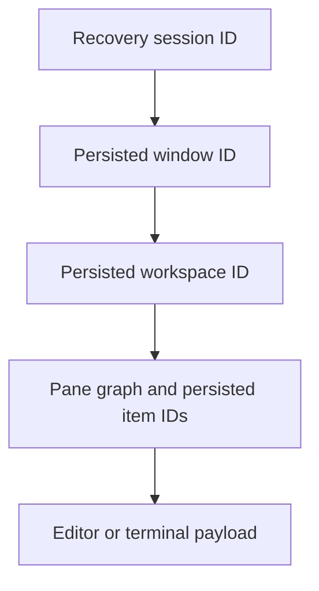

# Serialization and recovery: review map

## Status

Implementation tip: `f4736cf3238c7a40318fcdeb95df2f955c1837c5` on `kb/serialization-fixes`.
The series starts at `25b5569dd231e740922cfebafa26b1a6c08531e8`, the upstream-main baseline selected before implementation.
There are 17 implementation/test commits, each validated against its own staged tree rather than the larger working tree.
Nothing has been pushed and no PR has been opened.
Automated validation is green; native and visual smoke checks below remain unverified.
This is not a claim of lossless recovery under every interruption or storage failure.

## The model

Recovery needs both the saved contents and a saved route to those contents.
The identities in that route must not be confused with runtime entity or window IDs.



- Session lineage and runtime-to-persisted window mapping are in `crates/session/src/session.rs:18` and `:185`.
- Workspace publication captures item writes, waits for them, and then saves the graph in `crates/workspace/src/workspace.rs:7723` and `:7847`.
- Restoration owns its driving task and suppresses snapshots before installation in `crates/workspace/src/workspace.rs:7972`.
- Terminal-panel shutdown captures state before awaiting background publication in `crates/terminal_view/src/terminal_panel.rs:1041` and `:1103`.
- Whole-window membership is cleared only after grouped close consent in `crates/workspace/src/workspace.rs:12292` and `crates/workspace/src/persistence.rs:1929`.
- Startup attempts the saved active member and remaining local/remote members by ID in `crates/zed/src/main.rs:1448` and `:1648`.
- Live remote ownership is resolved before trusting an unflushed saved row in `crates/workspace/src/workspace.rs:11659`.

These are coordinated writes, not one transaction spanning every editor, pane, window, and session.
SQL completion is not a power-loss guarantee.

## Commit boundaries

| #   | Commit       | Scope                                                                                                            |
| --- | ------------ | ---------------------------------------------------------------------------------------------------------------- |
| 1   | `261aba00a7` | Admit the instance before publishing recovery state; capture shutdown writes without a new foreground dependency |
| 2   | `ea8ebc3089` | Order editor recovery writes                                                                                     |
| 3   | `ec26da43b3` | Recover saved text when its backing file cannot be opened                                                        |
| 4   | `2960adbd88` | Require persistent storage before suppressing save prompts                                                       |
| 5   | `46dabb89fa` | Preserve distinct workspaces whose roots match                                                                   |
| 6   | `8ed2a9364b` | Revalidate GC candidates and preserve candidates on filesystem errors                                            |
| 7   | `55e90a5276` | Isolate Zed test databases between app contexts                                                                  |
| 8   | `d64eb31dc8` | Add persisted session/window identity infrastructure                                                             |
| 9   | `f189c84545` | Add persisted item-ID allocation, providers, and fallible publication primitives                                 |
| 10  | `4c66c75462` | Use the same persisted item IDs in graphs, payloads, metadata, and cleanup                                       |
| 11  | `956d7f6243` | Flush terminal-panel state at shutdown in publication order                                                      |
| 12  | `550728123d` | Own restoration, preserve graphs on item failure, and require successful publication for hot exit                |
| 13  | `6ef18899d0` | Separate independent workspace ownership, including pending remote opens                                         |
| 14  | `66c5fe5e9a` | Coordinate close consent, session removal, and failure repair across a window                                    |
| 15  | `c7640f345b` | Restore session members by saved identity and enable LastSession lineage preservation                            |
| 16  | `932f9ec917` | Give the remote test transport independent identifier-scoped server endpoints                                    |
| 17  | `f4736cf323` | Restore inactive remote members and continue after an active-member failure                                      |

Suggested stacked PR boundaries are **1**, **2–3**, **4**, **5–6**, **7–8**, **9**, **10–12**, **13**, **14**, and **15–17**.
These boundaries separate review subjects without splitting the active graph/payload identity switch across PRs.
The tested parents are the preceding commits in this series; arbitrary cherry-picks directly onto main are not claimed to be validated.
Commit 8 deliberately leaves session-lineage preservation disabled until the later close and startup changes are present.
Commit 15 is an intermediate integration step; inactive remote members require commit 17.

The implementation/test series is large: 28 files, 10,785 insertions and 1,438 deletions before this audit.
Large regression modules and fixture changes are included in those figures, not hidden from them.
Unnecessary residual test rearrangements were removed rather than committed as another large cleanup.

## Intentional behavior change

An independent open of a workspace that already has a live or pending owner receives a fresh saved identity and opens the requested paths without copying the owner's tabs or recovery metadata.
The original workspace keeps its dirty editors and recovery records.
An unowned saved workspace still restores under its existing identity, and an explicit by-ID open reuses its owner.
This also preserves move-to-new-window restoration after the previous owner has been removed.
The policy and its saved-root-order regression are in commit 13.

A cross-workspace cloning implementation was rejected and removed after tests exposed mixed source revisions and missing destination metadata.
No generic snapshot or cloning framework is included.

## Regression evidence

Expected results use distinct Unicode text sentinels, unchanged backing-file contents, exact raw database bindings, and explicit pane/member identities.
Tests do not establish recovery merely by counting entities or checking that a payload row exists.

| Adversarial case                                        | Observed failing control                                               |
| ------------------------------------------------------- | ---------------------------------------------------------------------- |
| Older editor write completes after the latest request   | Original serialization persisted the older text                        |
| Backing file cannot be opened                           | Removing recovery fallback failed both opening routes                  |
| Two saved workspaces acquire matching roots             | Original deletion/index behavior removed or rejected one identity      |
| GC observes stale paths or a metadata error             | Original deletion behavior failed candidate-preservation assertions    |
| Runtime item ID collides with another saved item        | Runtime-keyed payload writes overwrote the other editor's text         |
| Item restoration fails after another item succeeds      | Suppressing error propagation replaced the saved graph                 |
| Terminal graph remains behind the debounce at quit      | Disabling the quit callback left the old graph                         |
| A second close prompt remains unanswered                | Parent close behavior removed the first workspace's session membership |
| Saved root order differs from requested order           | The intermediate opener restored the requested order instead           |
| Two remote opens are pending on the same saved identity | Disabling ownership separation gave both the same server identifier    |
| Local session members have colliding roots              | Root lookup restored the wrong active workspace ID                     |
| Local scratch is active above two saved remote members  | Skipping inactive remotes omitted both saved remote IDs                |
| Two protocol clients share one mock endpoint            | Aliasing endpoints disconnected the first client                       |
| A live remote owner's row has not been flushed          | Saved-row validation rejected the owner and waited for Retry/Cancel    |

Controls used either parent/baseline implementations with required test seams or narrowly disabled fixes.
They were not all pristine bare-main builds, and additional boundary tests are not all red without the fix.
The final remote tests cover two restarts, same-host identical roots, different roots, mixed hosts, root-free unsaved buffers, disabled-sidebar startup, and a failed active remote followed by healthy scratch recovery.

## Final automated validation

| Suite           |    Passed | Ignored |
| --------------- | --------: | ------: |
| Editor          |     1,035 |       1 |
| Workspace       |       330 |       0 |
| Terminal view   |        99 |       0 |
| Session         |         6 |       0 |
| DB              |         9 |       0 |
| Sqlez           |        20 |       0 |
| Remote          |        35 |       0 |
| Recent projects |        35 |       0 |
| Zed binary      |       104 |       1 |
| **Total**       | **1,673** |   **2** |

Zed and the component-preview example passed their build checks.
The project Clippy command passed for all affected packages, with release, all-targets, all-features, and denied warnings as imposed by `script/clippy`.
The final source hashes match the source validated by that Clippy run.
All 11 session tests, the owner-reuse regression, and eight workspace/transport tests passed scheduler seeds 0–19 in the final validation.
Earlier commit-specific sweeps also covered restoration, terminal shutdown, editor ordering, and grouped close.

The two ignored tests were already ignored: editor line joining and Zed restored-window edit state.
Initial timeouts and failing fixtures were investigated; the final complete runs above finished successfully.
Linker unwind-table and dependency future-compatibility warnings were observed during builds.

Local evidence is retained under `target/serialization-series/`, including `finalize-summary.json`, per-commit handoffs, reviewed patches, source hashes, and red/green logs.
Those ignored build artifacts are not part of a published PR and must not be treated as uploaded CI evidence.

## Limits and deferred policy

### Native shutdown and storage

The native shutdown deadline remains **200 ms** in `crates/gpui/src/app.rs:75`.
When quit futures exceed that deadline, the existing path logs a timeout at `crates/gpui/src/app.rs:1007–1014`; this series does not guarantee completion beyond it.
The database configuration remains WAL with `synchronous=NORMAL` in `crates/db/src/db.rs:168–173`.
No power-loss experiment, native Windows session-end test, or native SSH/WSL/Docker smoke test was performed.

### Failed restoration

An item-deserialization failure leaves the workspace's restoration guard set rather than publishing a reduced graph.
Automatic workspace snapshots remain suppressed while that guard is set (`crates/workspace/src/workspace.rs:7728`, `:7983–7999`).
Healthy session members still restore, and the failure is reported through the existing prompt/toast paths.
Fresh-instance retry is tested; in-place retry after repairing arbitrary provider/database failures is not claimed.
The worst-case consequence is that the affected workspace cannot complete automatic recovery publication until restoration succeeds; users must handle its save prompts explicitly.

### Historical-workspace retention

The seven-day GC eligibility rule for applicable historical local workspaces remains in `crates/workspace/src/persistence.rs:2757`.
This series fixes stale-candidate and metadata-error deletion, not a new indefinite-retention policy.
A proposed guard retaining every workspace with graph items was kept out and preserved locally as `target/serialization-series/session-retention.patch`.
That policy has no finite retention duration while references remain and can retain historical workspace records indefinitely.
It needs an explicit product decision before a separate PR, not an undocumented safety tradeoff.

## Manual checks still required

Use disposable data and this branch's built application, not another installed release.
These checks start after building and, for the remote case, after configuring the connection.

### Local check: about two minutes

```sh
mkdir -p /tmp/zed-recovery-review
printf 'ON_DISK\n' > /tmp/zed-recovery-review/note.txt
```

1. Open the folder, edit `note.txt` without saving, and create an untitled editor with different text in another pane.
2. Open the same folder independently in a new window and verify that it does not inherit the first window's tabs.
3. Confirm the first window still contains both unsaved texts, then quit and reopen.
4. Check the texts, active editor, pane arrangement, and sidebar state, then repeat quit/reopen once.

### Remote check: about two minutes with connections ready

1. Keep two remote projects and a local scratch project in one window, with distinct unsaved text in each.
2. Leave the local scratch project active, change a terminal tab name or split, and quit immediately.
3. Reopen twice and check all three texts, the active scratch project, and terminal layout/title.
4. Confirm the backing files remain unchanged on disk.

Please run these checks before treating visual and native-process behavior as verified.
Do not force a machine crash to validate this series.
