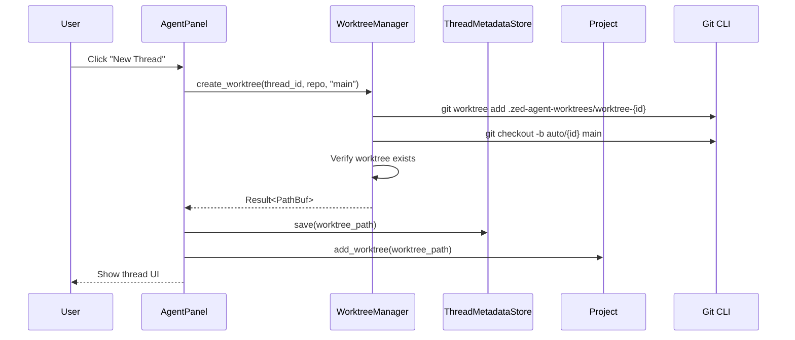
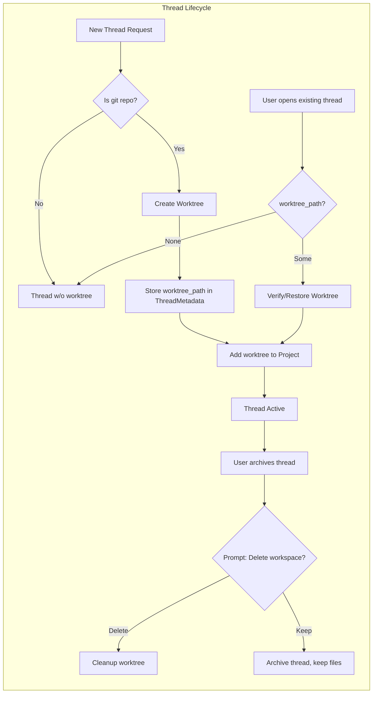
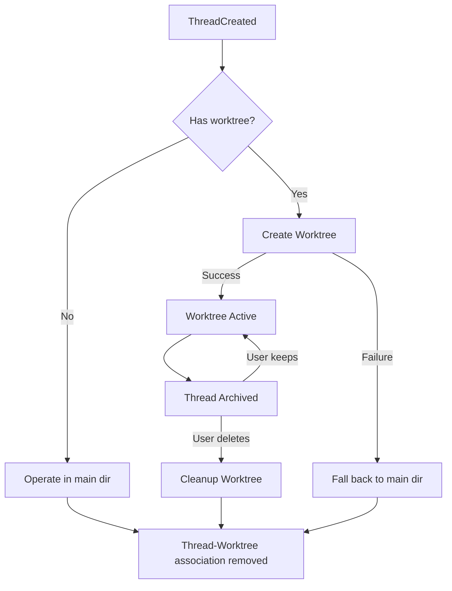

# Design: Auto Worktree Creation on New Thread

## Architectural Overview

The feature hooks into the existing thread creation flow and the thread's relationship with its project. A new crate `agent_worktree` (or module within `agent_ui`) provides a `WorktreeManager` that coordinates worktree lifecycle. The `Thread` and `AgentPanel` components interact with this manager.

```
┌──────────────────────────────────────────────────────────────┐
│                         User Action                           │
│                    "Open New Thread"                          │
└──────────────────────────────────────────────────────────────┘
                              │
                              ▼
┌──────────────────────────────────────────────────────────────┐
│                  Thread Creation Flow                         │
│              (AgentPanel / Agent)               │           │
│  1. Detect if project is git repo                            │
│  2. Check `auto_create_worktree` setting                    │
│  3. Determine default branch (main/master)                    │
│  4. Invoke WorktreeManager::create_worktree()                 │
│  5. Store worktree path in ThreadMetadata                   │
│  6. Add worktree to Project as a new worktree store         │
└──────────────────────────────────────────────────────────────┘
                              │
                              ▼
┌──────────────────────────────────────────────────────────────┐
│                 WorktreeManager (new module)                  │
│                                                               │
│   + create_worktree(thread_id, repo_path, base_branch)       │
│   + recover_worktree(thread_id, repo_path)                  │
│   + cleanup_worktree(thread_id)                             │
│   + get_worktree_path(thread_id) -> Option<Path>            │
│                                                               │
│   Internally executes:                                       │
│     git worktree add --no-checkout                            │
│       {.git parent}/.zed-agent-worktrees/worktree-{id}       │
│     git checkout -b {auto-branch} {base_branch}            │
└──────────────────────────────────────────────────────────────┘
                              │
                              ▼
┌──────────────────────────────────────────────────────────────┐
│               Thread ↔ Worktree Association                   │
│                                                               │
│   ThreadMetadata now includes:                                │
│     worktree_path: Option<PathBuf>                            │
│                                                               │
│   Thread metadata DB schema is extended with a new column    │
└──────────────────────────────────────────────────────────────┘
```

## Key Components and Modules

### 1. `crates/agent_worktree` (New Module or Crate)

A new internal crate (or a module within `agent_ui`) that encapsulates all worktree lifecycle management. This keeps the worktree logic testable and isolated from the UI.

#### `WorktreeManager` (Singleton / Global Entity)
- **Responsibility**: Coordinates creation, recovery, and cleanup of git worktrees for agent threads.
- **Lifecycle**: Initialized once on app startup (or lazily on first thread creation).
- **Methods**:
  - `async fn create_worktree(&self, thread_id: &SessionId, repo_path: &Path, base_branch: &str) -> Result<PathBuf, WorktreeError>`
  - `async fn ensure_worktree_exists(&self, thread_id: &SessionId, repo_path: &Path, base_branch: &str) -> Result<PathBuf, WorktreeError>` — idempotent, used when loading an existing thread
  - `fn get_worktree_path(&self, thread_id: &SessionId) -> Option<PathBuf>` — reads from an in-memory map backed by `ThreadMetadata` db lookups
  - `async fn cleanup_worktree(&self, thread_id: &SessionId) -> Result<(), WorktreeError>` — removes the worktree directory and runs `git worktree remove`.

#### Error Types
```rust
pub enum WorktreeError {
    NotAGitRepository,
    GitBinaryNotFound,
    BranchNotFound { branch: String },
    WorktreeAlreadyExists(PathBuf),
    Io(std::io::Error),
    // ...
}
```

### 2. Thread Metadata Extension

The `ThreadMetadata` struct in `crates/agent_ui/src/thread_metadata_store.rs` is extended with:

```rust
pub struct ThreadMetadata {
    // ... existing fields ...
    /// Path to the git worktree associated with this thread, if any.
    pub worktree_path: Option<PathBuf>,
}
```

This requires a new SQLite migration to add the `worktree_path` column to the `thread_metadata` table.

### 3. Settings Extension

A new boolean setting `auto_create_worktree` is added to `AgentSettingsContent` or a new `AgentWorkspaceSettings`:

```rust
// crates/settings_content/src/agent.rs (or similar)
fn auto_create_worktree_enabled(&self) -> bool {
    true // default
}
```

User-facing `settings.json` entry:
```json
{
  "agent": {
    "auto_create_worktree": true
  }
}
```

### 4. Thread Creation Flow (AgentPanel / AgentService)

When a new thread is created, the flow is augmented as follows:

1. **User clicks "New Thread"**
2. `AgentPanel::new_thread()` is called
3. Before or immediately after `Thread::new()` is constructed, the panel calls `WorktreeManager::create_worktree()`.
4. If successful, the returned `PathBuf` is stored in the thread's metadata.
5. The new worktree is added to the `Project` via `project.add_worktree(worktree_path)` so the agent can operate on it.
6. The thread UI updates when the worktree is ready.



### 5. Thread Load / Recovery Flow

When Zed restarts and the user opens an existing thread:

1. `ThreadMetadata` is read from the DB.
2. If `worktree_path` is `Some(path)`:
   - Verify the path exists.
   - If yes: add the worktree to the Project.
   - If no: attempt to recreate it (if it was accidentally deleted), or fall back to the main project directory.
3. If `worktree_path` is `None`: behave as before (operate in the main project directory).

### 6. Thread Switching Flow

When the user switches from Thread A to Thread B:

1. The active thread in the panel changes.
2. The `Project` is updated to reflect the new thread's worktree context:
   - The worktree for the newly active thread is added to the `Project`.
   - Open file tabs are reconciled (tabs for files not in the new worktree are closed or show a "file not found" indicator).
3. The editor displays the new worktree's file tree.

### 7. Cleanup Flow

When a thread is archived or deleted:

1. User archives thread `T`.
2. A modal or notification prompts: "Delete associated workspace files?" with options `Delete`, `Keep`, `Check worktree disk usage`.
3. If the user chooses `Delete`, `WorktreeManager::cleanup_worktree(thread_id)` is invoked.
4. This runs `git worktree remove <path>` and ensures the directory is cleaned up.
5. The `ThreadMetadataStore` updates `worktree_path` to `None` (or leaves it, depending on archive semantics).

## Data Flow



## State Machine: Thread-Worktree Relationship



## Database Schema Changes

### Migration: Add `worktree_path` to `ThreadMetadata`

```sql
-- Up
ALTER TABLE thread_metadata ADD COLUMN worktree_path TEXT;

-- Down
ALTER TABLE thread_metadata DROP COLUMN worktree_path;
```

## Invariants

1. If a thread has a `worktree_path`, that path must be a valid git worktree on disk (or recovery must be attempted on load).
2. No two threads can point to the same worktree path.
3. If `auto_create_worktree` is true, any new thread in a git project must have a non-None `worktree_path`. (Exception: creation failure with fallback.)
4. When a user switches threads, the `Project`'s active worktreeset must always reflect the currently active thread's worktree.
