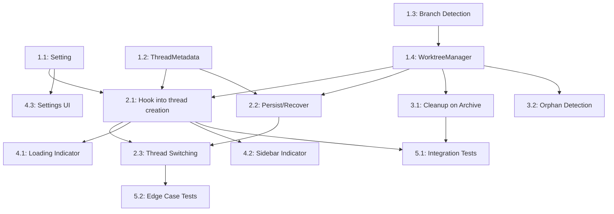

# Tasks: Auto Worktree Creation on New Thread

Tasks are ordered by dependency. Each task maps to one or more requirements from `requirements.md`.

## Phase 1: Foundation (No UI Changes)

### Task 1.1: Add `auto_create_worktree` Setting
**Reqs**: REQ-9, REQ-13  
**Files**:
- `crates/settings_content/src/agent.rs`
- `crates/agent_settings/src/agent_settings.rs`

**Description**:
Add a new boolean setting `auto_create_worktree` to `AgentSettingsContent` with a default of `true`. Wire it through the settings infrastructure so it is accessible via `AgentSettings::auto_create_worktree(cx)`.

**Acceptance Criteria**:
- Setting appears in Zed's settings UI under the agent section.
- Default value is `true`.
- Setting can be toggled and persists across restarts.
- Existing tests pass.

---

### Task 1.2: Extend `ThreadMetadata` with `worktree_path`
**Reqs**: REQ-4, REQ-6  
**Files**:
- `crates/agent_ui/src/thread_metadata_store.rs`
- `crates/db/sqlez` (migration)

**Description**:
Add `worktree_path: Option<PathBuf>` to the `ThreadMetadata` struct. Add a SQLite migration that adds a `worktree_path TEXT` column to the `thread_metadata` table. Update all `save`, `load`, and `column` methods to handle the new field. Ensure `None` values (legacy threads) are correctly handled.

**Acceptance Criteria**:
- Migration runs cleanly on existing DBs (column added with NULL default).
- `ThreadMetadata::worktree_path` round-trips through the DB.
- `worktree_path` is `None` for all existing threads (backward compat).
- All existing `ThreadMetadataStore` tests pass.

---

### Task 1.3: Implement Default Branch Detection
**Reqs**: REQ-2  
**Files**:
- `crates/git/src/repository.rs` (or new utility)

**Description**:
Implement a function `fn detect_default_branch(repo_path: &Path) -> Result<String>` that determines the default branch of a git repo. Logic:
1. Check `git symbolic-ref refs/remotes/origin/HEAD` for the remote default.
2. Fall back to checking if `main` or `master` exists locally.
3. Fall back to `main` as a convention.

**Acceptance Criteria**:
- Returns `"main"` for repos with a `main` branch.
- Returns `"master"` for repos with a `master` branch but no `main`.
- Prefers remote HEAD detection when available.
- Returns an error for non-git directories.

---

### Task 1.4: Implement `WorktreeManager`
**Reqs**: REQ-1, REQ-2, REQ-3, REQ-5  
**Files**:
- New crate: `crates/agent_worktree/` or new module: `crates/agent_ui/src/worktree_manager.rs`

**Description**:
Implement the `WorktreeManager` entity with the following core methods:

```rust
impl WorktreeManager {
    /// Creates a new git worktree at the standard path, based on `base_branch`.
    pub async fn create_worktree(
        &self,
        thread_id: &SessionId,
        repo_path: &Path,
        base_branch: &str,
    ) -> Result<PathBuf, WorktreeError>;

    /// Ensures the worktree for this thread exists. If it already exists on disk, returns the path.
    /// If the stored path is gone, attempts recreation.
    pub async fn ensure_worktree_exists(
        &self,
        thread_id: &SessionId,
        repo_path: &Path,
        base_branch: &str,
    ) -> Result<PathBuf, WorktreeError>;

    /// Removes the worktree directory and runs `git worktree remove`.
    pub async fn cleanup_worktree(
        &self,
        thread_id: &SessionId,
    ) -> Result<(), WorktreeError>;
}
```

The worktree naming convention is `{repo_parent}/.zed-agent-worktrees/worktree-{thread_id}/`. Internally, this runs:
```bash
git worktree add --no-checkout {path}
cd {path} && git checkout -b auto/agent-{thread_id} {base_branch}
```
Use the existing `git_binary_in_worktree` path resolution for locating `git`.

**Acceptance Criteria**:
- `create_worktree` creates a valid git worktree on disk.
- The worktree HEAD is at the `base_branch` commit, not the user's current branch.
- Running `create_worktree` twice with the same `thread_id` is idempotent (returns existing path).
- `cleanup_worktree` removes the worktree directory and deregisters it from git.
- Unit tests cover: creation, idempotency, cleanup, error cases (no git, no branch).

---

## Phase 2: Integration (Thread Lifecycle)

### Task 2.1: Hook Worktree Creation into New Thread Flow
**Reqs**: REQ-1, REQ-2, REQ-7, REQ-8, REQ-9, REQ-10  
**Files**:
- `crates/agent_ui/src/agent_panel.rs` (or wherever `NewThread` action is handled)
- `crates/agent/src/agent.rs`

**Description**:
When a new native agent thread is created via `NewThread` action:

1. Check if `auto_create_worktree` setting is enabled.
2. Check if the project has a git repository (via `GitStore`).
3. If both are true, call `WorktreeManager::create_worktree(thread_id, repo_path, base_branch)`.
4. If successful, store the resulting `PathBuf` in `ThreadMetadata::worktree_path`.
5. Call `project.add_worktree(worktree_path)` to add the worktree to the project context.
6. If creation fails, log the error and fall back to the main project directory (NFR-3).

Do **not** attempt worktree creation for:
- Non-git projects (REQ-8)
- Remote/SSH projects (REQ-10)
- When the setting is disabled (REQ-9)

**Acceptance Criteria**:
- New threads in git projects get a worktree, threads in non-git projects do not.
- Worktree creation failure does not block thread creation.
- When setting is disabled, no worktree is created.
- Agent can edit files in the worktree (via project context).

---

### Task 2.2: Persist and Recover Worktree on Thread Load
**Reqs**: REQ-6  
**Files**:
- `crates/agent_ui/src/agent_panel.rs`
- `crates/agent_ui/src/thread_metadata_store.rs`

**Description**:
When an existing thread is loaded (e.g., after Zed restart):

1. Read `ThreadMetadata::worktree_path` from the DB.
2. If `Some(path)`, verify the path exists on disk.
3. If it exists, add the worktree to the project context.
4. If it does not exist, call `WorktreeManager::ensure_worktree_exists()` to attempt recreation.
5. If recreation fails, fall back to the main project directory and show a notification.

**Acceptance Criteria**:
- Thread reuses its existing worktree after Zed restart.
- If worktree was manually deleted, recovery is attempted.
- If recovery fails, the thread still opens (in main project dir) with a user-visible notification.

---

### Task 2.3: Thread Switching Updates Project Worktree Context
**Reqs**: REQ-11  
**Files**:
- `crates/agent_ui/src/agent_panel.rs`
- `crates/project/src/project.rs`

**Description**:
When the user switches threads in the agent panel:

1. The newly active thread's `worktree_path` (if any) is added to the `Project`.
2. The previously active thread's worktree may be removed from the `Project` or kept (design choice: keeping is simpler and allows background agents to continue working).
3. Open editor tabs that reference files not in the new worktree are either:
   - Closed gracefully, or
   - Marked as "unavailable" (file not found indicator).
4. The project panel refreshes to show the active thread's worktree files.

**Acceptance Criteria**:
- Switching threads updates the visible file tree.
- Editor tabs reflect the correct worktree context.
- No stale file references remain open.

---

## Phase 3: Lifecycle Management

### Task 3.1: Worktree Cleanup on Archive/Delete
**Reqs**: REQ-5  
**Files**:
- `crates/agent_ui/src/thread_metadata_store.rs`
- `crates/agent_ui/src/agent_panel.rs`

**Description**:
When a thread is archived or deleted:

1. If the thread has a `worktree_path`, prompt the user with a notification/dialog:
   - "This thread has an associated workspace. Would you like to delete it?"
   - Options: `Delete workspace`, `Keep files`
2. If `Delete workspace` is chosen, call `WorktreeManager::cleanup_worktree()`.
3. Update `ThreadMetadata::worktree_path` to `None`.

For deleted threads (not just archived), the same cleanup prompt should appear.

**Acceptance Criteria**:
- Cleanup prompt appears only for threads with a worktree.
- Choosing "Delete" removes the worktree from disk and from git's worktree list.
- Choosing "Keep" leaves the files on disk.
- No prompt for threads without a worktree.

---

### Task 3.2: Orphan Worktree Detection
**Reqs**: REQ-5 (extended)  
**Files**:
- `crates/agent_ui/src/worktree_manager.rs`

**Description**:
On Zed startup, scan the `.zed-agent-worktrees/` directory for worktrees whose associated thread no longer exists in the metadata DB. Present a notification to the user listing orphan worktrees and offering to clean them up.

This is a nice-to-have for disk space management (NFR-4).

**Acceptance Criteria**:
- Orphan directories are detected on startup.
- User can clean them up in bulk or individually.
- No false positives (worktrees with valid thread associations are not flagged).

---

## Phase 4: UI and Polish

### Task 4.1: Loading Indicator During Worktree Creation
**Reqs**: NFR-2  
**Files**:
- `crates/agent_ui/src/conversation_view.rs`

**Description**:
While `WorktreeManager::create_worktree()` is in progress, show a loading state in the thread UI with text "Setting up workspace...". This replaces the blank thread state during the 2-3 second worktree creation window.

**Acceptance Criteria**:
- Loading indicator is visible during worktree creation.
- Indicator disappears once the worktree is ready (or on failure).
- Indicator is not shown when the feature is disabled.

---

### Task 4.2: Thread Worktree Info in Sidebar
**Reqs**: (UX improvement)  
**Files**:
- `crates/agent_ui/src/thread_metadata_store.rs`
- `crates/sidebar/src/thread_switcher.rs`

**Description**:
Show a small visual indicator in the thread list/sidebar for threads that have an associated worktree (e.g., a git branch icon or the worktree branch name). This helps the user understand which threads are isolated.

**Acceptance Criteria**:
- Threads with worktrees show a worktree/branch indicator in the sidebar.
- Threads without worktrees show no extra indicator.
- The branch name is accurate.

---

### Task 4.3: Settings UI for `auto_create_worktree`
**Reqs**: REQ-9, REQ-13  
**Files**:
- `crates/settings_ui/src/settings_ui.rs`

**Description**:
Add a toggle in the Zed settings UI for the `auto_create_worktree` setting, under the Agent section. Include a description: "Automatically create an isolated git worktree for each new agent thread, branching from main/master."

**Acceptance Criteria**:
- Toggle is visible and functional in settings UI.
- Description text is clear.
- Changing the setting takes effect on the next new thread (no restart required).

---

## Phase 5: Testing

### Task 5.1: Integration Tests for Worktree Lifecycle
**Reqs**: All  
**Files**:
- `crates/agent_ui/tests/` or `crates/agent/tests/`

**Description**:
Write integration tests covering:

1. **Happy path**: New thread in git repo gets a worktree based on main.
2. **Multiple threads**: Two threads get separate worktrees, edits don't conflict.
3. **Non-git project**: Thread operates in main dir, no worktree.
4. **Setting disabled**: No worktree created.
5. **Restart persistence**: Thread reuses worktree after simulated restart.
6. **Cleanup**: Archiving a thread and choosing "Delete" removes the worktree.
7. **Fallback**: Worktree creation failure falls back to main project dir.
8. **Thread switching**: Switching threads updates project context.

**Acceptance Criteria**:
- All test scenarios pass.
- Tests use real git operations (no mocks for git CLI).

---

### Task 5.2: Edge Case Tests
**Reqs**: REQ-10, NFR-3, NFR-5  
**Files**:
- `crates/agent_worktree/tests/` or `crates/agent_ui/tests/`

**Description**:
Test edge cases:

1. **Remote project**: SSH/remote projects do not attempt worktree creation.
2. **Bare repo**: Opening a thread on a bare git repo.
3. **Worktree already exists on disk**: Idempotent behavior.
4. **Disk space exhausted**: Graceful error handling.
5. **Concurrent thread creation**: Creating two threads simultaneously doesn't race.

**Acceptance Criteria**:
- Edge cases are covered and pass.
- No panics on unexpected states.

---

## Dependency Graph



## Summary

| Phase | Tasks | Estimated Effort | Reqs Covered |
|-------|-------|-------------------|--------------|
| Phase 1: Foundation | 1.1–1.4 | 3-4 days | REQ-1,2,3,4,5,9,13 |
| Phase 2: Integration | 2.1–2.3 | 3-4 days | REQ-1,2,6,7,8,9,10,11 |
| Phase 3: Lifecycle | 3.1–3.2 | 1-2 days | REQ-5, NFR-4 |
| Phase 4: UI/Polish | 4.1–4.3 | 2-3 days | NFR-2, REQ-9,13 |
| Phase 5: Testing | 5.1–5.2 | 2-3 days | All |
| **Total** | **12 tasks** | **11-16 days** | |
