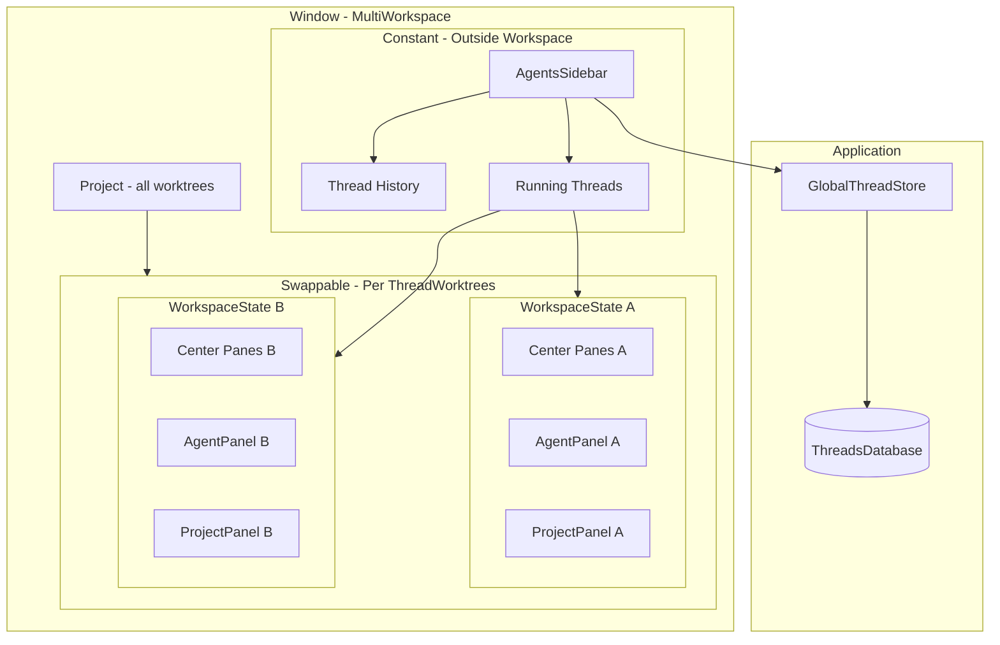

# MultiWorkspace Agent V2 Refactor


This is a multi-phase project to enable Agent V2's vision: a threads sidebar that can switch between projects within a single window, with global thread management and folder ownership.

---

## Phase 1: GlobalThreadStore Infrastructure

Adapt the existing `ThreadStore` to be global and add the data structures for project path associations and folder ownership tracking. **Note:** Association UI is deferred to Phase 3 - all threads will have empty paths initially.

### 1.1 Make ThreadStore Global

Add Global wrapper pattern (similar to `HistoryManager`):

```rust
// In crates/agent/src/thread_store.rs
struct GlobalThreadStore(Entity<ThreadStore>);
impl Global for GlobalThreadStore {}

impl ThreadStore {
    pub fn init(cx: &mut App) { ... }
    pub fn global(cx: &App) -> Entity<Self> { ... }
}
```

Initialize in [`crates/zed/src/main.rs`](crates/zed/src/main.rs) near other global inits.

### 1.2 Add Project Paths to Thread Storage

**Database migration** - Add `project_paths` column to threads table in [`crates/agent/src/db.rs`](crates/agent/src/db.rs):

```rust
// DbThreadMetadata - add project_paths for quick access
pub struct DbThreadMetadata {
    pub id: acp::SessionId,
    pub title: SharedString,
    pub updated_at: DateTime<Utc>,
    pub project_paths: Vec<PathBuf>,  // NEW
}

// DbThread - add with serde default for backwards compat
pub struct DbThread {
    // ... existing fields ...
    #[serde(default)]
    pub project_paths: Vec<PathBuf>,  // NEW
}
```

### 1.3 Folder Ownership Tracking

Add ownership tracking to `ThreadStore`:

```rust
pub struct ThreadStore {
    threads: Vec<DbThreadMetadata>,
    // Tracks which folders are owned by which window
    folder_owners: HashMap<PathBuf, WeakWindowHandle<Workspace>>,
    // Tracks which thread is actively open in which window
    active_threads: HashMap<acp::SessionId, WeakWindowHandle<Workspace>>,
}
```

Key methods:

- `claim_thread(session_id, window, project_paths)` - Claims ownership of thread's folders
- `release_thread(session_id)` - Releases folder ownership
- `can_open_thread(session_id, window)` - Checks if any folders overlap with another window
- `thread_available_in_window(session_id, window)` - Returns availability status for UI

### 1.4 Update Consumers

Update [`crates/agent_ui_v2/src/agents_panel.rs`](crates/agent_ui_v2/src/agents_panel.rs):

- Replace `cx.new(|cx| ThreadStore::new(cx))` with `ThreadStore::global(cx)`

**Note:** Folder overlap UI indicators are deferred to Phase 3. Since all threads have empty paths initially, there will be no conflicts to show.

---

## Phase 2: MultiWorkspace

Enable the workspace to swap between different ThreadWorktrees contexts while keeping state in memory. **Key insight:** Project stays singular per window; we swap which ThreadWorktrees group is active.

### 2.1 New Concept: ThreadWorktrees

Add to [`crates/project/src/project.rs`](crates/project/src/project.rs):

```rust
/// Identifies a ThreadWorktrees group - glues thread identity to workspace identity
#[derive(Clone, Hash, Eq, PartialEq)]
pub struct ThreadWorktreesId {
    pub session_id: Option<acp::SessionId>,  // None for "default" (no thread)
    pub workspace_db_id: WorkspaceId,
}

/// Groups worktrees that belong to a specific thread
pub struct ThreadWorktrees {
    pub id: ThreadWorktreesId,
    pub worktree_ids: Vec<WorktreeId>,
    pub folder_paths: Vec<PathBuf>,  // Absolute paths for the folders
}

// Project additions
pub struct Project {
    // Existing: all worktrees for all live threads in this window
    worktree_store: WorktreeStore,

    // NEW: Groups worktrees by thread
    thread_worktrees: HashMap<ThreadWorktreesId, ThreadWorktrees>,

    // NEW: Currently active thread context
    active_thread_worktrees: ThreadWorktreesId,
    // ...
}
```

**Worktree lifecycle:**

- Worktrees are automatically created/loaded when opening a thread
- Live threads (running in background) keep their worktrees loaded
- Worktrees shared between threads (e.g., /cloud in threads A and B) exist once in Project but are referenced by multiple ThreadWorktrees

### 2.2 ThreadWorktrees as Panel API Surface

Panels currently hold `Entity<Project>` and call methods like `project.read(cx).git_store()`. In multi-workspace, panels need **scoped access** - GitPanel for ThreadWorktrees A shouldn't see repos from ThreadWorktrees B.

**ThreadWorktrees becomes the primary API surface for panels**, acting as a filtered lens into Project:

```rust
pub struct ThreadWorktrees {
    id: ThreadWorktreesId,
    project: Entity<Project>,
    worktree_ids: HashSet<WorktreeId>,
}

impl ThreadWorktrees {
    // === Scoped worktree access ===
    pub fn visible_worktrees<'a>(&self, cx: &'a App) -> impl Iterator<Item = Entity<Worktree>> + 'a {
        let dominated_ids = self.worktree_ids.clone();
        self.project.read(cx)
            .visible_worktrees(cx)
            .filter(move |wt| dominated_ids.contains(&wt.read(cx).id()))
    }

    pub fn worktree_for_id(&self, id: WorktreeId, cx: &App) -> Option<Entity<Worktree>> {
        if self.worktree_ids.contains(&id) {
            self.project.read(cx).worktree_for_id(id, cx)
        } else {
            None
        }
    }

    // === Scoped git access ===
    pub fn active_repository(&self, cx: &App) -> Option<Entity<Repository>> {
        let repo = self.project.read(cx).active_repository(cx)?;
        let worktree_id = repo.read(cx).worktree_id();
        self.worktree_ids.contains(&worktree_id).then_some(repo)
    }

    pub fn git_store(&self, cx: &App) -> Entity<GitStore> {
        // Returns the shared git_store - events are filtered separately
        self.project.read(cx).git_store().clone()
    }

    // === Pass-through for global state ===
    pub fn is_via_collab(&self, cx: &App) -> bool {
        self.project.read(cx).is_via_collab()
    }

    pub fn is_read_only(&self, cx: &App) -> bool {
        self.project.read(cx).is_read_only(cx)
    }

    pub fn languages(&self, cx: &App) -> Arc<LanguageRegistry> {
        self.project.read(cx).languages().clone()
    }

    pub fn path_style(&self, cx: &App) -> PathStyle {
        self.project.read(cx).path_style(cx)
    }

    // === Scoped file operations ===
    pub fn open_buffer(&self, path: ProjectPath, cx: &mut Context<Self>) -> Task<Result<Entity<Buffer>>> {
        if !self.worktree_ids.contains(&path.worktree_id) {
            return Task::ready(Err(anyhow!("Path not in this ThreadWorktrees scope")));
        }
        self.project.update(cx, |project, cx| project.open_buffer(path, cx))
    }

    pub fn delete_file(&self, path: ProjectPath, trash: bool, cx: &mut Context<Self>) -> Option<Task<Result<()>>> {
        if !self.worktree_ids.contains(&path.worktree_id) {
            return None;
        }
        self.project.update(cx, |project, cx| project.delete_file(path, trash, cx))
    }
}
```

**Project API usage categories:**

| Category | Examples | ThreadWorktrees behavior |
|----------|----------|-------------------------|
| Worktree-scoped | `visible_worktrees()`, `worktree_for_id()` | Filtered to owned worktrees |
| Git-scoped | `active_repository()`, `git_init()` | Filtered by worktree ownership |
| File operations | `open_buffer()`, `delete_file()` | Validated against scope |
| Global/shared | `is_via_collab()`, `languages()`, `path_style()` | Pass-through to Project |

**Event filtering via ThreadWorktrees:**

ThreadWorktrees re-emits filtered events so panels don't need to filter themselves:

```rust
pub enum ThreadWorktreesEvent {
    ActiveRepositoryChanged(Option<Entity<Repository>>),
    RepositoryUpdated(RepositoryId),
    WorktreeAdded(WorktreeId),
    WorktreeRemoved(WorktreeId),
}

impl ThreadWorktrees {
    fn new(
        id: ThreadWorktreesId,
        project: Entity<Project>,
        worktree_ids: HashSet<WorktreeId>,
        cx: &mut Context<Self>,
    ) -> Self {
        let git_store = project.read(cx).git_store().clone();

        // Subscribe to git_store and filter events
        cx.subscribe(&git_store, |this, _store, event, cx| {
            match event {
                GitStoreEvent::ActiveRepositoryChanged(repo) => {
                    // Only emit if repo is in our worktrees
                    let dominated_repo = repo.as_ref().and_then(|r| {
                        this.worktree_ids.contains(&r.read(cx).worktree_id())
                            .then(|| r.clone())
                    });
                    cx.emit(ThreadWorktreesEvent::ActiveRepositoryChanged(dominated_repo));
                }
                GitStoreEvent::RepositoryUpdated(repo_id, _, _) => {
                    // Check if this repo belongs to our worktrees
                    if this.repo_in_scope(*repo_id, cx) {
                        cx.emit(ThreadWorktreesEvent::RepositoryUpdated(*repo_id));
                    }
                }
                // ... filter other events similarly
            }
        }).detach();

        Self { id, project, worktree_ids }
    }
}
```

**Panel migration pattern:**

```rust
// Before: Panel holds Project
pub struct GitPanel {
    project: Entity<Project>,
    // ...
}

// After: Panel holds ThreadWorktrees
pub struct GitPanel {
    thread_worktrees: Entity<ThreadWorktrees>,
    // ...
}

// Before: Direct project access
let repos = self.project.read(cx).visible_worktrees(cx);

// After: Scoped access via ThreadWorktrees
let repos = self.thread_worktrees.read(cx).visible_worktrees(cx);

// Before: Subscribe to git_store directly
cx.subscribe(&git_store, |this, _, event, cx| { ... });

// After: Subscribe to ThreadWorktrees events (pre-filtered)
cx.subscribe(&self.thread_worktrees, |this, _, event, cx| {
    match event {
        ThreadWorktreesEvent::ActiveRepositoryChanged(repo) => {
            this.active_repository = repo.clone();
            this.schedule_update(window, cx);
        }
        // ...
    }
});
```

**Benefits of this approach:**

1. **Type safety** - Panels can't accidentally access wrong scope; they only have `ThreadWorktrees`
2. **Centralized filtering** - Event filtering happens once in `ThreadWorktrees`, not in every panel
3. **Clear API boundary** - Easy to see which operations are scoped vs global
4. **Testability** - Can create `ThreadWorktrees` with specific worktree sets for testing

### 2.3 WorkspaceState per ThreadWorktrees

Modify [`crates/workspace/src/workspace.rs`](crates/workspace/src/workspace.rs):

```rust
/// State for a specific ThreadWorktrees context
struct WorkspaceState {
    thread_worktrees_id: ThreadWorktreesId,
    center: PaneGroup,
    panes: Vec<Entity<Pane>>,
    panes_by_item: HashMap<EntityId, WeakEntity<Pane>>,
    active_pane: Entity<Pane>,
    // Panel instances - each ThreadWorktrees gets its own panel entities
    panel_instances: HashMap<TypeId, Box<dyn PanelHandle>>,
}

pub struct Workspace {
    project: Entity<Project>,  // Still singular

    // NEW: State per ThreadWorktrees
    workspace_states: HashMap<ThreadWorktreesId, WorkspaceState>,
    active_workspace_state_id: ThreadWorktreesId,

    // Docks stay constant - but panel contents come from active WorkspaceState
    left_dock: Entity<Dock>,
    bottom_dock: Entity<Dock>,
    right_dock: Entity<Dock>,

    // These stay constant across switches
    status_bar: Entity<StatusBar>,
    modal_layer: Entity<ModalLayer>,
    toast_layer: Entity<ToastLayer>,
    titlebar_item: Option<AnyView>,
    notifications: Notifications,
    // ...
}
```

### 2.4 Switching Active ThreadWorktrees

When switching threads:

1. **Save current state** - Store current center/panes in `workspace_states`
2. **Update Project** - Set `active_thread_worktrees` to new ThreadWorktreesId
3. **Load/create WorkspaceState** - Either restore existing or create new
4. **Swap dock panels** - Update docks to show panels from new WorkspaceState
5. **Update status bar** - Refresh to reflect new active worktrees
```rust
impl Workspace {
    pub fn switch_to_thread(
        &mut self,
        thread_worktrees_id: ThreadWorktreesId,
        window: &mut Window,
        cx: &mut Context<Self>,
    ) {
        // 1. Save current state
        self.save_active_workspace_state(cx);

        // 2. Ensure worktrees are loaded in Project
        self.project.update(cx, |project, cx| {
            project.ensure_thread_worktrees_loaded(&thread_worktrees_id, cx);
        });

        // 3. Load or create WorkspaceState
        let state = self.workspace_states
            .entry(thread_worktrees_id.clone())
            .or_insert_with(|| WorkspaceState::new(thread_worktrees_id.clone(), cx));

        // 4. Update active state
        self.active_workspace_state_id = thread_worktrees_id;

        // 5. Update UI
        self.update_docks_for_active_state(window, cx);
        self.update_window_title(window, cx);
        cx.notify();
    }
}
```


### 2.5 Panel Instance Management

Each ThreadWorktrees gets its own panel instances:

```rust
impl WorkspaceState {
    fn get_or_create_panel<P: Panel>(&mut self, cx: &mut App) -> Entity<P> {
        let type_id = TypeId::of::<P>();
        if let Some(panel) = self.panel_instances.get(&type_id) {
            panel.downcast::<P>().unwrap()
        } else {
            let panel = cx.new(|cx| P::new(/* ... */));
            self.panel_instances.insert(type_id, Box::new(panel.clone()));
            panel
        }
    }
}
```

### 2.6 Feature-Flagged Action

Add action under `agent-v2` feature flag:

- `SwitchToThread(SessionId)` - Switches to a thread's ThreadWorktrees
- `OpenThread(SessionId)` - Opens a thread (loads its worktrees, creates WorkspaceState)
- Initially test with hardcoded thread data

---

## Phase 3: Agents Sidebar

Create a new sidebar on the far left (outside the workspace/docks), replace AgentsPanel, and remove utility pane concept.

### 3.1 Window Layout

```
┌──────────┬──────────────────────────────────────────────────┐
│          │                                                  │
│  Agents  │  ┌─────────┬──────────────────┬────────┐        │
│  Sidebar │  │  Left   │                  │ Right  │        │
│          │  │  Dock   │   Center Panes   │  Dock  │        │
│ ──────── │  │         │                  │        │        │
│ Thread   │  │ ─────── │                  │        │        │
│ List     │  │ Agent   │                  │        │        │
│          │  │ Panel   │                  │        │        │
│ ──────── │  │ (thread │                  │        │        │
│ Running  │  │  view)  │                  │        │        │
│ Threads  │  │         │                  │        │        │
│          │  └─────────┴──────────────────┴────────┘        │
└──────────┴──────────────────────────────────────────────────┘
```

**AgentsSidebar** (constant, outside workspace):

- Far left, before left dock
- Resizable (like docks)
- Contains thread list/history and running threads section
- Does NOT swap with ThreadWorktrees

**AgentPanel** (in left dock, swaps with ThreadWorktrees):

- Shows single thread view (the thread associated with active ThreadWorktrees)
- Each ThreadWorktrees has its own AgentPanel instance
- Simpler than current AgentsPanel (no history, just thread view)

### 3.2 AgentsSidebar Component

Create new [`crates/agent_ui_v2/src/agents_sidebar.rs`](crates/agent_ui_v2/src/agents_sidebar.rs):

```rust
pub struct AgentsSidebar {
    width: Pixels,
    thread_history: Entity<AcpThreadHistory>,  // Reuse existing
    running_threads: Vec<RunningThread>,
    focus_handle: FocusHandle,
}

struct RunningThread {
    session_id: acp::SessionId,
    thread_worktrees_id: ThreadWorktreesId,
    thread: Entity<Thread>,  // Keeps running in background
    title: SharedString,
    status: ThreadStatus,  // Running, Idle, Error, etc.
}

impl AgentsSidebar {
    /// Called when user clicks a thread in the list
    fn open_thread(&mut self, session_id: &acp::SessionId, cx: &mut Context<Self>) {
        // 1. Check folder availability via GlobalThreadStore
        // 2. If available, switch to thread's ThreadWorktrees
        // 3. Show thread in AgentPanel
    }

    /// Called when user clicks a running thread
    fn switch_to_running_thread(&mut self, session_id: &acp::SessionId, cx: &mut Context<Self>) {
        // Switch to that thread's ThreadWorktrees AND show in AgentPanel
        // (Multiple threads can share the same ThreadWorktrees)
    }
}
```

### 3.3 AgentPanel (Simplified)

Replace current AgentsPanel with simpler AgentPanel in [`crates/agent_ui_v2/src/agent_panel.rs`](crates/agent_ui_v2/src/agent_panel.rs):

```rust
/// Panel in left dock that shows the thread view for active ThreadWorktrees
pub struct AgentPanel {
    thread_view: Option<Entity<AcpThreadView>>,
    thread_worktrees_id: ThreadWorktreesId,
    // No history - that's in the sidebar now
}

impl AgentPanel {
    /// Shows thread associated with the current ThreadWorktrees
    fn show_thread(&mut self, thread: &AgentSessionInfo, cx: &mut Context<Self>) {
        // Create/update AcpThreadView
    }
}
```

**Key difference from current AgentsPanel:**

- No thread history (moved to sidebar)
- No utility pane management (removed)
- One instance per ThreadWorktrees (swaps with workspace state)

### 3.4 Remove Utility Pane Concept

Delete or deprecate:

- `AgentThreadPane` (`crates/agent_ui_v2/src/agent_thread_pane.rs`)
- Utility pane infrastructure in workspace

### 3.5 Running Threads Section

```rust
impl AgentsSidebar {
    fn render_running_threads(&self, cx: &Context<Self>) -> impl IntoElement {
        v_flex()
            .child(Label::new("Running Threads").size(LabelSize::Small))
            .children(self.running_threads.iter().map(|rt| {
                ListItem::new(rt.session_id.clone())
                    .child(Label::new(rt.title.clone()))
                    .child(ThreadStatusIndicator::new(rt.status))
                    .on_click(cx.listener(move |this, _, _, cx| {
                        this.switch_to_running_thread(&rt.session_id, cx);
                    }))
            }))
    }
}
```

### 3.6 Integration with Workspace

Modify [`crates/workspace/src/workspace.rs`](crates/workspace/src/workspace.rs) to add sidebar:

```rust
pub struct Workspace {
    // NEW: Sidebar lives outside the swappable content
    agents_sidebar: Option<Entity<AgentsSidebar>>,
    agents_sidebar_width: Pixels,

    // Existing (docks swap their panel contents)
    left_dock: Entity<Dock>,
    // ...
}

impl Workspace {
    fn render(&mut self, window: &mut Window, cx: &mut Context<Self>) -> impl IntoElement {
        h_flex()
            .size_full()
            // Sidebar first (far left)
            .when_some(self.agents_sidebar.as_ref(), |this, sidebar| {
                this.child(sidebar.clone())
            })
            // Then the rest of workspace (docks + center)
            .child(self.render_workspace_content(window, cx))
    }
}
```

### 3.7 Thread Association UI

Add UI for associating threads with project folders (deferred from Phase 1):

- **Thread context menu** - Right-click thread in sidebar → "Associate with current project"
- **Sidebar action** - Button in thread list header
- **New thread prompt** - When creating thread, prompt to associate
```rust
impl AgentsSidebar {
    fn associate_thread_with_project(
        &mut self,
        session_id: &acp::SessionId,
        cx: &mut Context<Self>,
    ) {
        // Get current window's worktree paths from Project
        // Update ThreadStore with association
        // Refresh thread availability indicators
    }
}
```


---

## Architecture Diagram



## Window Layout

```
┌──────────┬──────────────────────────────────────────────────┐
│ Agents   │  ┌─────────┬──────────────────┬────────┐        │
│ Sidebar  │  │ Left    │                  │ Right  │        │
│          │  │ Dock    │   Center Panes   │  Dock  │        │
│ ──────── │  │         │   (swappable)    │        │        │
│ Thread   │  │ Agent   │                  │        │        │
│ History  │  │ Panel   │                  │        │        │
│          │  │ (swap)  │                  │        │        │
│ ──────── │  │         │                  │        │        │
│ Running  │  │ Project │                  │        │        │
│ Threads  │  │ Panel   │                  │        │        │
│          │  │ (swap)  │                  │        │        │
│(constant)│  └─────────┴──────────────────┴────────┘        │
└──────────┴──────────────────────────────────────────────────┘
      ↑                        ↑
   Outside              Inside Workspace
   Workspace            (swaps with ThreadWorktrees)
```

## Key Concepts

```
Window (MultiWorkspace)
└── Project (singular)
    ├── Worktrees: [/zed, /cloud, /zed.dev]  ← All loaded worktrees
    ├── ThreadWorktrees A: [/zed, /cloud]     ← Thread A's folders
    ├── ThreadWorktrees B: [/cloud, /zed.dev] ← Thread B's folders
    └── active_thread_worktrees: A

└── Workspace
    ├── workspace_states:
    │   ├── A → WorkspaceState (center panes, panels for Thread A)
    │   └── B → WorkspaceState (center panes, panels for Thread B)
    ├── active_workspace_state_id: A
    └── Docks (constant, panels swapped from active WorkspaceState)
```

## Folder Ownership Model

```
Thread A: folders {zed, cloud}
Thread B: folders {cloud, zed.dev}

Window 1 opens Thread A:
  → Window 1 owns: {zed, cloud}
  → Thread B unavailable in Window 2 (shares "cloud")
  → Thread B available in Window 1 (same window, can open both)
```

---

## Key Files

| File | Phase | Changes |
|------|-------|---------|
| [`crates/agent/src/thread_store.rs`](crates/agent/src/thread_store.rs) | 1 | Global wrapper, ownership tracking |
| [`crates/agent/src/db.rs`](crates/agent/src/db.rs) | 1 | Add project_paths to schema |
| [`crates/zed/src/main.rs`](crates/zed/src/main.rs) | 1 | ThreadStore::init() |
| [`crates/project/src/project.rs`](crates/project/src/project.rs) | 2 | ThreadWorktrees struct, ThreadWorktreesId |
| [`crates/project/src/thread_worktrees.rs`](crates/project/src/thread_worktrees.rs) | 2 | NEW: ThreadWorktrees API surface, event filtering |
| [`crates/workspace/src/workspace.rs`](crates/workspace/src/workspace.rs) | 2, 3 | WorkspaceState, AgentsSidebar integration |
| [`crates/git_ui/src/git_panel.rs`](crates/git_ui/src/git_panel.rs) | 2 | Migrate from `Entity<Project>` to `Entity<ThreadWorktrees>` |
| [`crates/outline_panel/src/outline_panel.rs`](crates/outline_panel/src/outline_panel.rs) | 2 | Migrate from `Entity<Project>` to `Entity<ThreadWorktrees>` |
| [`crates/project_panel/src/project_panel.rs`](crates/project_panel/src/project_panel.rs) | 2 | Migrate from `Entity<Project>` to `Entity<ThreadWorktrees>` |
| [`crates/agent_ui/src/agent_panel.rs`](crates/agent_ui/src/agent_panel.rs) | 2 | Migrate from `Entity<Project>` to `Entity<ThreadWorktrees>` |
| [`crates/agent_ui_v2/src/agents_sidebar.rs`](crates/agent_ui_v2/src/agents_sidebar.rs) | 3 | NEW: AgentsSidebar component |
| [`crates/agent_ui_v2/src/agent_panel.rs`](crates/agent_ui_v2/src/agent_panel.rs) | 3 | Simplified thread view panel |
| [`crates/agent_ui_v2/src/agents_panel.rs`](crates/agent_ui_v2/src/agents_panel.rs) | 3 | DELETE or heavily refactor |
| [`crates/agent_ui_v2/src/agent_thread_pane.rs`](crates/agent_ui_v2/src/agent_thread_pane.rs) | 3 | DELETE (utility pane removed) |

---

## Design Decisions

1. **Thread-project association is explicit** - Users must explicitly associate threads with projects (UI in Phase 3). No automatic association on thread creation.

2. **Existing threads have empty paths** - Backwards compatible: threads without `project_paths` are treated as available everywhere (no folder ownership conflicts).

3. **Missing paths prompt reassociation** - If a thread's associated folders no longer exist on disk, prompt user to re-associate when opening.

4. **Association scope** - When associating, all worktrees in the current project are associated.

5. **Association UI entry points** (Phase 3):
   - Thread context menu
   - Sidebar action
   - Auto-prompt on new thread creation

6. **ThreadWorktrees as panel API surface** - Panels hold `Entity<ThreadWorktrees>` instead of `Entity<Project>`. This provides:
   - **Type safety**: Panels can't accidentally access wrong scope
   - **Centralized event filtering**: ThreadWorktrees filters git/worktree events before re-emitting
   - **Clear API boundary**: Scoped operations (worktrees, git, files) vs pass-through (is_via_collab, languages)

7. **Project remains singular** - One `Entity<Project>` per window holds all worktrees. ThreadWorktrees is a filtered lens, not a separate data store. Worktrees shared between threads exist once in Project.

8. **Panel migration strategy** - Panels migrate incrementally:
   - Replace `project: Entity<Project>` with `thread_worktrees: Entity<ThreadWorktrees>`
   - Replace `cx.subscribe(&git_store, ...)` with `cx.subscribe(&thread_worktrees, ...)`
   - Scoped methods have same signatures, making migration mechanical

---

## Open Questions

*All questions resolved!*

---

## Resolved Questions

### R1. ThreadWorktrees and buffer_store

**Resolution: SHARED (pass-through)**

`buffer_store()` is shared across all ThreadWorktrees, not scoped. Rationale:

- **Buffers represent files, which are singular** - BufferStore already deduplicates by `ProjectPath`. Opening the same file twice returns the same `Entity<Buffer>`.
- **Shared worktrees mean shared files** - If Thread A and B both have `/cloud`, edits to `/cloud/src/main.rs` should be visible in both immediately.
- **Scoping is about visibility, not isolation** - ThreadWorktrees controls which worktrees appear in UI, not parallel editing universes.
- **LSP and collab depend on shared buffers** - Language servers work per-file, remote collaboration shares buffers by ID.

Implementation:
```rust
impl ThreadWorktrees {
    // Pass-through - buffers are shared
    pub fn buffer_store(&self, cx: &App) -> Entity<BufferStore> {
        self.project.read(cx).buffer_store().clone()
    }

    // Convenience with scope validation (workflow guard, not isolation)
    pub fn open_buffer(&self, path: ProjectPath, cx: &mut Context<Self>) -> Task<Result<Entity<Buffer>>> {
        if !self.worktree_ids.contains(&path.worktree_id) {
            return Task::ready(Err(anyhow!("Path not in this ThreadWorktrees scope")));
        }
        self.project.update(cx, |project, cx| project.open_buffer(path, cx))
    }
}
```

### R2. Cross-thread file references

**Resolution: Center panes are NOT scoped, only panels are**

When "Go to Definition" (or similar navigation) targets a file outside the current ThreadWorktrees:

- **If the worktree is loaded** (another thread is live) → **Just works**. The file opens in a center tab. ProjectPanel won't show it in its tree (filtered by ThreadWorktrees), but the editor works normally.

- **If the worktree is NOT loaded** → **File not available**. Show message: "Definition is in `/path` which is not currently loaded."

Rationale:
- **Project** holds ALL worktrees from ALL live threads
- **ThreadWorktrees** is a filtered *view* for panels only
- **Center panes** (editors, tabs) can show any buffer from any loaded worktree
- This matches current Zed behavior - you can have open files that aren't in the project panel (via drag-drop, external open, etc.)

Architecture:
```
┌─────────────────────────────────────────────────────────┐
│                         Window                          │
├──────────┬──────────────────────────────────────────────┤
│  Agents  │  ┌─────────┬──────────────────┬────────┐    │
│  Sidebar │  │ Left    │                  │ Right  │    │
│          │  │ Dock    │   Center Panes   │  Dock  │    │
│          │  │         │                  │        │    │
│          │  │ SCOPED  │   NOT SCOPED     │ SCOPED │    │
│          │  │ (shows  │   (can open any  │        │    │
│          │  │  only   │    buffer from   │        │    │
│          │  │  Thread │    any loaded    │        │    │
│          │  │  A's    │    worktree)     │        │    │
│          │  │  trees) │                  │        │    │
│          │  └─────────┴──────────────────┴────────┘    │
└──────────┴──────────────────────────────────────────────┘
```

### R3. ThreadWorktrees lifecycle

**Resolution: Reference counting handles cleanup automatically**

GPUI entities are reference counted. No special "closed" state or explicit cleanup logic needed.

**Thread states:**
- **Active**: Currently shown in UI
- **Backgrounded**: Still alive (in `workspace_states` hashmap), not currently shown

**Cleanup flow when closing a thread:**
1. Remove `WorkspaceState` from `workspace_states` hashmap
2. WorkspaceState is dropped, which drops panel instances
3. Panels drop their `Entity<ThreadWorktrees>` references
4. ThreadWorktrees is automatically cleaned up by GPUI (refcount → 0)
5. Worktrees may stay in Project (if referenced by other threads) or get cleaned up similarly

No explicit `remove_thread_worktrees()` call needed - just drop the WorkspaceState and reference counting handles the rest.

### R4. Panel state preservation

**Resolution: Preserved by design**

Each ThreadWorktrees has its own panel instances stored in `WorkspaceState.panel_instances`. When switching threads:
- Current WorkspaceState (with all panel state) stays in the `workspace_states` hashmap
- New ThreadWorktrees' WorkspaceState is restored (or created)
- Switch back → original panel state is intact (scroll positions, selections, etc.)

No extra work needed - the architecture inherently preserves panel state.

### R5. Global vs scoped panels

**Resolution: Most panels are scoped, a few stay global**

**SCOPED (per-ThreadWorktrees)** - stored in `WorkspaceState.panel_instances`:
| Panel | Reason |
|-------|--------|
| ProjectPanel | Shows worktree file trees |
| GitPanel | Shows repos tied to worktrees |
| OutlinePanel | Shows context for files in worktrees |
| DebugPanel | Debug sessions are project-specific |
| TerminalPanel | Terminals have working directories in worktrees |
| AgentPanel | Thread-specific conversation |

**GLOBAL (shared)** - stored on `Workspace` directly (current behavior):
| Panel | Reason |
|-------|--------|
| CollabPanel | Collaborators, channels, contacts - user's social state |
| NotificationPanel | User's notifications across all projects |

**SPECIAL:**
| Panel | Reason |
|-------|--------|
| AgentsSidebar | Lives outside workspace/dock system entirely |

**Implementation note:** `WorkspaceState` should be an `Entity<WorkspaceState>` so that `zed.rs` can initialize scoped panels using the existing `initialize_panels` pattern. This:
- Keeps the initialization flow in one place (zed.rs)
- Solves cyclic reference problems (panels reference workspace, workspace references panels)
- Matches the existing pattern that already works

```rust
// In zed.rs - similar to current initialize_panels but per-WorkspaceState
fn initialize_scoped_panels(
    workspace_state: WeakEntity<WorkspaceState>,
    thread_worktrees: Entity<ThreadWorktrees>,
    cx: AsyncWindowContext,
) {
    cx.spawn(async move |cx| {
        let project_panel = ProjectPanel::load(thread_worktrees.clone(), cx.clone());
        let git_panel = GitPanel::load(thread_worktrees.clone(), cx.clone());
        // ... other scoped panels

        futures::join!(
            add_panel_when_ready(project_panel, workspace_state.clone(), cx.clone()),
            add_panel_when_ready(git_panel, workspace_state.clone(), cx.clone()),
            // ...
        );
    }).detach();
}
```

Global panels (CollabPanel, NotificationPanel) continue to be initialized once per Workspace as they are today.

### R6. Sidebar persistence

**Resolution: Serialize alongside MultiWorkspace state**

Sidebar state should be persisted to the database alongside the MultiWorkspace state. Rationale:
- One MultiWorkspace per Sidebar (per window) - their lifecycles are tied
- State should be co-located for consistency
- Enables full restore of window state on restart

**What to persist:**
- Sidebar width
- Expanded/collapsed sections (thread history, running threads)
- Scroll position in thread list
- Any filter/search state

**Where to store:**
Alongside the existing workspace serialization in the DB, keyed by `WorkspaceId`. The `SerializedWorkspace` struct (or a new sibling) would include sidebar state.

```rust
struct SerializedMultiWorkspace {
    // Existing workspace fields...

    // Sidebar state
    sidebar_width: Option<Pixels>,
    sidebar_expanded_sections: Vec<String>,
    sidebar_scroll_position: Option<f32>,

    // Per-ThreadWorktrees state
    thread_workspace_states: HashMap<ThreadWorktreesId, SerializedWorkspaceState>,
    active_thread_worktrees_id: Option<ThreadWorktreesId>,
}
```
